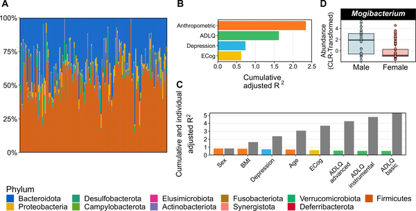
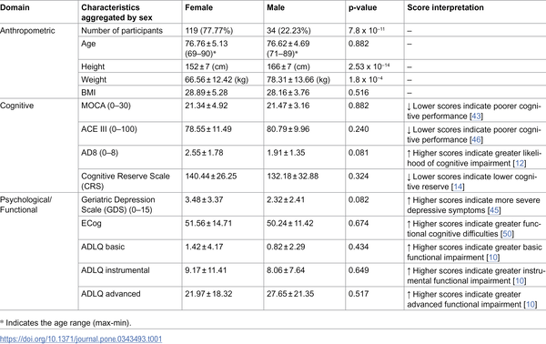
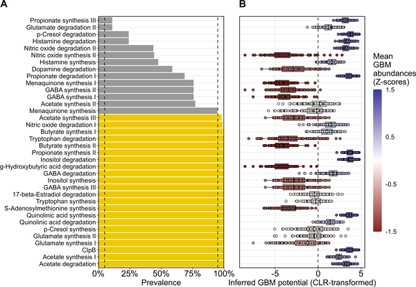
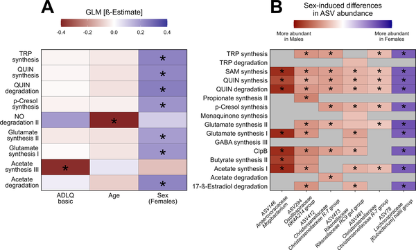

Could the trillions of microbes living in our gut be quietly shaping our mood and memory as we age? Emerging research suggests that the gut microbiome—the community of bacteria and other microorganisms in our digestive tract—may play a surprising role in mental health and cognitive function, especially in older adults. A recent study from Chile sheds new light on how changes in gut bacteria might be linked to depression and cognitive complaints in the elderly, opening intriguing avenues for understanding brain health through the lens of the microbiome.

> **TL;DR**
> - The study found associations between specific gut bacteria and mental health measures, including depression and cognitive performance, in older adults with cognitive complaints.
> - Bacterial pathways involved in producing neuroactive compounds varied with age, sex, and cognitive function, suggesting the gut microbiome’s potential role in brain health and sex-related mental health differences.

As the global population ages, maintaining mental health and cognitive function becomes increasingly important. Many older adults experience cognitive complaints—self-reported concerns about memory or thinking abilities—that can signal a higher risk for future cognitive decline or dementia. At the same time, ageing is known to bring changes in the gut microbiome, including shifts in bacterial diversity and composition. Scientists have begun to explore the 'microbiome-gut-brain axis,' a complex communication network linking gut microbes to brain function through metabolic, immune, and neural pathways. While previous studies have suggested links between gut bacteria and mental health in younger populations, less is known about how these relationships play out in elderly adults, particularly those with early cognitive concerns.

This study examined 153 older adults in Santiago, Chile, all aged 70 or above and reporting cognitive complaints but without diagnosed dementia. Researchers collected stool samples to analyze gut microbiome composition using 16S rRNA gene sequencing, which identifies bacterial groups present. Alongside, participants underwent detailed mental health and cognitive assessments using validated tests measuring depression symptoms, daily functioning, and various cognitive domains. The team also gathered anthropometric data such as age, sex, and body mass index. By integrating microbiome data with clinical and cognitive measures, the researchers explored associations between gut bacterial profiles, their capacity to produce neuroactive compounds, and mental health outcomes.

The study revealed notable links between gut bacteria and mental health measures. For example, higher depression scores were associated with changes in the abundance of certain bacterial groups, including the Lachnospiraceae family member Eubacterium xylanophilum and Fusobacteriaceae Fusobacterium. Importantly, the researchers inferred bacterial metabolic pathways related to neuroactive compounds—such as tryptophan, short-chain fatty acids, glutamate, and nitric oxide—and found these pathways varied with participants' age, sex, and cognitive performance. Additionally, sex differences emerged in the neuroactive potential of specific gut bacteria, suggesting that the microbiome might contribute to sex-related differences in mental health among the elderly. These findings support the idea that the gut microbiome’s functional capacity to produce brain-active molecules may influence mood and cognition in aging adults.

This study provides some of the first evidence from a South American elderly cohort linking the neuroactive potential of the gut microbiome to mental health and cognitive function. By highlighting specific bacteria and metabolic pathways associated with depression and cognitive complaints, it opens new perspectives on how gut microbes might modulate brain health during aging. Understanding these connections could eventually inform strategies to promote healthy cognitive aging, such as microbiome-targeted therapies or dietary interventions. Moreover, recognizing sex-specific microbiome features may help tailor future approaches to mental health care in older adults.

While these findings are compelling, it is important to note that the study is observational and cannot establish cause and effect. The associations observed do not prove that changes in gut bacteria cause mental health symptoms or cognitive decline. Additionally, the cohort consisted of older adults with cognitive complaints but no diagnosed dementia, so the results may not generalize to all elderly populations. The inferred metabolic pathways are predictions based on bacterial DNA sequences rather than direct measurements of microbial metabolites. Future research including longitudinal studies and experimental interventions will be needed to clarify the causal roles of the gut microbiome and explore its potential as a therapeutic target.

## Figures

*Gut microbiome types and how factors like body, mood, and cognition explain their differences in 153 study participants.*

*Summary of body measurements, thinking skills, and mental health traits of 153 participants, grouped by sex.*

*Gut microbiome pathways linked to brain activity vary in presence and abundance among GERO study participants.*

*Age, sex, and daily living skills affect gut bacteria's brain-related activity, with differences seen between males and females.*

## Sources

- [The neuroactive potential of the elderly human gut microbiome is associated with mental health status](https://journals.plos.org/plosone/article?id=10.1371/journal.pone.0343493)
- DOI: [10.1371/journal.pone.0343493](https://doi.org/10.1371/journal.pone.0343493)
