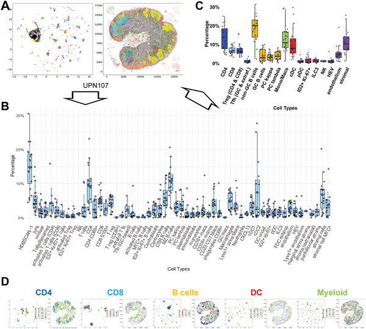

Have you ever wondered what the microscopic world inside your lymph nodes looks like? These small but vital organs are bustling hubs where immune cells gather, communicate, and coordinate to protect your body from infections and diseases. Thanks to cutting-edge imaging technology, scientists have now created an unprecedented map of the diverse cell types and neighborhoods within normal human lymph nodes, uncovering new immune cell subsets and how they spatially organize themselves in this complex tissue.

> **TL;DR**
> - Using a 78-marker antibody panel and a multiplexed cyclic staining method, researchers classified 77 distinct cell types in normal human lymph nodes, including numerous subsets of T-cells and B-cells.
> - Spatial analysis revealed novel immune cell niches and interactions, providing a detailed atlas of lymph node architecture that could serve as a reference for understanding immune responses and diseases.

Lymph nodes are secondary lymphoid organs critical for mounting coordinated immune responses. They serve as meeting points where immune cells encounter pathogens and each other, triggering defense mechanisms. Traditionally, studies of lymph node cells relied on analyzing single-cell suspensions, which lose the spatial context of where cells reside and interact within the tissue. Understanding the precise location and neighborhood relationships of immune cells is essential because their functions often depend on their microenvironment. Recent advances in multiplexed imaging and computational analysis have made it possible to study many proteins simultaneously in intact tissue sections, preserving spatial information and enabling detailed cellular classification.

In this study, researchers examined 19 normal human lymph nodes using an innovative approach combining a 78-antibody panel with a cyclic staining technique called MILAN, which allows repeated rounds of staining and imaging on the same tissue section. This hyperplexed method captures a high-dimensional proteomic profile of each cell in situ. The team developed a sophisticated bioinformatics pipeline named BRAQUE to segment cells, reduce data dimensionality, and cluster cells based on their protein expression patterns. This approach enabled the classification of over 7.5 million cells into 77 distinct phenotypic types, including fine subdivisions of CD4 and CD8 T-cells, B-cells, dendritic cells, and stromal cells. Spatial statistics were then applied to analyze cell neighborhoods and interactions within the lymph node architecture.

The study identified a rich diversity of immune cells within the lymph nodes. Notably, CD4 and CD8 T-cells were subdivided into 27 unique subsets based on expression of the transcription factor TCF7, co-inhibitory receptors, and activation markers. Novel B-cell types were defined by markers CD5 and TCF7, with mature CD27+ B-cells occupying previously unrecognized nodal spaces distinct from classic cortical or medullary regions. Type 2 conventional dendritic cells were found in specific nodular paracortical aggregates. Pairwise neighborhood analysis revealed both expected and new cell-cell interactions, highlighting sparse but significant cellular neighborhoods that form distinct immune niches. These findings provide a spatially resolved cellular atlas of the normal human lymph node, revealing complexity beyond prior knowledge.

This comprehensive spatial proteomic map offers a foundational reference for the normal human lymph node’s cellular composition and organization. By preserving spatial context, the study advances our understanding of how immune cells coexist and interact within their natural microenvironments. Such knowledge is crucial for interpreting immune responses in health and disease, including infections, autoimmune disorders, and cancer. The detailed classification of novel immune cell subsets and their niches may guide future research into targeted therapies and diagnostics. Moreover, the methodologies developed here demonstrate the power of combining multiplexed imaging with advanced computational analysis to unravel complex tissue architectures.

While this study provides an extensive snapshot of lymph node cell types and their spatial relationships in normal tissue, it represents a static view without direct functional assays. The samples were from individuals without known recent antigenic exposures, so the immune cell composition might differ during active immune responses or disease states. Additionally, the classification relies on protein markers detectable by antibodies, which may not capture all functional states or rare cell types. Future studies integrating transcriptomic data and functional analyses will be needed to fully elucidate the roles of these newly identified subsets and interactions.

## Figures

*Fig 2 shows how different human lymph node cells are grouped and mapped in 27 samples, highlighting key immune cell types and their distribution.*

## Sources

- [The normal human lymph node cell classification and landscape defined by high-dimensional spatial proteomics](https://journals.plos.org/plosone/article?id=10.1371/journal.pone.0346693)
- DOI: [10.1371/journal.pone.0346693](https://doi.org/10.1371/journal.pone.0346693)
