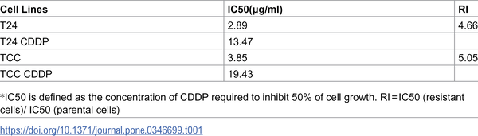
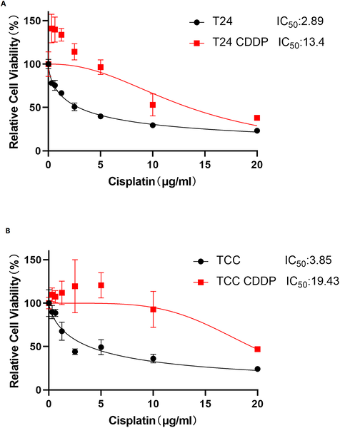
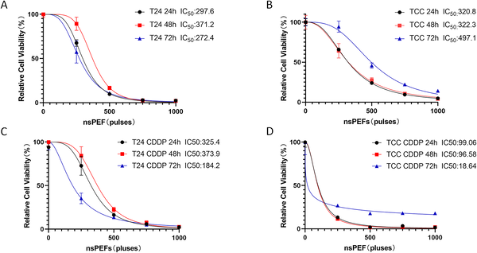
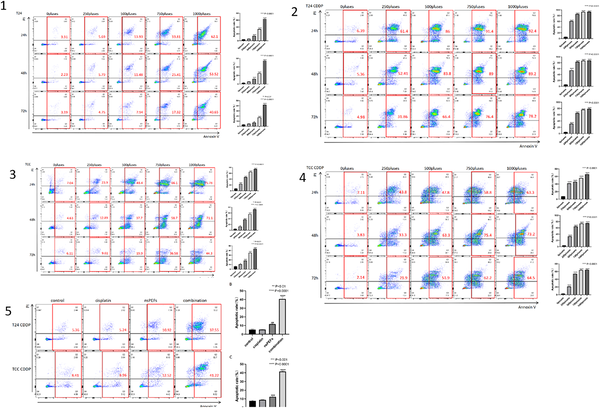

What if tiny, ultra-fast electric shocks could help chemotherapy work again against stubborn bladder cancer? Researchers are exploring how nanosecond pulsed electric fields (nsPEF)—bursts of electricity lasting just billionths of a second—can target drug-resistant cancer cells, potentially reversing their resistance and improving treatment outcomes.

> **TL;DR**
> - Nanosecond pulsed electric fields (nsPEF) can induce DNA damage and apoptosis in bladder cancer cells, including those resistant to cisplatin chemotherapy.
> - Combining nsPEF with cisplatin shows a synergistic effect, significantly inhibiting growth of drug-resistant bladder cancer cells in both lab and animal models.

Bladder cancer is one of the most common cancers worldwide, with urothelial carcinoma making up over 90% of cases. Cisplatin chemotherapy is a mainstay treatment, especially for advanced or recurrent disease. However, many patients develop resistance to cisplatin over time, limiting its effectiveness and contributing to poor survival rates. This resistance can arise from cancer cells’ enhanced ability to repair DNA damage or evade cell death. Finding new ways to overcome this chemoresistance is a critical challenge in bladder cancer therapy.

In this study, researchers developed cisplatin-resistant bladder cancer cell lines by gradually exposing cells to increasing doses of cisplatin. They then applied nanosecond pulsed electric fields (nsPEF)—extremely short, high-intensity electrical pulses—to both the original and drug-resistant cells. The team measured cell survival, apoptosis (programmed cell death), and DNA damage markers after treatment. They also tested nsPEF’s effects in mice implanted with drug-resistant bladder cancer cells, comparing tumor growth under different treatment regimens including cisplatin alone, nsPEF alone, and their combination.

The results showed that nsPEF treatment reduced the viability of both cisplatin-sensitive and resistant bladder cancer cells in a dose- and time-dependent manner. Notably, drug-resistant cells were particularly sensitive to nsPEF-induced apoptosis. Molecular analysis revealed that nsPEF increased levels of γ-H2AX, a marker of DNA double-strand breaks, indicating that the electric pulses caused significant DNA damage in resistant cells. In mouse models, nsPEF alone significantly inhibited tumor growth of drug-resistant bladder cancer, and combining nsPEF with cisplatin enhanced this effect, demonstrating a physicochemical synergy that reversed chemoresistance.

This study provides promising experimental evidence that nsPEF technology could be a novel adjunct to chemotherapy for bladder cancer patients who no longer respond to cisplatin. By physically disrupting cancer cells and inducing DNA damage, nsPEF may sensitize resistant tumors to treatment, potentially improving outcomes and expanding therapeutic options. The non-thermal nature of nsPEF also means it can target tumors with minimal damage to surrounding tissues, making it a compelling candidate for further development.

While these findings are encouraging, the research is still at an early stage, primarily involving cell cultures and animal models. More studies, including clinical trials, are needed to confirm safety, optimal dosing, and efficacy in humans. Additionally, the technical complexity of delivering nsPEF treatments and understanding long-term effects requires further investigation before this approach can become a standard clinical tool.

## Figures

*Table showing the concentration of CDDP needed to stop half the growth of different bladder cancer cell types.*

*T24/CDDP and TCC/CDDP cells show higher survival than original cells after 48-hour treatment with increasing CDDP doses.*

*nsPEF treatment reduces growth of bladder cancer cells and their drug-resistant versions over time, with stronger effects at higher pulse numbers.*

*Cells treated with nsPEF showed increased apoptosis over time and pulse number, measured by flow cytometry in different bladder cancer cell types.*

## Sources

- [The Physicochemical Synergy Effect of Nanosecond Pulsed Electric Fields (nsPEF) and cisplatin on reversing chemoresistance of bladder cancer](https://journals.plos.org/plosone/article?id=10.1371/journal.pone.0346699)
- DOI: [10.1371/journal.pone.0346699](https://doi.org/10.1371/journal.pone.0346699)
