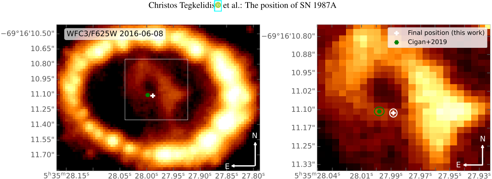
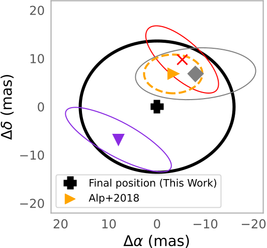
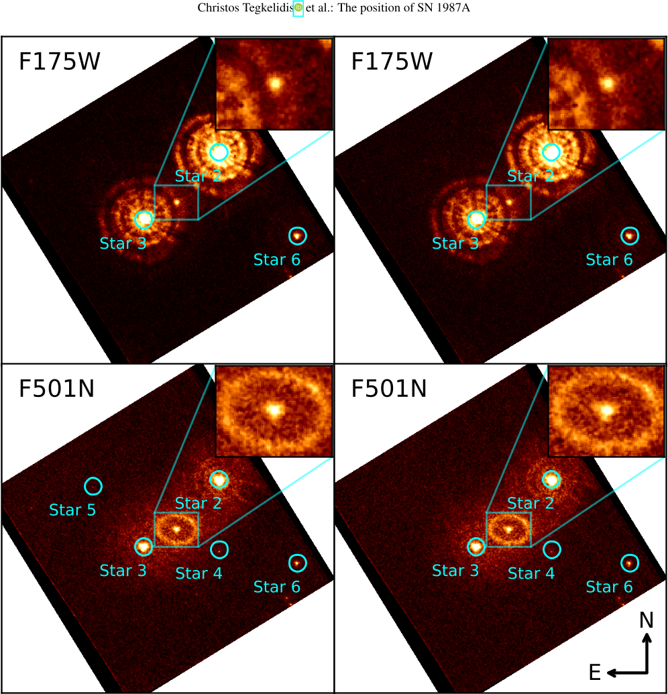
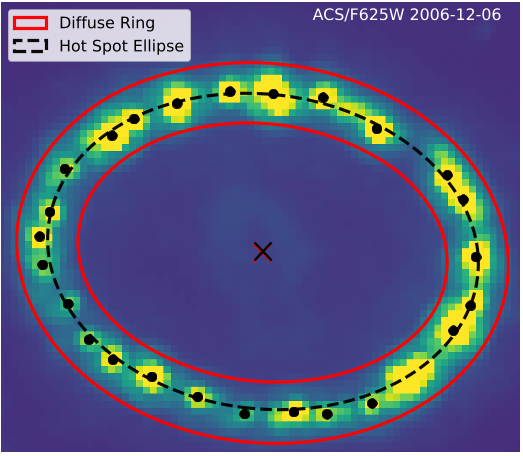

Where exactly is Supernova 1987A in the sky? For decades, this star’s precise location has eluded astronomers, hampering efforts to unravel its aftermath—including how its nascent neutron star was launched through space. Thanks to new measurements combining Hubble Space Telescope imagery with the Gaia space observatory’s celestial map, astronomers have finally charted its spot with unprecedented accuracy.

*HST image of the ER and ejecta at day 10,698, showing SN 1987A and ALMA positions. Left: full ER view; right: zoom on the ejecta.*

> **TL;DR**
> - Astronomers used Hubble and Gaia data to measure SN 1987A's position with ~21 milliarcsecond uncertainty.
> - The results strengthen estimates of the neutron star's motion and support future supernova studies.

*Positions of various features are shown around the central explosion point of SN 1987A, with uncertainty regions and previous measurements marked.*

SN 1987A stands out in astronomical history: exploding in the Large Magellanic Cloud in 1987, it has since illuminated theories of supernova mechanics, stellar evolution, and neutron star birth. However, connecting observations across radio, optical, and infrared telescopes has been tricky, in part because its exact position wasn't nailed down. This small uncertainty matters—a precise fix lets astronomers measure how fast debris expands or how the newfound neutron star was kicked outward during the explosion.

*HST/FOC images of SN 1987A show the expanding ejecta in the center, with full views of 11″×11″ and zoomed-in insets of 1.95″×1.53″.*

To tackle this, the researchers sifted through a trove of Hubble Space Telescope (HST) images, ranging from some of the earliest ultraviolet and optical pictures in 1990 to the sharp, dithered exposures spanning three decades. They focused on two key features: the expanding supernova ejecta (the cloud of debris from the explosion) and SN 1987A’s famous equatorial ring (a dense loop of material ejected thousands of years before the blast). By fitting these structures across multiple wavelengths and epochs, and anchoring them to background stars catalogued by Gaia Data Release 3—which provides ultra-precise positions for nearly two billion stars—they could tie SN 1987A’s radar blip directly to the modern International Celestial Reference System (ICRS).

*HST image of the ER on day 7226 showing the fitted diffuse ring (red), hot spot centroids (black points), and their center estimates (cross marks).*

Their final determination places SN 1987A at right ascension 5h 35m 27.9884s, declination -69° 16' 11.1134'' (ICRS J2016), with only about 21 milliarcseconds uncertainty. Intriguingly, the center of the early ejecta sits about 14 milliarcseconds south and 16 milliarcseconds east of the equatorial ring’s center—a small but statistically significant (96% confidence) offset. This tiny difference could stem from systematic measurement quirks, or it might hint at real physical displacements from the original explosion.

Why does this matter? These improved coordinates let astronomers measure proper motions—how fast SN 1987A and its components move through space—with enhanced precision. For example, by comparing their new position to the spot of the compact source seen by the James Webb Space Telescope (JWST), they estimate the neutron star’s sky-plane velocity to be about 399 km/s, and its true three-dimensional kick velocity at 472 km/s (give or take 126 km/s). This result fits neatly with earlier estimates, solidifying the idea that neutron stars can receive substantial kicks when born, likely from uneven explosions or neutrino emission.

Better astrometry doesn’t just tick a box. It’s a foundation: pinpointing SN 1987A’s position clarifies decades of archival data, tightens measurements of how quickly supernova debris spreads, and strengthens models of how neutron stars rocket away from their natal clouds. As telescopes like JWST and ELT peer ever more closely, such precision could reveal subtle physics behind some of the universe’s most dramatic events. 

Still, a few caveats remain. Measurement uncertainties—whether from instrumental quirks, distortions, or registration mismatches—linger at the margins. And while the observed offset between ejecta and ring might just be noise, it could equally be a real clue about explosion asymmetry. Future observations may provide the tie-breaker, or perhaps new mysteries will emerge as we probe the wreckage even deeper.

## Sources
- [http://arxiv.org/abs/2511.07394v1](http://arxiv.org/abs/2511.07394v1)
- [https://doi.org/10.48550/arXiv.2511.07394](https://doi.org/10.48550/arXiv.2511.07394)
