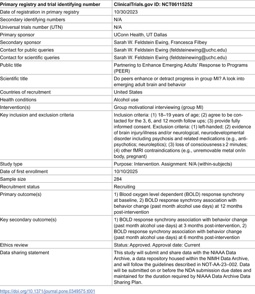
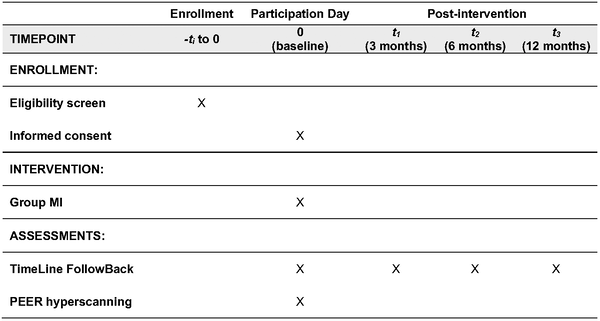

What happens in your brain when you and a friend try to change a risky habit together? Scientists are now using innovative brain scanning technology to peer inside the minds of young people as they engage in group conversations aimed at reducing alcohol use. This study explores whether syncing up brain activity between peers during these sessions can boost the chances of drinking less.

> **TL;DR**
> - This clinical trial will use simultaneous fMRI brain scans of peer pairs during group motivational interviewing to measure how their brains synchronize during positive, prosocial talk about changing drinking habits.
> - Researchers will examine whether greater brain synchrony in social cognition regions predicts reductions in alcohol use among underage emerging adults over the following year.

Emerging adults aged 18 to 19 who drink heavily are at risk for negative health and developmental consequences, yet few receive effective interventions. Motivational interviewing (MI), a counseling approach encouraging behavior change, is often delivered in groups but its brain mechanisms—especially how peers influence each other—remain poorly understood. Adolescents’ brains are highly sensitive to peer influences, which can be both risky and protective. Understanding how positive peer interactions during group MI affect brain activity could reveal why some youth succeed in reducing alcohol use while others do not.

This study will recruit 248 underage emerging adults with recent binge drinking episodes. Participants will attend a single group MI session in peer dyads and then undergo a novel ‘hyperscanning’ procedure, where two participants are scanned simultaneously using functional magnetic resonance imaging (fMRI). This allows researchers to measure real-time brain activity alignment, or synchrony, between peers as they engage in positive, prosocial ‘change talk’ extracted from the MI session. Follow-up assessments at 3, 6, and 12 months will track alcohol use to see if brain synchrony predicts behavior change.

While results are pending, the study hypothesizes that greater neural synchrony in brain networks involved in social cognition during positive peer interactions will be associated with larger reductions in drinking. Prior research suggests that brain alignment between individuals during social tasks correlates with cooperation and prosocial behavior, making this a promising avenue to understand how peer support enhances intervention outcomes.

This research could transform how we design and deliver interventions for at-risk youth by highlighting the neural mechanisms through which peers influence behavior change. If brain synchrony proves to be a key factor, group MI programs might be optimized to foster more effective peer interactions, ultimately reducing underage drinking and its harms. The use of hyperscanning represents an innovative leap in studying social neuroscience in real-world intervention contexts.

As a protocol paper, this study outlines the planned methods and hypotheses but does not yet provide results. The complexity of brain synchrony and its relationship to behavior is still emerging science, and findings will require careful interpretation. Additionally, the study focuses on a specific age group and drinking behavior, so generalizing to other populations or interventions should be done cautiously. Future research will be needed to confirm and expand on these insights.

## Figures

*Summary of how the trial was designed and conducted.*

*Timeline showing when participants joined, received treatments, and were assessed during the study.*

## Sources

- [The Protocol for: Do peers enhance behavior change in group motivational interviewing? A translational clinical trial investigating brain synchrony in underage emerging adults during an fMRI hyperscanning task and association with alcohol use reductions](https://journals.plos.org/plosone/article?id=10.1371/journal.pone.0349575)
- DOI: [10.1371/journal.pone.0349575](https://doi.org/10.1371/journal.pone.0349575)
