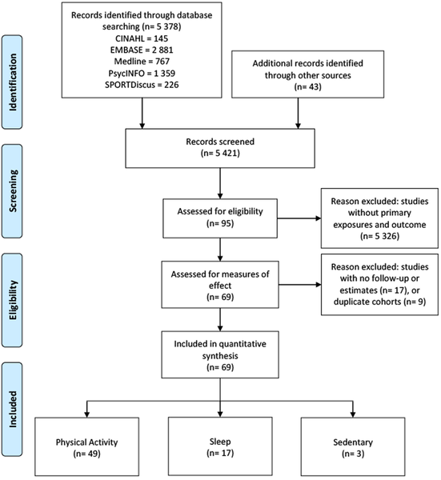
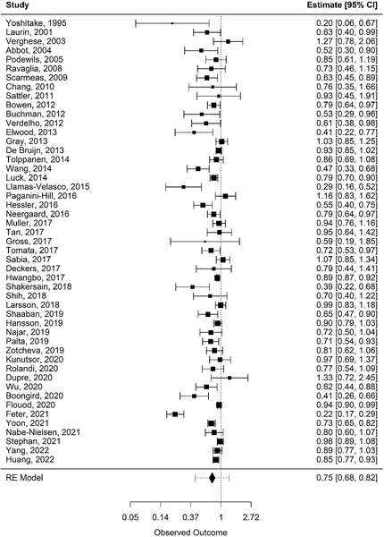
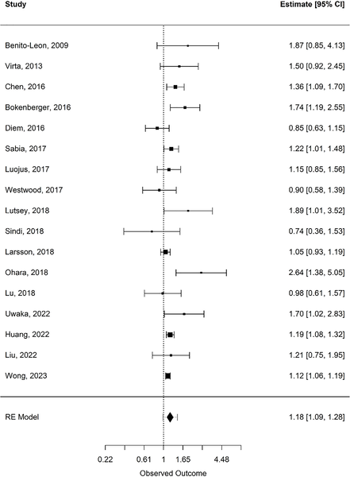
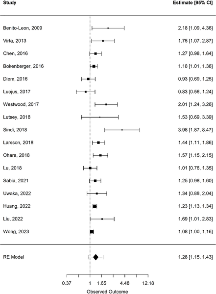

Can how much you move, sit, and sleep really change your risk of dementia? Recent research pooling data from millions of adults suggests that these everyday lifestyle factors do matter. By examining the links between physical activity, sedentary behavior, and sleep duration, scientists are uncovering patterns that could help protect our brains as we age.

> **TL;DR**
> - Regular physical activity is associated with a roughly 25% lower risk of developing dementia.
> - Both prolonged sitting (8+ hours per day) and sleeping too little or too much (less than 7 or more than 8 hours) are linked to increased dementia risk.

Dementia, including Alzheimer’s disease, affects millions worldwide and is a leading cause of cognitive decline and disability in older adults. With no definitive cure, prevention strategies focusing on modifiable lifestyle factors have become a priority. Physical activity, sedentary behavior, and sleep are known to influence brain health and cardiovascular risk, but how they relate specifically to dementia risk has been less clear. This large systematic review and meta-analysis synthesized data from nearly three million people across dozens of cohort studies to clarify these relationships.

Researchers systematically searched multiple databases for prospective cohort studies involving community-dwelling adults aged 35 and older. They included studies that measured physical activity, sedentary time, or sleep duration at baseline and followed participants over time to identify new cases of dementia. The team applied national guidelines to categorize activity levels (active vs. inactive), sedentary time (&lt;8 vs. 8+ hours sitting), and sleep duration (&lt;7, 7–8, &gt;8 hours). Using random-effects meta-analysis, they pooled risk estimates from 49 studies on physical activity, 17 on sleep, and 3 on sedentary behavior, encompassing over 4 million participants in total.

The analysis revealed that adults engaging in regular physical activity—at least 150 minutes of moderate to vigorous exercise per week—had a 25% lower risk of developing dementia compared to inactive individuals. Conversely, sitting for eight or more hours daily was associated with a 27% increased risk. Sleep duration showed a U-shaped relationship: both short sleepers (&lt;7 hours) and long sleepers (&gt;8 hours) had elevated dementia risk compared to those sleeping 7–8 hours nightly, with risk increases of about 18% and 28%, respectively. These associations were consistent across different ages and follow-up periods, though some variability between studies was noted.

These findings underscore the importance of balanced movement behaviors for brain health. Regular physical activity and limiting prolonged sitting are actionable steps that may help delay or prevent dementia onset. Similarly, maintaining a healthy sleep duration appears to be another modifiable factor. Given the rising global burden of dementia and limited treatment options, lifestyle interventions targeting these behaviors could have significant public health impact. The study also highlights the need for further research tracking changes in these behaviors over time, especially starting in midlife.

While the meta-analysis included a large number of participants and used rigorous methods, it is important to remember that the evidence is observational. This means we cannot definitively conclude cause and effect. The studies varied in how they measured activity, sitting, and sleep, and some had moderate risk of bias. Additionally, factors such as diet, genetics, and other health conditions may also influence dementia risk and were not fully accounted for. Future research with longer follow-up and more precise measures will help clarify these relationships.

## Figures

*Diagram showing how studies were selected step-by-step for the research.*

*This chart shows how physical activity is linked to lower risk of developing dementia based on multiple studies.*

*This chart shows how short sleep duration is linked to the risk of developing dementia based on multiple studies combined.*

*This chart shows how sleeping longer than usual may be linked to a higher chance of developing dementia.*

## Sources

- [The Relationships between physical activity, sedentary behaviour, sleep, and dementia: A systematic review and meta-analysis of cohort studies](https://journals.plos.org/plosone/article?id=10.1371/journal.pone.0343621)
- DOI: [10.1371/journal.pone.0343621](https://doi.org/10.1371/journal.pone.0343621)
