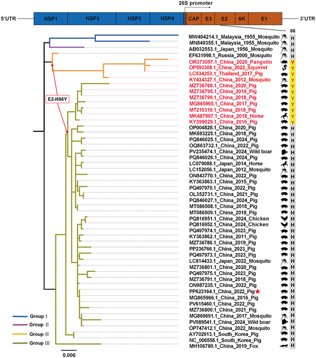
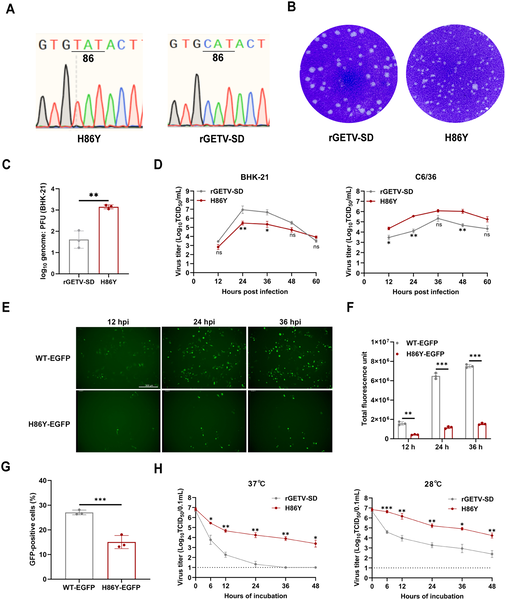
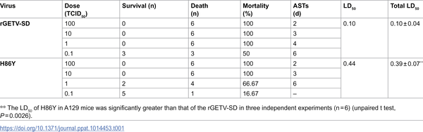
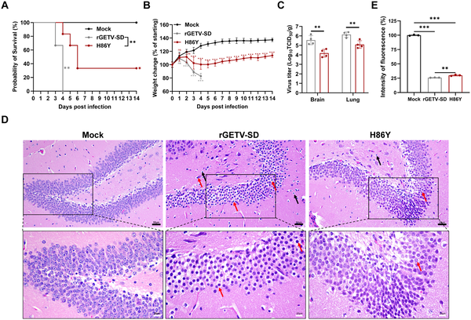

Viruses are masters of adaptation, often changing just a single amino acid in their proteins to alter how they infect hosts or evade immune defenses. The Getah virus, a mosquito-borne alphavirus spreading across Asia, has recently been found to carry a mutation that does just that—switching its infection efficiency between mosquitoes and mammals. Understanding this subtle molecular shift not only sheds light on how viruses jump between species but also opens avenues for developing safer vaccines.

> **TL;DR**
> - A single amino acid change (H86Y) in the Getah virus E2 glycoprotein reduces its ability to infect mammalian cells by weakening binding to key host molecules but increases infection efficiency in mosquito cells.
> - This mutation attenuates the virus’s virulence in mouse models while still eliciting strong immune protection, highlighting a potential target for antiviral therapies and vaccine development.

Getah virus (GETV) is an alphavirus transmitted by mosquitoes that has expanded its host range to include various mammals such as pigs, horses, and even wild animals like pangolins. While GETV infections in humans are not yet well characterized, its growing presence and broad host spectrum raise public health concerns. Alphaviruses enter host cells by first attaching to molecules on the cell surface, such as glycosaminoglycans (GAGs), and then binding to specific receptors like the low-density lipoprotein receptor (LDLR) to gain entry. However, the exact viral protein features that govern these interactions and influence virulence have remained unclear for GETV.

Researchers used reverse genetics to introduce a specific mutation—substituting histidine with tyrosine at position 86 (H86Y) in the E2 glycoprotein of GETV. They then compared the mutant virus to the original strain in various cell cultures, including mammalian and mosquito cells, and in mouse models that mimic human infection. Techniques such as viral growth assays, plaque morphology, genome-to-infectious particle ratios, and live-cell imaging tracked viral replication and infectivity. To dissect the molecular interactions, the team performed binding assays including co-immunoprecipitation and biolayer interferometry, as well as experiments with cells lacking GAGs or LDLR. They also examined the mutant’s virulence and immune response in mice, assessing survival, viral loads, tissue pathology, and inflammation.

The H86Y mutation caused a striking host-specific shift: while it enhanced viral replication in mosquito cells, it significantly reduced infectivity in multiple mammalian cell lines. This was linked to a weakened ability of the virus to bind both GAGs and LDLR, critical molecules for viral attachment and entry in mammalian cells. In mouse models, the mutant virus showed lower viral loads, milder brain pathology, and reduced inflammation compared to the parental strain, yet still triggered a robust protective immune response. Importantly, the mutation’s attenuation effect persisted even in mice lacking LDLR, but was reversed when GAGs were enzymatically removed, confirming that both receptors contribute to the mutant’s reduced virulence. The study also revealed that the GAG-binding site overlaps with the LDLR interaction interface on the E2 protein, highlighting residue 86 as a key molecular switch controlling receptor usage.

This research uncovers a precise molecular mechanism by which a single amino acid change in the Getah virus glycoprotein modulates its ability to infect different hosts and its overall virulence. By identifying residue 86 as a critical determinant of receptor binding and infection efficiency, the study provides a valuable target for antiviral drug design and vaccine development. The fact that the attenuated mutant still elicits strong immunity suggests it could serve as a promising live-attenuated vaccine candidate, potentially offering protection against GETV and related alphaviruses. Moreover, understanding how viruses balance infectivity between vectors and hosts deepens our knowledge of viral evolution and zoonotic risk.

While the findings are compelling, this study focuses on laboratory-adapted viral strains and mouse models, which may not fully capture the complexity of natural infections in diverse mammalian hosts, including humans. The long-term stability and safety of the H86Y mutant as a vaccine candidate require further investigation. Additionally, the precise structural details of how residue 86 influences receptor binding remain to be elucidated, which could inform more targeted therapeutic strategies. Finally, as GETV is less well-known globally compared to other alphaviruses, more epidemiological data are needed to assess the public health impact of this mutation.

## Figures

*A family tree of 48 GETV virus strains shows genetic differences, highlighting a key mutation in red and the main strain with red stars.*

*The H86Y virus mutant shows differences in gene sequence, growth, infectivity, and stability compared to the original virus in various cell tests.*

*Table comparing the lethal dose (LD50) of rGETV-SD and H86Y viruses.*

*Mutation at residue 86 affects GETV virus severity in mice, impacting survival, weight, brain virus levels, and brain cell health.*

## Sources

- [The residue 86 of the Getah virus E2 glycoprotein mediates both glycosaminoglycan- and LDLR-dependent infection](https://journals.plos.org/plospathogens/article?id=10.1371/journal.ppat.1014453)
- DOI: [10.1371/journal.ppat.1014453](https://doi.org/10.1371/journal.ppat.1014453)
