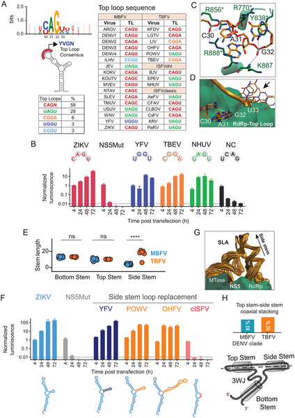
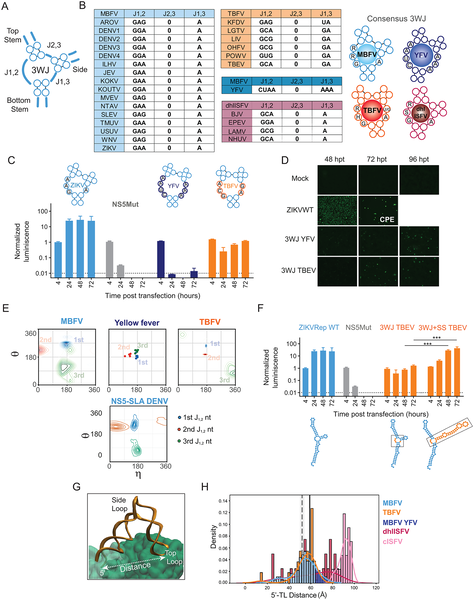

Imagine a tiny molecular switch that viruses use to copy themselves inside our cells. Scientists have now discovered that a specific RNA structure—a kind of folded genetic 'promoter'—is remarkably conserved across a diverse group of viruses responsible for diseases like dengue, Zika, yellow fever, and tick-borne encephalitis. This universal RNA element not only orchestrates viral replication but also offers a new target for antiviral drugs that could potentially combat multiple dangerous viruses at once.

> **TL;DR**
> - A conserved RNA structure called Stem-Loop A (SLA) acts as a universal promoter for genome replication across diverse pathogenic flaviviruses.
> - Small molecules that bind this RNA structure can inhibit replication of multiple flaviviruses, highlighting a promising broad-spectrum antiviral target.

Orthoflaviviruses are a genus of RNA viruses that include some of the most impactful human pathogens worldwide, such as dengue virus (DENV), Zika virus (ZIKV), yellow fever virus (YFV), and tick-borne encephalitis virus (TBEV). These viruses cause recurrent outbreaks and affect hundreds of millions of people annually. Despite their global health burden, no specific antiviral drugs have been approved to treat infections caused by these viruses. Their genomes are composed of RNA that not only encodes viral proteins but also folds into complex structures that regulate critical steps in the viral life cycle. Among these, the Stem-Loop A (SLA) structure at the 5′ end of the viral RNA genome plays a key role by recruiting the viral polymerase enzyme NS5 to initiate replication.

To investigate whether the SLA structure is conserved and functionally interchangeable among different flaviviruses, the researchers combined molecular virology techniques with computational structural analysis. They created chimeric viruses by swapping the SLA region between dengue and Zika viruses and other mosquito-borne and tick-borne flaviviruses. Using replication-competent reporter viruses that produce a measurable luciferase signal when replicating, they assessed whether these chimeric viruses could replicate in cultured cells. They also performed detailed structural modeling and sequence alignments to understand conserved and variable features of the SLA. Finally, they screened a library of small molecules for compounds that bind the SLA RNA and tested their ability to inhibit viral replication.

The study revealed that SLAs from diverse pathogenic flaviviruses are functionally interchangeable in the context of dengue and Zika virus replication, indicating a conserved mechanism of polymerase recognition across these viruses. Structural analyses showed that while some parts of the SLA vary between virus groups, key nucleotide contacts between the SLA’s top loop and the NS5 polymerase domain are conserved, preserving the three-dimensional architecture necessary for viral replication. Importantly, small molecules identified through screening were found to bind the SLA and inhibit replication not only of dengue virus but also of other flaviviruses like Zika, yellow fever, and tick-borne encephalitis viruses, demonstrating the potential of targeting this RNA structure for broad-spectrum antiviral therapy.

This discovery of a universal RNA promoter structure in flaviviruses sheds light on fundamental principles of viral RNA evolution and replication. From a practical standpoint, it opens new avenues for antiviral drug development by targeting a conserved RNA element rather than viral proteins, which often mutate rapidly. Drugs designed to bind the SLA could potentially block replication of multiple flaviviruses simultaneously, offering a powerful tool against diseases that currently lack effective treatments. Given the global impact of flavivirus outbreaks and the challenges in controlling them, this research represents a promising step toward broad-spectrum antiviral strategies.

While the findings are compelling, the study was conducted primarily in cell culture models, and further research is needed to evaluate the safety, efficacy, and pharmacodynamics of SLA-targeting compounds in animal models and humans. RNA structures can be dynamic and influenced by cellular factors, so understanding how these compounds perform in complex biological environments is crucial. Additionally, viruses may evolve resistance mechanisms over time, so combination therapies and ongoing surveillance will be important for long-term antiviral success.

## Figures

*This figure shows how specific RNA sequences affect virus replication and their interactions with viral proteins in different flaviviruses.*

*This figure analyzes the 3-way RNA junction in flaviviruses, showing its structure, sequence, and impact on virus replication and cell infection over time.*

## Sources

- [The RNA promoter for pathogenic orthoflaviviruses replication is universal and serves as target for viral inhibition](https://journals.plos.org/plospathogens/article?id=10.1371/journal.ppat.1014233)
- DOI: [10.1371/journal.ppat.1014233](https://doi.org/10.1371/journal.ppat.1014233)
