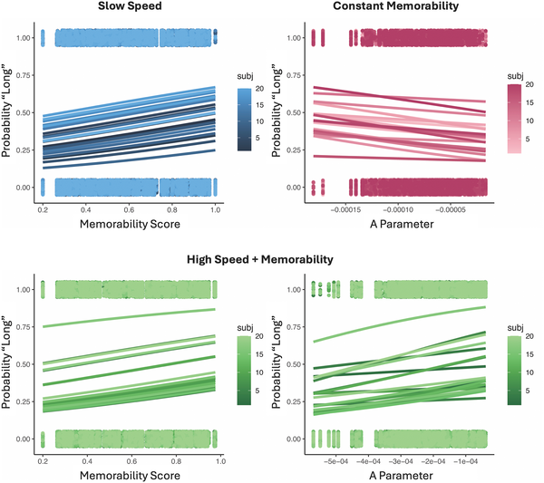
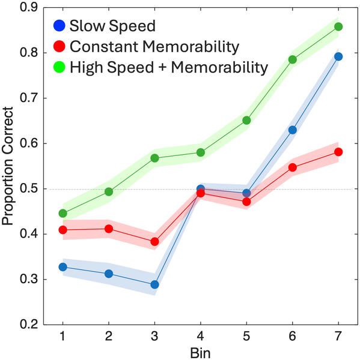
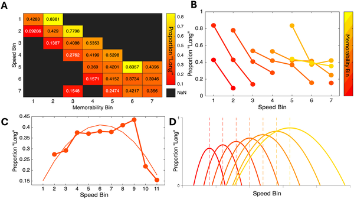

Why do some images seem to linger longer in our minds than others? Have you ever noticed that certain pictures feel like they last a moment longer, or that time seems to stretch or shrink depending on what you’re looking at? Recent research uncovers a surprising connection between how quickly our brains process images, how memorable those images are, and how we perceive the passage of time.

> **TL;DR**
> - Both the memorability of an image and the speed at which it is processed by the brain can make it feel like it lasts longer, a phenomenon called time dilation.
> - However, when images are processed extremely quickly, this effect reverses, causing time compression—images feel like they last for a shorter period.

Our perception of time is not as straightforward as a ticking clock. Visual stimuli can appear to last longer or shorter than their actual duration, influenced by factors like attention, brightness, or emotional content. Previous studies showed that images that are more memorable tend to ‘stretch’ our sense of time, making them feel like they last longer. But what drives this effect? And how does the speed of processing these images in the brain play a role? To explore these questions, researchers turned to a combination of human experiments and computational modeling using neural networks that mimic aspects of visual processing.

The study involved 60 participants divided into three groups, each viewing sets of images carefully selected based on two key features: memorability and processing speed. Memorability scores were derived from a large image database, while processing speed was estimated using a recurrent convolutional neural network (rCNN) model. This model simulates how the brain processes images over multiple steps, measuring how quickly it ‘settles’ on recognizing an image. Participants performed a timing task where they judged whether images were shown for a ‘short’ or ‘long’ duration, followed by a surprise memory test 24 hours later to assess how well they recognized the images.

The results revealed that both higher memorability and faster processing speeds independently made images feel like they lasted longer. Interestingly, when images were processed at very high speeds, the effect flipped: time felt compressed, and images seemed to last for a shorter period. This relationship followed an inverted-U shape, where moderate speeds and high memorability stretched perceived time, but extremely fast speeds shortened it. Additionally, faster processing speeds alone improved memory recognition by about 17%, showing a direct link between how quickly we process visual information and how well we remember it.

These findings deepen our understanding of how the brain’s processing dynamics shape our subjective experience of time and memory. By showing that both the memorability of an image and the speed of its neural processing influence perceived duration, the study highlights a nuanced interplay between perception and cognition. This insight could inform future research in cognitive neuroscience and even inspire developments in artificial intelligence systems designed to mimic human memory and perception.

While the study offers compelling evidence for the role of processing speed and memorability in time perception, it focuses on specific types of images and controlled experimental settings. The neural network model used approximates brain processing but cannot capture all the complexities of human vision. Moreover, the practical applications of these findings remain exploratory, and further research is needed to understand how these effects play out in everyday life and across different sensory modalities.

## Figures

*Speed and memorability affect how long people think a stimulus lasts, with different patterns depending on speed and memorability levels.*

*People remembered images better when they were more memorable, faster, or both, with the best memory in the high speed and memorability group.*

*Faster speeds generally reduce 'long' responses, but higher memorability lessens this effect, showing a complex link between speed, memorability, and time perception.*

## Sources

- [The speed limit of visual perception: Bidirectional influence of image memorability and processing speed on perceived duration and recognition](https://journals.plos.org/ploscompbiol/article?id=10.1371/journal.pcbi.1013448)
- DOI: [10.1371/journal.pcbi.1013448](https://doi.org/10.1371/journal.pcbi.1013448)
