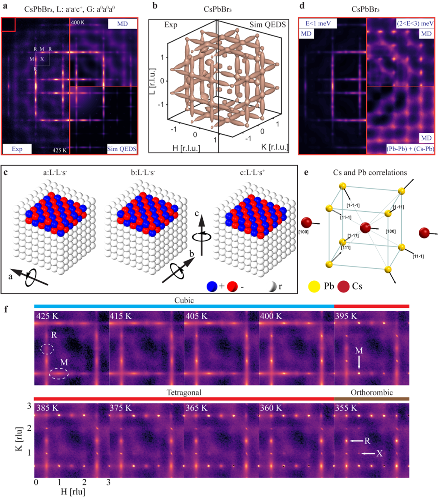
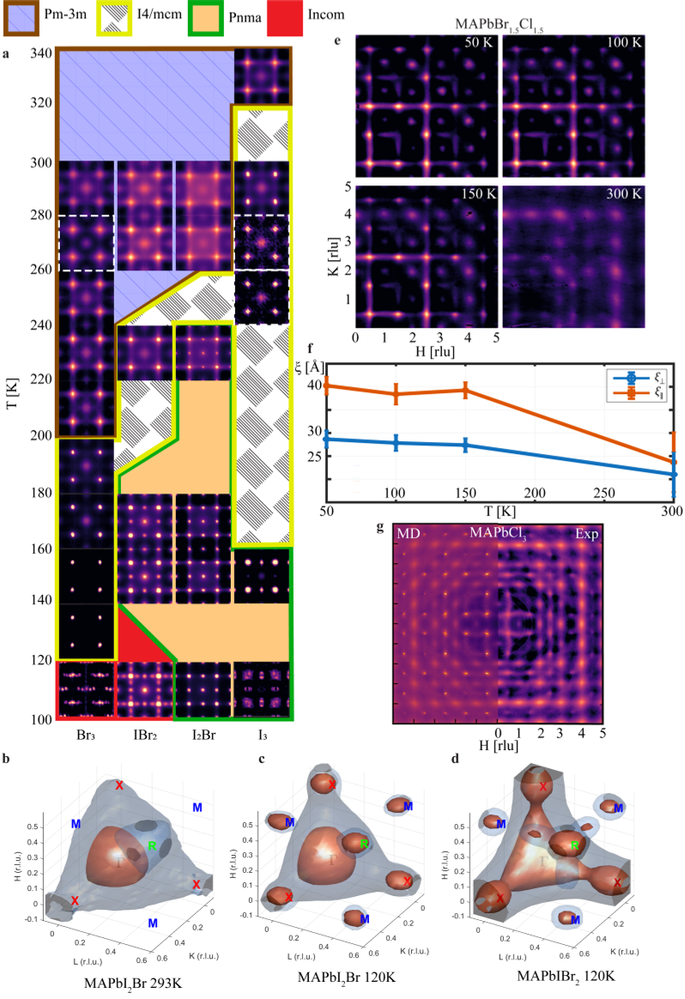

Did you know that the speed at which you heat or cool a material can change how it behaves at the nanoscale? In the world of cutting-edge solar cell materials known as lead halide perovskites, this thermal history doesn’t just tweak performance—it fundamentally alters the tiny crystal structures inside, shaping how these materials absorb and emit light.

> **TL;DR**
> - Lead halide perovskites contain dynamic nanodomains—tiny regions a few nanometers wide where the crystal lattice tilts and fluctuates—affecting their optoelectronic properties.
> - The thermal history, including heating and cooling rates, controls these nanodomains’ structure and dynamics, thereby influencing the material’s light emission efficiency.

*Note: this summary is based on a preprint — research shared ahead of formal peer review.*

Lead halide perovskites have emerged as promising materials for solar cells, LEDs, and photodetectors due to their excellent ability to convert light into electricity and vice versa. While their power conversion efficiencies have approached theoretical limits, a key challenge remains: stability. Traditionally, researchers focused on ionic motion within a fixed crystal lattice to understand instabilities. However, recent work reveals a hidden layer of complexity—dynamic nanodomains inside the lattice that fluctuate and locally break the crystal symmetry. These subtle structural features are crucial because they influence how electrons and photons interact inside the material, affecting performance and durability.

To uncover these nanoscale details, the researchers combined advanced experimental and computational techniques. They used single crystal X-ray and neutron diffuse scattering to detect weak, broad signals revealing short-range correlated distortions in the lattice. Machine-learning-assisted molecular dynamics simulations helped model how atoms move and interact over time, while a phenomenological octahedral tilt model described how the metal-halide octahedra tilt and fluctuate. Hyperspectral photoluminescence measurements tracked how these structural changes impact the material’s light emission across temperature changes and phase transitions.

The study found that nearly every composition of lead halide perovskites hosts dynamic nanodomains—regions where octahedral units tilt in correlated ways, spanning just a few nanometers. The shape, symmetry, and anisotropy of these nanodomains depend primarily on the A-site cation (cesium, methylammonium, or formamidinium). For example, cesium-based perovskites form dense, anisotropic orthorhombic nanodomains, while formamidinium-based ones have sparse, isotropic tetragonal nanodomains. The halide ion (chloride, bromide, iodide) influences the degree of dynamic disorder and the sequence of phase transitions. Crucially, thermal history—how quickly or slowly the material is heated or cooled—can push the same composition into different crystallographic phases, each with distinct local orders. In methylammonium lead iodide (MAPbI3), the heating rate alone changed the photoluminescence quantum efficiency, demonstrating direct control over optoelectronic response via thermal processing.

These findings highlight thermal history as a vital design variable alongside composition in engineering perovskite materials. Since the phase transitions and local structural fluctuations occur within typical device operating temperatures—from everyday thermal cycling to extreme conditions in space—understanding and controlling thermal processing can improve device stability and efficiency. This insight helps explain why perovskite device performance is often sensitive to fabrication conditions and offers a new pathway to optimize next-generation solar cells and light-emitting devices by tailoring their microscopic crystal dance.

While the study provides compelling evidence linking thermal history to local structure and optoelectronic properties, the complexity of real-world device environments means many factors interplay to determine performance and stability. The dynamic nanodomains fluctuate on picosecond timescales and are challenging to observe directly in operating devices. Further research is needed to translate these microscopic insights into robust manufacturing protocols and to understand long-term effects under varied environmental stresses.

## Figures

*CsPbBr3 shows tiny tilted nanodomains and unique atomic shifts that create distinct patterns, changing with temperature across its phases. — Figure from Milos Dubajic et al., [CC BY 4.0](http://creativecommons.org/licenses/by/4.0/), caption edited.*

*Halide substitution changes local structures in mixed halide materials, shown by temperature-dependent patterns and simulations of atomic arrangements. — Figure from Milos Dubajic et al., [CC BY 4.0](http://creativecommons.org/licenses/by/4.0/), caption edited.*

## Sources

- [Thermal history controls the optoelectronic response of lead halide perovskites through structure and dynamics](https://arxiv.org/abs/2609.03211)
- DOI: [10.48550/arxiv.2609.03211](https://doi.org/10.48550/arxiv.2609.03211)

*This article reuses and adapts text and figures from the original research by Milos Dubajic et al., available via arXiv Materials Science, under the [CC BY 4.0](http://creativecommons.org/licenses/by/4.0/) license.*
