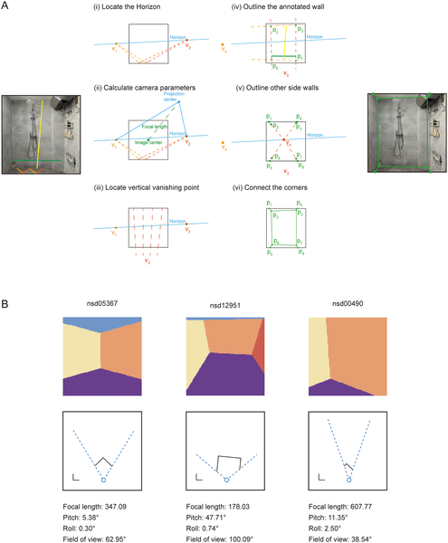
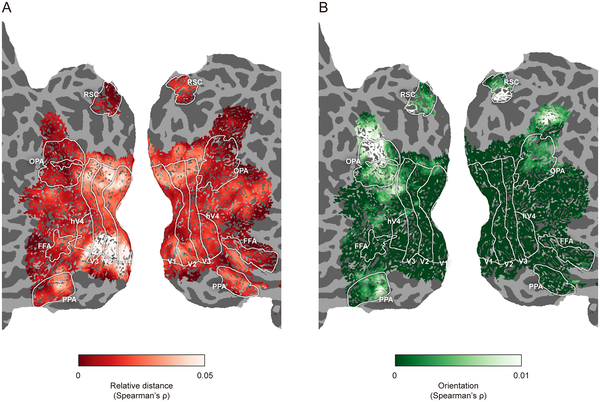

Imagine walking into a room and instantly sensing how far the walls are and which way they face. This effortless perception helps you navigate and orient yourself in space. But how does the brain visually encode these crucial features of our environment? Recent research using advanced brain imaging techniques reveals that our visual cortex processes the distance to walls and their orientation in distinct ways, unfolding over time and across different brain regions.

> **TL;DR**
> - The human brain encodes the distance to nearby walls early and in lower-level visual areas, while orientation of walls is processed later in higher-level scene-selective regions.
> - Navigation-related tasks enhance the brain’s representation of wall orientation, suggesting that attention and task demands modulate spatial layout processing.

Spatial navigation depends heavily on how our brain represents the three-dimensional layout of the environment. While studies in rodents have uncovered neurons that encode boundaries as vectors defined by distance and orientation, how the human brain accomplishes this has been less clear. Humans primarily rely on vision to construct mental maps of their surroundings, with specialized brain areas known to respond to scenes and landmarks. Yet, understanding how these areas encode specific environmental features like wall distance and orientation, especially from natural images, has remained a challenge.

To tackle this, researchers developed a novel computer vision approach to reconstruct 3D room layouts from natural indoor photographs. By manually labeling key edges in images, they estimated camera parameters and generated detailed 3D maps of walls and viewer positions. This enabled analysis of a large-scale brain imaging dataset (the Natural Scenes Dataset) collected while participants viewed these images. The team also conducted additional experiments using functional MRI and magnetoencephalography (MEG) to measure brain activity during navigation-related and non-navigation tasks. Importantly, they controlled for other visual and semantic features to isolate brain responses specific to spatial layout.

The study uncovered a clear dissociation in how the brain encodes wall distance and orientation. Early visual cortex areas (like V1 and V2) represented the relative distance to walls shortly after viewing, and this encoding was consistent regardless of task. In contrast, higher-level scene-selective areas such as the occipital place area (OPA) and parahippocampal place area (PPA) encoded wall orientation later in processing. Moreover, when participants engaged in navigation-related tasks, the brain’s representation of wall orientation was enhanced, even in early visual areas, suggesting top-down feedback mechanisms. This hierarchical and dynamic processing supports a vector coding principle where distance and orientation are separately but complementarily represented.

These findings provide a new window into the neural computations that allow humans to perceive and navigate complex 3D environments. By showing that distance and orientation information are processed differently and modulated by task demands, the research advances our understanding of how perception links to action in spatial navigation. This knowledge could inform future neurotechnologies aimed at assisting navigation and spatial awareness, as well as clinical approaches for disorders affecting spatial cognition.

While the study used robust imaging methods and naturalistic stimuli, the reconstruction of 3D layouts relied on manual labeling and assumptions that may introduce some error. Also, the navigation tasks were simulated rather than involving real-world movement, which could engage additional brain systems. Further research is needed to explore how these findings generalize to more dynamic navigation and to other types of environments beyond indoor scenes.

## Figures

*We reconstructed 3D room layouts and viewer positions from indoor photos using labeled edges and created maps showing walls and viewpoints.*

*Brain maps show how one person's brain represents 3D space, highlighting distance and orientation patterns on the brain surface.*

## Sources

- [Three-dimensional scene boundary representations for wall orientation and distance are represented distinctly in the human visual cortex](https://journals.plos.org/plosbiology/article?id=10.1371/journal.pbio.3003541)
- DOI: [10.1371/journal.pbio.3003541](https://doi.org/10.1371/journal.pbio.3003541)
