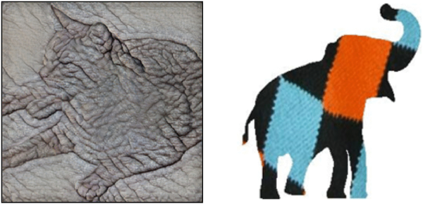
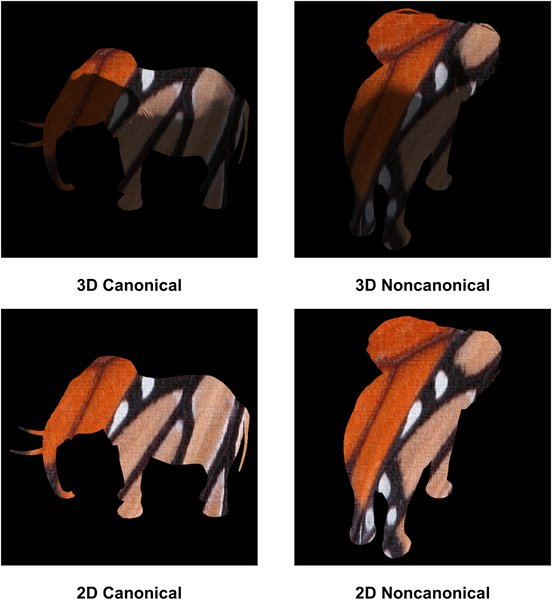
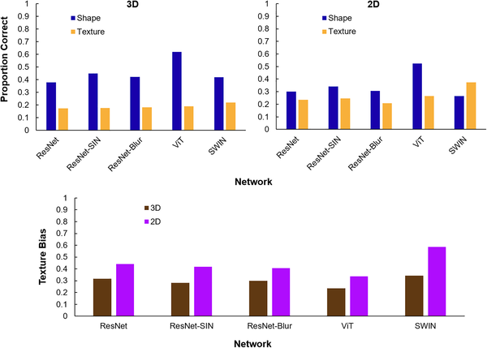

Why do humans effortlessly recognize objects from unusual angles, while artificial intelligence sometimes struggles? A recent study dives into how subtle 3D cues like shading and shadows influence object recognition in both humans and AI systems. The findings reveal surprising differences in how our brains and neural networks interpret these visual signals, shedding light on the unique ways humans perceive the world around us.

> **TL;DR**
> - Humans rely heavily on 3D shape cues such as shading and attached shadows to infer an object's structure, especially when viewed from noncanonical perspectives.
> - Artificial neural networks tend to treat shading and shadows as surface textures rather than cues to 3D shape, leading to different recognition patterns compared to humans.

Visual object recognition is a complex process involving both shape and texture information. Humans typically prioritize shape when identifying objects, using cues like contours, shading, and shadows to build a mental 3D model. In contrast, many deep neural networks—AI systems designed to classify images—show a strong bias toward texture, often struggling when textures are misleading or altered. Previous research focused mainly on external contours, but this new study investigates how internal 3D cues, such as shading and shadows, affect recognition in both humans and AI.

Researchers created a large dataset of 3D object images from ShapeNet models, generating 120,000 images with varied textures applied to shapes and viewed from multiple angles. These images included versions with and without shading and attached shadows, allowing a controlled comparison of 3D cues. They tested three state-of-the-art neural networks—ResNet-50, ViT-16, and SWIN—and human participants on their ability to classify objects by shape and texture. Importantly, they distinguished between canonical (typical) and noncanonical (unusual) viewpoints to assess how perspective influences recognition.

Humans outperformed neural networks in recognizing objects by shape when textures were substituted, particularly when relying on external contours alone. However, when 3D cues like shading and shadows were present, the performance gap narrowed. Notably, humans benefited most from these 3D cues when objects were viewed from noncanonical perspectives, suggesting that shading helps infer 3D structure under challenging viewing conditions. Neural networks showed improved recognition with 3D cues too, but their gains were greatest for canonical views, implying they use shading more as a surface-level texture cue rather than for 3D inference.

This research highlights a fundamental difference in how biological and artificial vision systems process 3D shape information. Humans appear to use shading and shadows to build volumetric representations of objects, enabling flexible recognition even from unusual angles. Neural networks, however, rely more on texture and treat shading as another texture pattern, limiting their ability to generalize across perspectives. Understanding these differences can guide the development of AI models that better mimic human perception and improve robustness in real-world applications.

While the study used a large and well-controlled dataset, the neural networks tested represent only a subset of possible architectures and training methods. Some networks trained with alternative approaches to emphasize shape showed different biases. Additionally, human participants were tested under controlled lab conditions which may not capture all aspects of natural vision. Future work could explore how training AI with explicit 3D shape inference tasks affects their use of shading cues and whether hybrid models can bridge the gap between human and machine vision.

## Figures

*Examples showing a cat shape with elephant skin texture and an elephant shape with argyle sock texture.*

*Images show a 3D elephant-butterfly from different angles and the same image in flat 2D form for comparison.*

*Fig 3 shows how well neural networks recognize shapes and textures using 3D and 2D info, plus their texture preference in each case.*

## Sources

- [Three-dimensional shape cues affect human and artificial recognition systems differently](https://journals.plos.org/plosone/article?id=10.1371/journal.pone.0338885)
- DOI: [10.1371/journal.pone.0338885](https://doi.org/10.1371/journal.pone.0338885)
