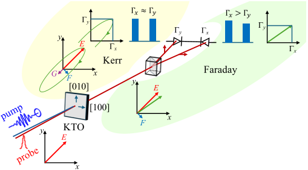

What if you could make a non-magnetic material act magnetic—just by shining special light on it? Scientists have now demonstrated that ultrafast pulses of terahertz (THz) radiation can induce a transient magnetic-like response in KTaO3, a crystal that normally shows no magnetism. This surprising effect arises from the way light vibrates atoms in the crystal, creating a fleeting magnetic moment through the motion of these vibrations, known as phonons.

> **TL;DR**
> - Circularly polarized THz pulses resonantly excite soft polar phonons in KTaO3, inducing a transient magnetic-like response detectable via the Faraday effect.
> - The induced magnetism is temperature dependent and shows unexpected behavior, suggesting new physics in phonon-mediated magnetism.

*Note: this summary is based on a preprint — research shared ahead of formal peer review.*

Controlling magnetism with light is a growing frontier in physics, with potential applications in ultrafast data storage and quantum technologies. Traditionally, magnetism is a property of materials with magnetic atoms or spin order. However, recent research has explored how light can manipulate magnetic states on ultrafast timescales, even inducing magnetism in materials that are normally non-magnetic. One promising mechanism involves phonons—quantized vibrations of atoms in a crystal lattice. When these phonons move in a circular pattern, they can carry an orbital magnetic moment, effectively creating a transient magnetization. This concept, known as dynamical multiferroicity or phonomagnetism, has been theorized but only recently observed experimentally.

The research team studied a single crystal of potassium tantalate (KTaO3), a diamagnetic quantum paraelectric material known for its soft polar phonon modes. Using the TELBE high-field THz facility, they generated intense, circularly polarized THz pulses with electric field amplitudes around 300 kV/cm and tuned near 0.7 THz to resonantly excite these phonons. They then probed the crystal’s response with femtosecond laser pulses and measured changes in the polarization of the transmitted light via the magneto-optic Faraday effect, which is sensitive to magnetic moments. To isolate the magnetic-like signal from other nonlinear optical effects such as the electro-optic Kerr effect, the team used a clever experimental setup and data analysis that subtracted signals from right- and left-hand circularly polarized THz pumps, effectively canceling out non-magnetic contributions.

The experiments revealed a clear transient magnetic-like response in KTaO3 induced by the circularly polarized THz pulses. This response was detected as a Faraday rotation signal that changed sign depending on the polarization handedness of the pump light, confirming its magnetic origin. The effect was strongest at intermediate low temperatures (around 31 K) and decreased at both higher and lower temperatures, showing a non-monotonic temperature dependence. The researchers developed a theoretical model based on the concept of dynamical multiferroicity that quantitatively matched the time-dependent Faraday rotation data, except for some discrepancies near resonance conditions. The unexpected temperature dependence of the signal amplitude suggests that additional physical mechanisms may be at play, inviting further study.

This work provides the first unambiguous experimental demonstration of phonon-induced transient magnetism in a diamagnetic quantum paraelectric material. By showing that circularly polarized THz light can generate a controllable magnetic moment in a normally non-magnetic crystal, it opens new possibilities for ultrafast magnetic control without requiring magnetic atoms or spin order. Such control could be valuable for future technologies in data storage, spintronics, and quantum information processing, where speed and precision of magnetic manipulation are critical. Moreover, the findings deepen our understanding of the interplay between lattice vibrations and magnetism, a frontier area in condensed matter physics.

While the observed phonomagnetic effect is robust and well supported by theory, some aspects remain unexplained, notably the unusual temperature dependence of the signal amplitude. The experiments were conducted on a specialized material under carefully controlled conditions at low temperatures, which may limit immediate practical applications. Additionally, the transient magnetic moments are short-lived and relatively weak compared to conventional magnets. Further research is needed to explore the underlying mechanisms fully, extend the effect to other materials, and assess how it might be harnessed in real-world devices.

## Figures

*This figure shows how light's polarization changes after interacting with a sample, revealing effects like Kerr and Faraday through signal differences. — Figure from C. Kadlec et al., [CC BY 4.0](http://creativecommons.org/licenses/by/4.0/), caption edited.*

## Sources

- [THz-induced phonomagnetism in diamagnetic quantum paraelectric KTaO$_3$](https://arxiv.org/abs/2608.27060)
- DOI: [10.48550/arxiv.2608.27060](https://doi.org/10.48550/arxiv.2608.27060)

*This article reuses and adapts text and figures from the original research by C. Kadlec et al., available via arXiv Materials Science, under the [CC BY 4.0](http://creativecommons.org/licenses/by/4.0/) license.*
