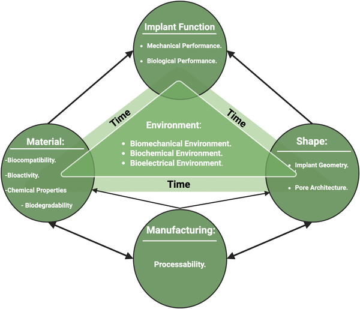
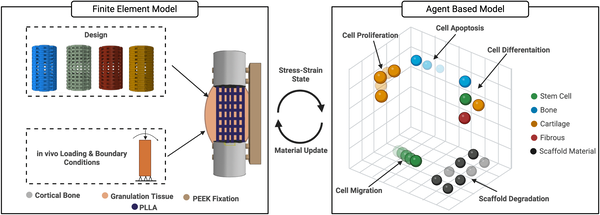
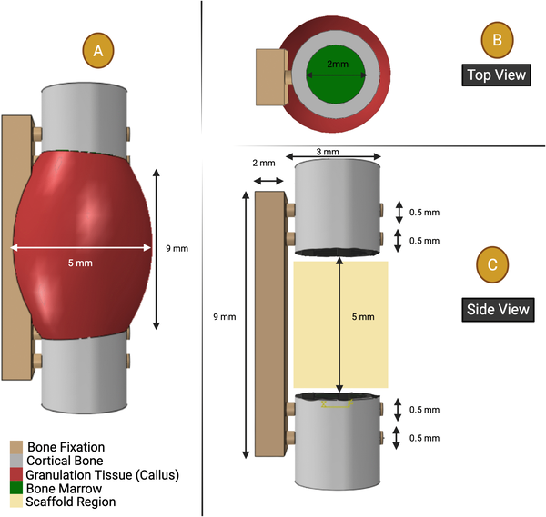

When bones break badly, doctors sometimes use synthetic scaffolds—tiny 3D frameworks designed to support and encourage new bone growth. But it turns out that not just what these scaffolds are made of, but how they are shaped, can dramatically influence how well they work. Recent research has developed a novel computer model that simulates how scaffold architecture affects both the scaffold’s breakdown and the body’s bone regeneration, offering new insights to improve implant design.

> **TL;DR**
> - The shape and porosity of bone scaffolds significantly affect how they degrade and how much new bone tissue forms.
> - A new computational model combining mechanical stress, cell behavior, and scaffold degradation offers a powerful tool to optimize scaffold designs before physical testing.

Bone tissue scaffolds are artificial structures used to help repair large bone defects. Traditionally, research has focused on finding the best materials for these scaffolds, like biodegradable polymers. However, bones aren’t solid—they have a porous, complex internal structure that supports cell growth and nutrient flow. Mimicking this architecture is crucial. Larger pores can help cells migrate and blood vessels grow but may weaken the scaffold mechanically. Finding the right balance between biological function and mechanical stability is a key challenge. Until now, exploring all possible scaffold shapes experimentally has been slow and costly.

To tackle this, researchers developed a detailed computer simulation that combines a finite element model (a method to analyze mechanical forces) with an agent-based model that simulates individual cell behaviors and scaffold degradation over time. They modeled a rat femur with a bone defect fixed by a plate and implanted with scaffolds made of poly-L-lactic acid, a common biodegradable polymer. Four scaffold designs with different filament thicknesses and porosities were tested virtually over 90 days. The model incorporated how mechanical loading during movement affects cells and how the scaffold’s shape changes as it degrades, influencing the mechanical environment and cell responses.

The simulations showed that scaffold architecture plays a major role in both degradation and bone formation. For example, scaffolds with thicker filaments (0.6 mm) produced more than twice the volume of new bone compared to thinner filaments (0.2 mm) after 90 days. Higher porosity scaffolds allowed 31% more cell migration, which is crucial for healing. The model also revealed how degradation alters mechanical stresses, which in turn affects cell behavior and tissue regeneration. This integrated approach is the first to combine degradation kinetics, mechanical environment, and cellular activity in a single computational framework.

This work highlights that scaffold design isn’t just about material choice but also about shape and structure. By using such mechanobiological models, researchers and engineers can predict how different scaffold architectures will perform, reducing the need for extensive physical experiments. This can accelerate the development of better implants that support faster and more effective bone healing. Ultimately, this approach could lead to personalized scaffold designs tailored to individual patients’ needs and injury types.

While promising, the model currently simplifies some biological complexities. It does not yet include factors like localized pH changes, chemical autocatalysis affecting degradation rates, or the growth of new blood vessels (angiogenesis), all of which are important in real bone healing. The model was partially validated with experimental data but further in vivo studies are needed to confirm predictions. Future improvements will aim to incorporate these biological factors for even more accurate simulations.

## Figures

*Diagram showing how material, shape, manufacturing, environment, and time affect how implants work.*

*A detailed model links physical forces and cell behavior to study tissue changes.*

*Diagram showing the bone healing area, bone marrow size, and bone with screws fixing a 5 mm rat thigh bone injury.*

## Sources

- [Tissue scaffold architecture affects implant degradation and bone tissue regeneration: A novel in silico mechanobiological model analysing cell behavior, mechanical stress and degradation kinematics](https://journals.plos.org/plosone/article?id=10.1371/journal.pone.0349708)
- DOI: [10.1371/journal.pone.0349708](https://doi.org/10.1371/journal.pone.0349708)
