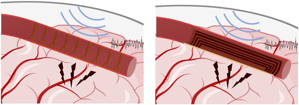
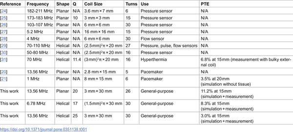

Imagine a future where brain implants don’t require wires threading through your skin or blood vessels, eliminating infection risks and mechanical failures. What if tiny coils inside your blood vessels could receive power wirelessly through your skull, enabling neural stimulation and recording with minimal invasiveness? This is the vision driving recent advances in endovascular neural interfaces (ENIs), and a new study explores how to efficiently deliver wireless power to these devices safely and reliably.

> **TL;DR**
> - Researchers designed and tested miniature coils that can be placed inside blood vessels to wirelessly receive power through the skull, eliminating the need for long transvascular wires.
> - Using computational models, benchtop experiments, and in vivo tests in sheep, the team demonstrated that up to 72 milliwatts of power can be safely delivered at clinically relevant depths, with optimized coil designs improving efficiency and tolerance to misalignment.

Implantable neural devices like deep brain stimulators have transformed treatment of neurological disorders but require invasive surgery and carry risks such as infection and mechanical failure. Endovascular neural interfaces offer a less invasive alternative by placing electrodes inside blood vessels near brain tissue. However, current ENIs rely on long wires running from the brain to a chest implant, which pose infection risks, can disrupt blood flow, and are prone to wear and breakage. Removing these wires to create fully wireless ENIs would improve safety and reliability, but powering devices wirelessly through tissue and bone while meeting safety limits on electromagnetic exposure is a major challenge.

The researchers designed two types of receiver coils—planar coils printed on flexible substrates and helical coils shaped like tiny springs—to fit inside blood vessels about 3 millimeters in diameter. Corresponding wearable transmitter coils were designed to sit on the scalp and generate magnetic fields aligned with the receiver coils. Using computational electromagnetic simulations, benchtop coil measurements in tissue-mimicking environments, and in vivo experiments in anesthetized sheep, the team evaluated power transfer efficiency, coil quality factors, and safety metrics like specific absorption rate (SAR). They tested different coil geometries, operating frequencies (6.78 MHz and 13.56 MHz), and the effect of ferrite cores to enhance magnetic flux and improve power delivery.

The study found that inductive power transfer could deliver clinically relevant power levels to endovascular coils placed up to 30 millimeters deep, with power transfer efficiencies reaching 11% at 15 millimeters depth and 2% at 30 millimeters. The planar coil design performed best at shallower depths (≤15 mm), while a ferrite-core flux-pipe transmitter coil paired with a helical receiver coil outperformed at greater depths (~20 mm and beyond) and was more tolerant to coil misalignment. The system could safely deliver up to 72 milliwatts at 30 millimeters depth without exceeding SAR safety limits, sufficient to power multichannel neural interfaces for stimulation and recording.

This work demonstrates the feasibility of fully wireless endovascular neural interfaces, potentially transforming neural implant technology by eliminating long transvascular wires. Removing these wires could reduce infection risk, avoid blood flow disturbances, and improve mechanical reliability, making neural implants safer and more practical for long-term clinical use. The optimized coil designs and operating frequencies provide practical guidance for developing wearable transmitters and implantable receivers that can work reliably in real-world conditions. This advance brings us closer to minimally invasive brain implants that can be powered and controlled wirelessly through the skull.

While the results are promising, the power transfer efficiencies remain relatively low, especially at greater depths, which may limit the power available for some neural stimulation applications. The in vivo tests were conducted in anesthetized sheep, and human anatomy and movement may present additional challenges for coil alignment and stability. Long-term safety and durability of the implanted coils inside blood vessels also require further study. Moreover, the system’s ability to support simultaneous data communication alongside power transfer was not addressed here and will be important for practical neural interface operation.

## Figures

*Wireless devices with spiral or flat coils used to stimulate and record brain activity.*

*Overview of wireless devices used inside blood vessels from various studies.*

## Sources

- [Toward a fully wireless endovascular neural interface: Evaluating power transfer efficacy](https://journals.plos.org/plosone/article?id=10.1371/journal.pone.0351138)
- DOI: [10.1371/journal.pone.0351138](https://doi.org/10.1371/journal.pone.0351138)
