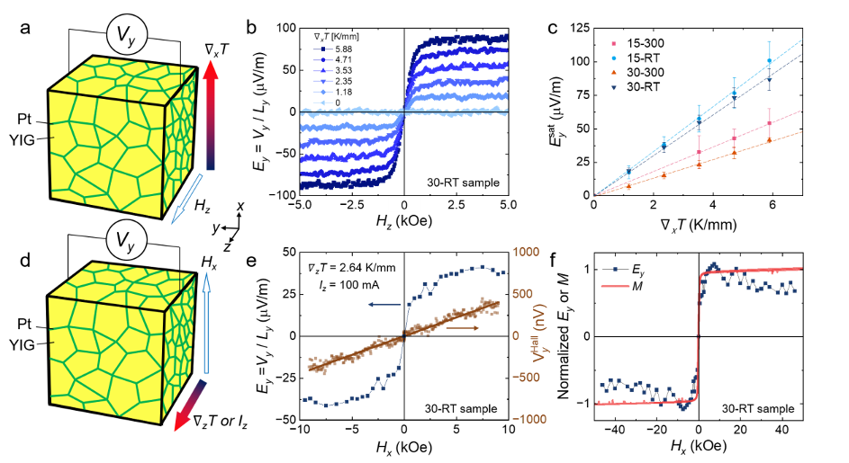
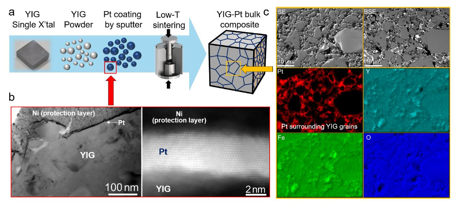
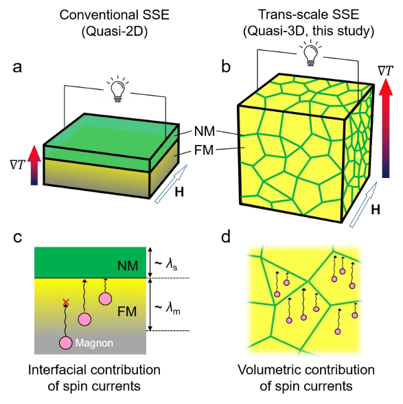
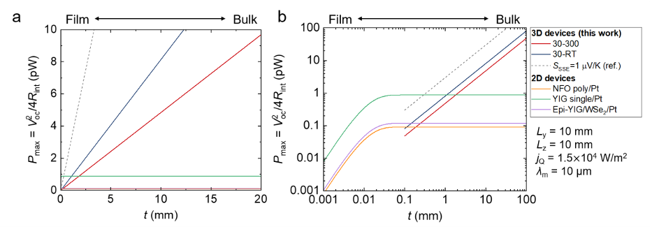

Scientists have found a way to boost energy harvesting by scaling up tiny spin currents into bulk materials. By combining magnetic powders coated with platinum into a three-dimensional composite, they have created a new platform that converts heat into electricity more effectively than traditional nanoscale thin-film devices.

> **TL;DR**
> - The spin Seebeck effect (SSE) converts heat into electrical voltage via spin currents in magnetic materials, but conventional devices are limited to thin films with low power output.
> - This study demonstrates a trans-scale SSE in bulk composites made of platinum-coated yttrium iron garnet powders, enabling scalable, isotropic thermoelectric power generation beyond nanoscale constraints.

*Note: this summary is based on a preprint — research shared ahead of formal peer review.*

The spin Seebeck effect (SSE) is a phenomenon where a temperature gradient applied to a magnetic material generates spin currents—flows of spin angular momentum carried by magnons or electrons. When these spin currents enter an adjacent normal metal like platinum, they are converted into an electric voltage through the inverse spin Hall effect. This transverse thermoelectric effect offers an intriguing route for energy harvesting, especially since it can work in magnetic insulators where conventional charge-based thermoelectrics fail. However, the practical use of SSE has been hampered by fundamental limits: the spin and magnon diffusion lengths restrict device thickness to just a few nanometers or micrometers, confining SSE devices to thin-film architectures with limited power output. Overcoming these nanoscale constraints to build bulk-scale devices has been a longstanding challenge.

To tackle this challenge, the researchers developed a novel fabrication technique involving dynamic powder sputtering to coat yttrium iron garnet (YIG) powders uniformly with a thin layer of platinum, about 5 nanometers thick. These Pt-coated powders were then sintered at relatively low temperatures to form mechanically robust, three-dimensional bulk composites with continuous platinum channels embedded throughout the magnetic matrix. This architecture contrasts with conventional planar thin films by distributing the normal metal and magnetic insulator interfaces throughout the bulk, enabling volumetric utilization of spin currents. The team prepared samples with different platinum thicknesses and sintering conditions, then performed transverse thermoelectric measurements under various magnetic field and temperature gradient configurations to characterize the spin Seebeck effect in these composites.

The experiments revealed clear spin Seebeck signals in the bulk composites, consistent across different magnetothermal configurations, demonstrating isotropic SSE behavior at the macroscopic scale. Notably, the transverse electric voltage scaled linearly with the applied temperature gradient, confirming the thermoelectric origin of the signal. Samples sintered at room temperature showed higher spin Seebeck coefficients compared to those sintered at elevated temperatures, highlighting the importance of fabrication conditions. Electrical conductivity measurements indicated continuous platinum pathways, while thermal conductivity was reduced relative to pure YIG, likely due to phonon scattering at interfaces and pores. Power factor analysis suggested that the three-dimensional composite architecture enables scalable thermoelectric power generation beyond the limitations imposed by spin and magnon diffusion lengths in thin films.

This work represents a significant advance in spin caloritronics by bridging nanoscale quantum spin phenomena with macroscopic device integration. By moving beyond thin-film constraints, the demonstrated bulk composites open new possibilities for scalable and robust thermoelectric devices that harvest waste heat from insulating materials. The approach leverages the unique advantages of the spin Seebeck effect—such as simplified device architectures and compatibility with magnetic insulators—while overcoming previous power output limitations. This scalable platform could accelerate the development of practical spin-based thermoelectric generators and contribute to more efficient energy harvesting technologies.

Despite these promising results, the overall thermopower and power output remain modest compared to conventional thermoelectric materials, and further optimization is needed to enhance efficiency. The fabrication process requires precise control to maintain uniform platinum coatings and continuous conductive channels, which could pose scalability challenges. Additionally, while the isotropic SSE signals in bulk composites are encouraging, long-term stability and device integration under real-world conditions have yet to be demonstrated. Future work will need to address these aspects to fully realize the potential of bulk spin Seebeck thermoelectrics.

## Figures

*This figure shows how temperature differences and magnetic fields create electric signals in different directions in a material. — Figure from Sang J. Park et al., [CC BY 4.0](http://creativecommons.org/licenses/by/4.0/), caption edited.*

*YIG powders are coated with platinum and sintered to create composites with uniform structure and element distribution for spin Seebeck effect studies. — Figure from Sang J. Park et al., [CC BY 4.0](http://creativecommons.org/licenses/by/4.0/), caption edited.*

*This figure compares traditional thin-film spin Seebeck devices with a new bulk composite design that boosts energy conversion by using more efficient local channels. — Figure from Sang J. Park et al., [CC BY 4.0](http://creativecommons.org/licenses/by/4.0/), caption edited.*

*Graph shows how output power changes with magnetic layer thickness in spin Seebeck devices under fixed heat and size conditions. — Figure from Sang J. Park et al., [CC BY 4.0](http://creativecommons.org/licenses/by/4.0/), caption edited.*

## Sources

- [Trans-scale spin Seebeck effect in nanostructured bulk composites based on magnetic insulator](https://arxiv.org/abs/2509.08327)
- DOI: [10.1038/s41467-026-75232-0](https://doi.org/10.1038/s41467-026-75232-0)

*This article reuses and adapts text and figures from the original research by Sang J. Park et al., available via Nat. Commun. 17, 6389 (2026), under the [CC BY 4.0](http://creativecommons.org/licenses/by/4.0/) license.*
