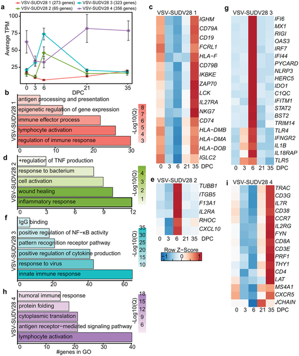

How can a single vaccine dose protect against a deadly virus in just one week? Sudan virus, a highly lethal pathogen responsible for severe outbreaks, has long challenged scientists due to the lack of approved vaccines. Recent research using a novel vaccine platform shows not only rapid protection but also reveals the immune system’s molecular choreography behind this swift defense.

> **TL;DR**
> - A single dose of a vesicular stomatitis virus-based vaccine expressing Sudan virus glycoprotein protects nonhuman primates from lethal infection even when given just 7 days before exposure.
> - Distinct transcriptional (gene expression) signatures reveal that rapid protection involves a recall adaptive immune response and controlled inflammation, differing from non-protective vaccine responses.

Sudan virus (SUDV) is a member of the filovirus family, which also includes Ebola virus. It causes Sudan virus disease with fatality rates ranging from 41% to 100%. Despite its deadly nature and outbreak potential, no approved vaccines currently exist. Past vaccine efforts targeting related viruses like Ebola have shown limited cross-protection against SUDV, highlighting the need for species-specific vaccines. One promising approach uses a recombinant vesicular stomatitis virus (VSV) engineered to express the Sudan virus glycoprotein (VSV-SUDV). Previous studies demonstrated that a single dose of this vaccine can protect macaques from lethal SUDV challenge, but the molecular mechanisms behind this rapid protection remained unclear.

In this study, researchers vaccinated cynomolgus macaques with either VSV-SUDV or a control vaccine targeting Ebola virus (VSV-EBOV). Animals received the vaccines either 28 days or 7 days before being exposed to a lethal dose of Sudan virus. Blood samples collected over time were analyzed using bulk RNA sequencing to measure gene expression changes. Advanced computational tools — including EdgeR, STEM, MaSigPro, and CIBERSORTx — helped identify patterns in gene activity and estimate immune cell populations. This approach allowed the team to compare molecular responses between protective and non-protective vaccination scenarios and to track how timing influenced immune activation.

The study found that VSV-SUDV vaccination triggered a distinct and robust gene expression response compared to the Ebola-targeting vaccine. Notably, animals vaccinated with VSV-EBOV showed signs of dysregulated inflammation after Sudan virus challenge and succumbed to infection. In contrast, VSV-SUDV vaccinated macaques exhibited gene expression patterns consistent with a recall adaptive immune response, indicating the immune system was primed to respond effectively. This response included activation of genes related to antibody production, antigen presentation, and immune regulation. Remarkably, even vaccination just 7 days before exposure induced protective humoral immunity and controlled inflammation. Computational analysis also revealed shifts in immune cell populations, such as increases in memory T cells and resolution-associated cells, only in the protected group.

These findings provide valuable insight into how a single-dose VSV-based vaccine can rapidly protect against a highly lethal virus. Understanding the molecular signatures of protection helps clarify why some vaccines succeed while others fail, guiding future vaccine design and outbreak response strategies. The ability to induce protection within a week is especially important for controlling sudden outbreaks of Sudan virus, where time is critical. This work supports the potential use of VSV-SUDV as a rapid-response vaccine to contain future epidemics and improve global health preparedness.

While the study offers compelling molecular evidence from a well-established nonhuman primate model, translating these findings to humans will require further clinical testing. The transcriptional data provide snapshots of immune activity but cannot capture all aspects of immune protection, such as cellular interactions or long-term memory. Additionally, the study focused on a specific vaccine platform and virus strain; responses may vary with different vaccine formulations or viral variants. Nonetheless, these results represent a significant step toward understanding rapid vaccine-induced immunity against Sudan virus.

## Figures

*Graphs show gene activity changes linked to protection from deadly disease after VSV-SUDV28 exposure.*

## Sources

- [Transcriptional signatures of rapid protection from Sudan virus infection by a single dose of a vesicular stomatitis virus-based vaccine](https://journals.plos.org/plospathogens/article?id=10.1371/journal.ppat.1014143)
- DOI: [10.1371/journal.ppat.1014143](https://doi.org/10.1371/journal.ppat.1014143)
