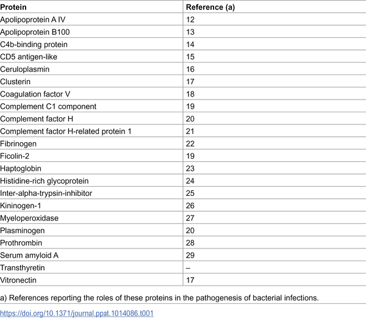
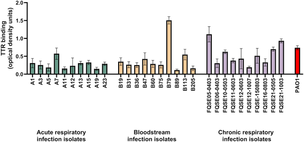
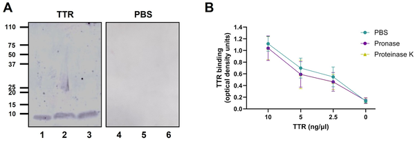
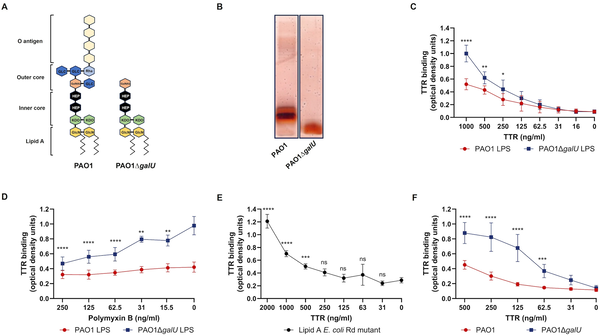

Did you know that a common protein in your blood, best known for transporting thyroid hormones, doubles as a natural antibiotic? Scientists have uncovered that transthyretin, a protein you might not have associated with immunity before, can bind to and kill harmful bacteria like Pseudomonas aeruginosa, a notorious pathogen responsible for severe infections. This discovery opens an intriguing window into our body's innate defenses and hints at new ways to fight antibiotic-resistant bacteria.

> **TL;DR**
> - Transthyretin (TTR), traditionally known as a thyroid hormone and retinol carrier, binds directly to the lipid A portion of Gram-negative bacterial lipopolysaccharide (LPS), causing bacterial clumping and reducing their viability.
> - A small peptide derived from TTR's N-terminal region disrupts bacterial membranes and kills a broad range of Gram-negative bacteria, revealing a hidden antimicrobial function of this human protein.

Pseudomonas aeruginosa is a common but dangerous bacterium that causes serious infections, especially in hospitalized patients and those with weakened immune systems. It is notoriously resistant to many antibiotics, making infections difficult to treat. While our innate immune system uses various proteins and cells to fight infections, the interactions between P. aeruginosa and these defenses are not fully understood. Transthyretin (TTR) is a protein circulating in our blood and cerebrospinal fluid, mainly known for carrying thyroid hormone and vitamin A. Until now, it was not known to play a role in immune defense against bacteria.

Researchers used an unbiased proteomic approach to identify human serum proteins that bind to P. aeruginosa. By incubating bacteria with human serum and analyzing the proteins that attached to the bacterial surface, they discovered TTR as a novel binding partner. They confirmed this interaction across multiple clinical bacterial isolates using antibody detection methods. To pinpoint the bacterial target, they tested whether TTR binds to bacterial proteins or lipopolysaccharides (LPS), the sugar-lipid molecules on the bacterial surface. Enzyme treatments and binding assays revealed that TTR specifically binds to the lipid A portion of LPS. Further experiments used confocal microscopy and flow cytometry to observe how TTR causes bacteria to clump together and assessed bacterial survival after exposure to TTR and synthetic peptides derived from its structure.

The study found that transthyretin binds strongly to the lipid A part of the bacterial LPS, a conserved molecule on Gram-negative bacteria. This binding causes bacteria to agglutinate, or clump together, which correlates with a reduction in bacterial viability. Importantly, the bactericidal activity was mapped to the N-terminal region of TTR. A synthetic peptide from this region, called TTR1′, was able to disrupt bacterial membranes and kill a broad range of Gram-negative bacteria, including multiple clinical isolates of P. aeruginosa. These effects were observed at physiological concentrations of TTR, suggesting relevance in natural human immunity.

This discovery expands our understanding of transthyretin beyond its classical role as a hormone carrier. It reveals that TTR is an innate immune effector with direct antimicrobial properties, particularly against Gram-negative pathogens that are often resistant to antibiotics. The identification of a natural human protein that can bind and kill bacteria by targeting their membranes offers exciting possibilities for developing new antimicrobial therapies. Moreover, it suggests that other amyloidogenic proteins in the body might also have hidden roles in host defense, opening new avenues for research into innate immunity.

While these findings are promising, they are primarily based on laboratory experiments using purified proteins and bacterial cultures. The exact role of transthyretin in human infections and its effectiveness in complex biological environments remain to be fully understood. Additionally, the therapeutic potential of TTR-derived peptides requires further investigation, including safety and efficacy studies in animal models and humans. As with all early-stage discoveries, translating these insights into clinical applications will take time and careful research.

## Figures

*List of human blood proteins that attach to the P. aeruginosa PAO1 bacteria.*

*Transthyretin binds to P. aeruginosa bacteria from patients and a lab strain, shown by measuring how much protein sticks to the cells.*

*Scientists found where transthyretin binds on P. aeruginosa bacteria by testing protein and sugar parts after enzyme treatments.*

*This figure shows how the protein TTR binds to bacterial molecules called LPS and lipid A from different strains and mutants.*

## Sources

- [Transthyretin is a novel innate immune effector against Gram negative bacteria](https://journals.plos.org/plospathogens/article?id=10.1371/journal.ppat.1014086)
- DOI: [10.1371/journal.ppat.1014086](https://doi.org/10.1371/journal.ppat.1014086)
