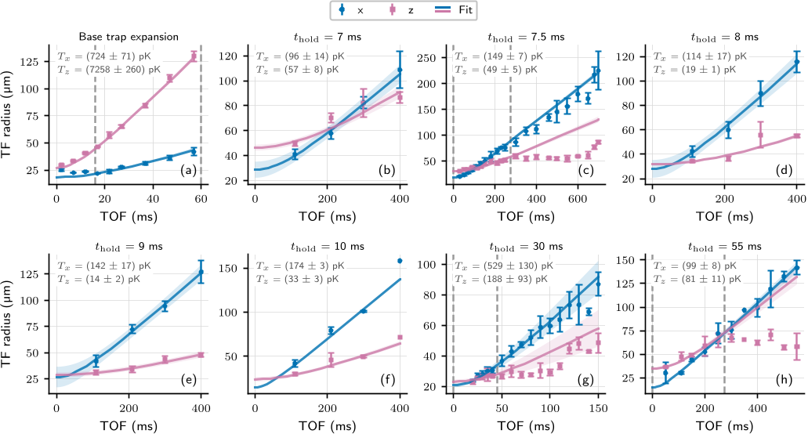
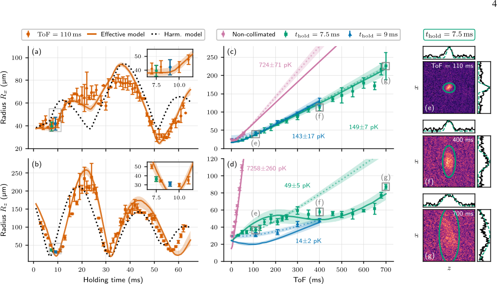
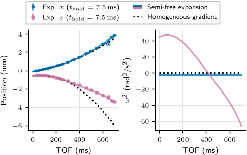

How do scientists cool atoms to near absolute zero in space, and why does it matter? Imagine a cloud of atoms so cold and still that their quantum nature becomes visible, drifting almost motionless in the weightless environment of the International Space Station (ISS). This ultra-cold state allows physicists to explore fundamental questions about gravity and quantum mechanics with extraordinary precision. Recently, researchers have unveiled a novel method called trap-quenched collimation, which refines the control over these atomic clouds in microgravity, opening new frontiers in space-based quantum experiments.

> **TL;DR**
> - A new trap-quenched collimation technique was demonstrated aboard NASA’s Cold Atom Laboratory on the ISS, achieving record-low expansion energies of ultra-cold rubidium atoms in microgravity.
> - This method promises to enable dual-species atomic experiments in space, crucial for precision tests of Einstein’s Universality of Free Fall and other fundamental physics investigations.

*Note: this summary is based on a preprint — research shared ahead of formal peer review.*

Testing the Universality of Free Fall (UFF) — the principle that all objects fall at the same rate regardless of their composition — is a cornerstone of Einstein’s theory of General Relativity. While classical experiments have tested this principle to high precision, quantum systems like Bose-Einstein condensates (BECs) offer a promising new avenue to push these tests even further. In space, where gravity is effectively neutralized, ultra-cold atoms can be observed for longer times without falling, increasing the sensitivity of measurements. However, controlling the motion and expansion of these atomic clouds, especially when working with mixtures of different atomic species, is technically challenging. The new trap-quenched collimation technique addresses these challenges by precisely tuning the atomic cloud’s size and momentum, enabling extended free-fall times and minimal expansion velocities.

The trap-quenched collimation technique involves manipulating the magnetic traps that hold the atoms. Initially, the atoms are cooled and confined in a tight trap. Then, by suddenly relaxing the trap’s strength — a process called 'trap quenching' — the atomic cloud is allowed to oscillate in size inside the weaker trap. By timing the release of the atoms to coincide with the cloud’s maximal expansion inside the trap, the researchers minimize the atoms’ momentum spread upon release. This process also includes exciting collective oscillations within the cloud to increase the amplitude of size oscillations, further reducing expansion energy. The team implemented this method using the Cold Atom Laboratory aboard the ISS, employing a single-species rubidium-87 Bose-Einstein condensate as a testbed. They carefully calibrated and modeled the center-of-mass dynamics and trap parameters to optimize the procedure.

Using this approach, the researchers achieved free expansion times of up to 700 milliseconds, significantly longer than typical ground-based experiments. They measured two-dimensional expansion energies as low as approximately 78 picokelvin (pK) in the imaging plane, with detailed modeling suggesting even lower energies around 15 pK along certain axes of the condensate. These ultra-low expansion energies correspond to atomic clouds that drift extremely slowly, enabling longer observation times and higher measurement precision. The team also theoretically extended their technique to a dual-species mixture of potassium-41 and rubidium-87 atoms, predicting that simultaneous collimation meeting the stringent requirements for state-of-the-art UFF tests at the 10^-15 accuracy level is achievable.

This work represents a significant advance in the control of ultra-cold atomic gases in space, a critical step toward using quantum sensors for precision tests of fundamental physics. The ability to prepare dual-species quantum mixtures with minimal expansion and controlled center-of-mass motion is essential for atom interferometry experiments that probe the equivalence principle and search for new physics beyond General Relativity. Moreover, the trap-quenched collimation technique’s compatibility with atom-chip setups and its robustness against complex dynamics make it a promising tool for future space missions. Beyond fundamental tests, these methods could enhance quantum technologies such as ultra-sensitive inertial sensors and contribute to our understanding of few-body physics and quantum many-body phenomena in microgravity.

While the demonstrated trap-quenched collimation technique shows impressive control over single-species condensates, extending it to dual-species mixtures introduces additional complexities, such as differing trap frequencies and residual center-of-mass displacements. The theoretical predictions for dual-species collimation await experimental validation. Furthermore, the technical demands of operating such delicate quantum experiments in the harsh environment of space remain significant. The concepts and results, while promising, are specialized and require careful interpretation. Visualizing the atomic cloud dynamics is challenging for non-experts, and the practical deployment of these techniques in future space missions will depend on continued engineering and experimental refinements.

## Figures

*Graph shows how particles expand over time after release, with fits highlighting energy and uncertainties in different directions. — Figure from Gabriel Müller et al., [CC BY 4.0](http://creativecommons.org/licenses/by/4.0/), caption edited.*

*This figure shows how changing trap conditions affects the size and expansion of a cooled atom cloud over time, with models matching experimental data. — Figure from Gabriel Müller et al., [CC BY 4.0](http://creativecommons.org/licenses/by/4.0/), caption edited.*

*We tracked how atoms moved after release, showing complex magnetic effects change their path, especially along the z-axis, over time. — Figure from Gabriel Müller et al., [CC BY 4.0](http://creativecommons.org/licenses/by/4.0/), caption edited.*

## Sources

- [Trap-Quenched Matter-Wave Optics in Space](https://arxiv.org/abs/2606.14577)
- DOI: [10.48550/arxiv.2606.14577](https://doi.org/10.48550/arxiv.2606.14577)

*This article reuses and adapts text and figures from the original research by Gabriel Müller et al., available via arXiv Quantum Physics, under the [CC BY 4.0](http://creativecommons.org/licenses/by/4.0/) license.*
