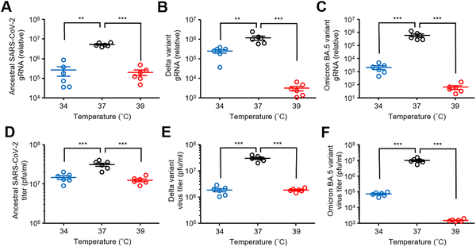
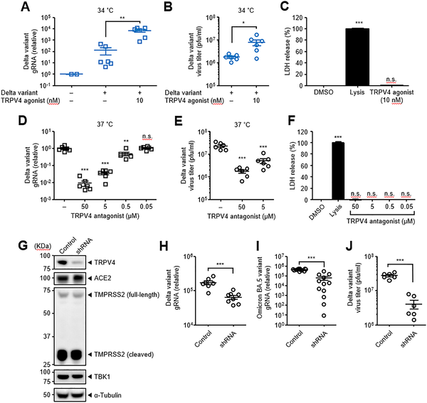
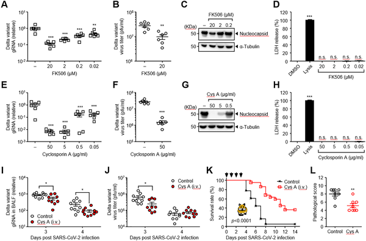

Have you ever wondered why the COVID-19 virus seems to thrive inside our bodies at normal body temperature? Scientists have discovered that a temperature-sensitive protein channel called TRPV4 plays a key role in helping SARS-CoV-2 replicate efficiently at 37°C, the typical core body temperature. Intriguingly, drugs already approved for other uses, such as the blood pressure medication manidipine, can block this channel and reduce viral replication, offering hope for new treatment strategies.

> **TL;DR**
> - SARS-CoV-2, including Delta and Omicron variants, replicates most efficiently at 37°C, the human core body temperature.
> - The TRPV4 calcium channel, activated at this temperature, facilitates viral replication, and blocking it with drugs like manidipine reduces infection severity in animal models.

Respiratory viruses often show temperature-dependent behavior, replicating differently in the cooler upper respiratory tract versus the warmer lower respiratory tract. For SARS-CoV-2, this temperature sensitivity is especially relevant because the nasal cavity is cooler (around 33–35°C), while the lungs and core body maintain about 37°C. Fever, a common symptom of COVID-19, raises body temperature further, potentially influencing viral replication. Understanding how temperature affects SARS-CoV-2 replication could reveal new targets for therapy, especially since the virus continues to evolve and challenge existing treatments.

Researchers infected cultured cells with ancestral SARS-CoV-2, Delta, and Omicron BA.5 variants and incubated them at different temperatures (34°C, 37°C, and 39°C). They measured viral replication by quantifying viral RNA and infectious virus particles. To explore the role of TRPV4, a temperature-sensitive calcium channel activated at 37°C, they used specific chemical agonists and antagonists, as well as genetic knockdown techniques to reduce TRPV4 expression. Calcium influx was monitored using fluorescence assays. Finally, they tested FDA-approved drugs known to block calcium channels, including manidipine, in cell cultures and in Syrian hamsters infected with the Delta variant to assess their potential to reduce viral replication and disease severity.

The study found that all SARS-CoV-2 variants tested replicated best at 37°C compared to cooler or hotter temperatures. Activation of the TRPV4 channel increased viral replication at lower temperatures, while blocking TRPV4 reduced replication at 37°C. Genetic knockdown of TRPV4 similarly diminished viral growth, highlighting its role in temperature-dependent viral proliferation. Importantly, treatment with manidipine, a calcium channel blocker approved for hypertension, suppressed viral replication in cells and protected hamsters from lethal SARS-CoV-2 Delta infection. Another selective TRPV4 antagonist also provided protection in animal models, confirming the channel’s critical role in supporting efficient viral replication at body temperature.

This research uncovers a previously underappreciated mechanism by which SARS-CoV-2 exploits a host’s temperature-sensitive calcium channel to enhance its replication. The identification of TRPV4 as a facilitator of viral growth at 37°C not only advances our understanding of virus-host interactions but also points to a practical therapeutic opportunity. Since manidipine is already FDA-approved for treating high blood pressure, repurposing it as an anti-COVID-19 drug could accelerate the development of new treatments, especially for severe cases where controlling viral replication is crucial. This approach might complement existing vaccines and antivirals, broadening our arsenal against COVID-19 and its variants.

While the findings are promising, it is important to recognize that results in cell cultures and animal models do not always translate directly to humans. Further clinical studies are needed to evaluate the safety and efficacy of manidipine or other TRPV4 blockers in COVID-19 patients. Additionally, the role of TRPV4 may vary depending on the viral variant and host factors, and blocking calcium channels could have side effects given their involvement in many physiological processes. Therefore, careful investigation is required before these findings can inform clinical practice.

## Figures

*SARS-CoV-2 variants, including Delta and Omicron, replicate differently at various temperatures in lab-grown cells over 24-48 hours.*

*TRPV4 affects SARS-CoV-2 Delta variant replication in cells, with agonists and antagonists altering virus levels without harming cells.*

*Calcineurin inhibitors FK506 and cyclosporine A reduce SARS-CoV-2 Delta variant replication in infected cells without harming cell health.*

## Sources

- [TRPV4-mediated calcium influx contributes temperature-dependent SARS-CoV-2 replication](https://journals.plos.org/plospathogens/article?id=10.1371/journal.ppat.1014520)
- DOI: [10.1371/journal.ppat.1014520](https://doi.org/10.1371/journal.ppat.1014520)
