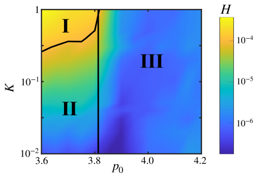
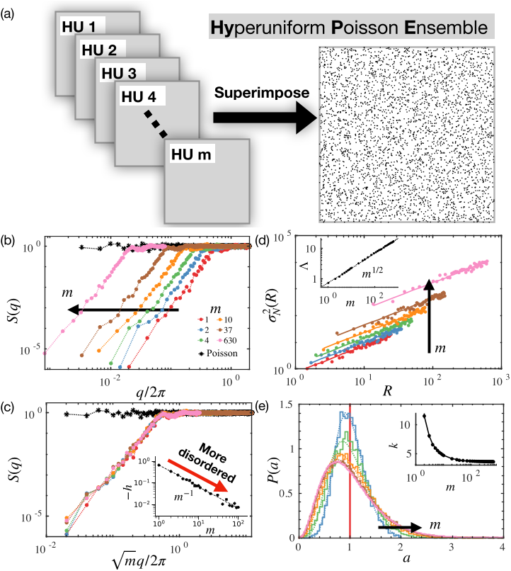

Imagine a material that looks random and disordered at first glance—like a liquid—but hides a secret: it suppresses large-scale fluctuations with a precision usually reserved for crystals. This curious state of matter, known as hyperuniformity, blends the best of both worlds and promises exciting applications in optics, acoustics, and beyond. Recent research has uncovered how tuning tiny mechanical forces in cellular structures can create and control this hidden order, potentially revolutionizing how we design materials with extraordinary properties.

> **TL;DR**
> - Hyperuniformity is a unique state where materials appear disordered yet suppress density fluctuations like crystals, leading to exotic optical and transport behaviors.
> - By adjusting mechanical parameters in a vertex model of cellular structures, researchers can independently tune hyperuniformity and rigidity, creating a continuous spectrum of states with practical applications in metamaterials.

*Note: this summary is based on a preprint — research shared ahead of formal peer review.*

Hyperuniform systems occupy a fascinating middle ground between liquids and crystals. Unlike typical fluids, which show large density fluctuations over long distances, hyperuniform materials maintain uniformity at large scales despite local disorder. This hidden order has been observed in various natural and synthetic systems, including biological tissues and engineered materials. However, most methods to create hyperuniformity rely on algorithmic designs that lack physical realism, leaving open questions about the fundamental mechanical and thermodynamic principles behind such states. Biological tissues, with their complex yet regulated cellular arrangements, offer a promising platform to explore these principles in a physically grounded way.

The researchers employed a mechanical vertex model known as the Self-Propelled Voronoi (SPV) model to simulate densely packed cellular monolayers. In this framework, cells are represented as polygons filling space without gaps, with their shapes and arrangements governed by mechanical energy contributions from cell area and perimeter. Two key parameters control the system: cortical elasticity (K), reflecting the stiffness of the cell cortex, and the target shape index (p0), which balances cell adhesion and contractility, thereby influencing whether the tissue behaves like a solid or fluid. By systematically tuning these parameters and using computational simulations, the team explored how hyperuniformity emerges and varies across different mechanical regimes, analyzing structural order through metrics like the structure factor and spatial correlations.

The study revealed that hyperuniformity and mechanical rigidity can be tuned independently in cellular structures. When cortical elasticity is zero, enforcing equal cell areas leads to strictly hyperuniform states known as Equal Area Random (EAR) packings. Introducing finite elasticity allows a continuous range of hyperuniform states both in solid-like and fluid-like phases. Notably, hyperuniformity does not depend solely on whether the tissue is rigid or fluid but is primarily controlled by cell mechanics. The researchers also introduced a novel class of states called the Hyperuniform Poisson Ensemble (HyPE), formed by overlaying independent hyperuniform subsets. These HyPE states exhibit long-range hidden order while appearing nearly random at short scales, representing the most disordered hyperuniform systems known and establishing a fundamental thermodynamic lower bound on the information content of hyperuniform matter.

This work bridges the gap between cellular mechanics and the statistical physics of hidden order, providing a universal framework to design materials with tunable hyperuniformity. Such materials could be engineered for advanced applications including photonic bandgap devices that control light, phononic materials that manipulate sound, and composites responsive to mechanical stress. By demonstrating that hyperuniformity can be achieved and controlled through realistic mechanical interactions rather than artificial algorithms, the study opens new avenues for creating multifunctional metamaterials inspired by biological tissues. Furthermore, the concept of HyPE states introduces a fresh perspective on how disorder and order coexist, with implications for understanding information content in complex materials.

While the theoretical and computational results are robust, the study currently lacks experimental validation in real biological or synthetic systems. The models are athermal and do not incorporate thermal fluctuations or active cellular motility, which may influence hyperuniformity in living tissues. Additionally, the abstract nature of hyperuniformity and its measurement can be challenging to visualize and interpret outside specialized contexts. Future work is needed to experimentally realize these tunable hyperuniform states and to explore their dynamic behavior and practical implementation in material design.

## Figures

*This diagram shows how cell shape and elasticity create three states: non-hyperuniform solid, hyperuniform solid, and hyperuniform fluid. — Figure from Yiwen Tang et al., [CC BY 4.0](http://creativecommons.org/licenses/by/4.0/), caption edited.*

*This figure shows how Hyperuniform Poisson Ensemble states are generated and their self-similar patterns, density fluctuations, and cell area distributions. — Figure from Yiwen Tang et al., [CC BY 4.0](http://creativecommons.org/licenses/by/4.0/), caption edited.*

## Sources

- [Tunable Hyperuniformity and Hidden Information in Random Cellular Structures](https://arxiv.org/abs/2408.08976)
- DOI: [10.48550/arxiv.2408.08976](https://doi.org/10.48550/arxiv.2408.08976)

*This article reuses and adapts text and figures from the original research by Yiwen Tang et al., available via arXiv Materials Science, under the [CC BY 4.0](http://creativecommons.org/licenses/by/4.0/) license.*
