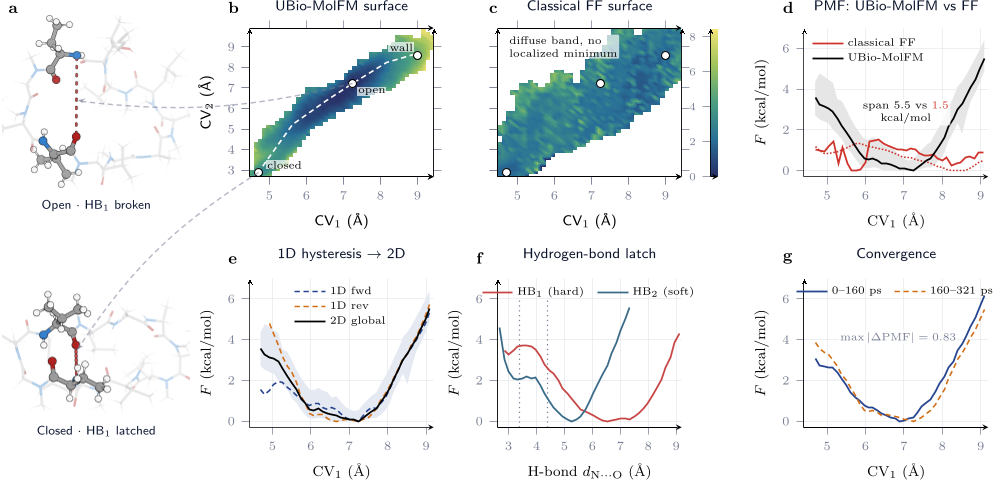
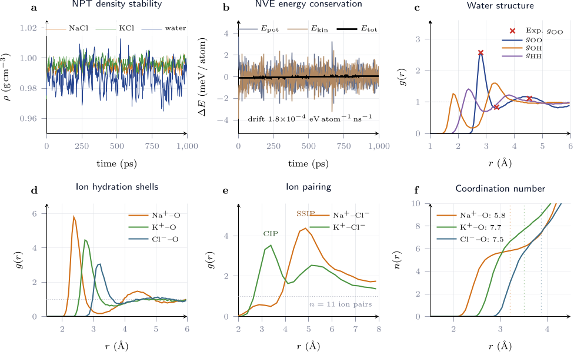
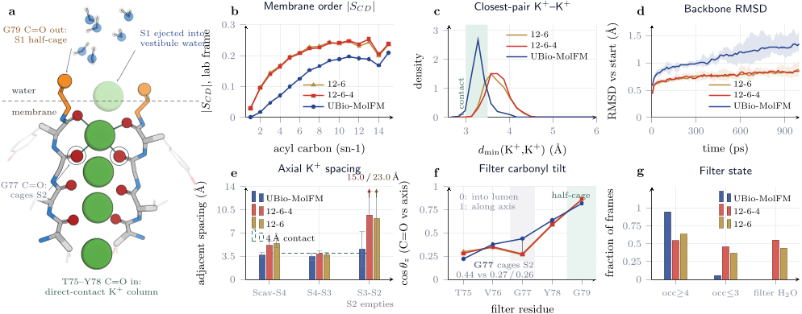
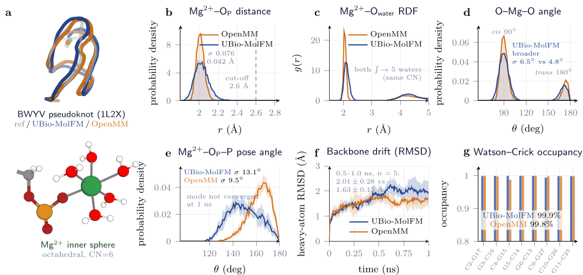

Imagine watching ions move through a protein channel in your body, atom by atom, with the precision of quantum mechanics. Until now, such detailed simulations were limited to tiny molecular systems due to computational costs. But a breakthrough AI-powered method called UBio-MolFM changes this, enabling researchers to simulate biomolecules with over 100,000 atoms at near quantum accuracy. This opens new doors to understanding how ion channels work, how drugs interact with membranes, and how biomolecules behave at an unprecedented scale.

> **TL;DR**
> - UBio-MolFM is a foundation model trained on 160 million quantum-chemical labels that enables near-DFT (density functional theory) accuracy simulations of biomolecules exceeding 100,000 atoms.
> - This method reveals new ion conduction geometries in potassium channels and accurately models complex biomolecular systems like RNA metal-binding sites and drug molecules without system-specific tuning.

*Note: this summary is based on a preprint — research shared ahead of formal peer review.*

Many critical biological processes—such as ion conduction, enzyme catalysis, and membrane permeation—depend on subtle electronic effects like polarization and charge transfer. Traditional quantum mechanical methods, like density functional theory (DFT), provide this detail but are limited to systems of a few hundred atoms due to their computational cost. On the other hand, classical force fields can simulate large biomolecules but sacrifice quantum accuracy, missing key electronic interactions. Bridging this gap has been a longstanding challenge in computational chemistry and molecular biology.

UBio-MolFM overcomes these challenges by leveraging a large, bio-specific quantum-chemical dataset called UBio-Mol26, which includes approximately 19 million quantum labels at multiple DFT fidelities, combined with the OMol25 dataset to total around 160 million labels. The model uses an advanced equivariant transformer architecture (E2Former-V2) with a hierarchical cutoff scheme to efficiently capture both short- and medium-range atomic interactions. Training occurs in three stages, including a novel force supervision step using autograd to ensure thermodynamic consistency and stable molecular dynamics. This design removes the need for system-specific parameterization and enables simulations of biomolecules with over 100,000 atoms on a single GPU.

The model accurately reproduces experimental water density and ion hydration structures, maintaining stable dynamics and energy conservation over nanosecond timescales. It faithfully captures the octahedral coordination of magnesium ions in RNA pseudoknots without ion-specific parameters, a regime where classical models often fail. In simulations of the 108,964-atom KcsA potassium channel, UBio-MolFM reveals a dehydrated, direct-contact four-ion column within the selectivity filter—an ion conduction geometry that fixed-charge classical models never form. Additionally, it accurately models the conformational energetics of cyclosporine A, a drug molecule, including subtle hydrogen bonding effects that classical models flatten. These results demonstrate the model’s ability to provide quantum-accurate insights into large biomolecular systems previously out of reach.

By enabling quantum-level simulations at biologically relevant scales, UBio-MolFM offers a powerful new tool for understanding fundamental biomolecular mechanisms such as ion conduction and drug permeation. This capability could transform drug design by allowing researchers to model complex molecular interactions with unprecedented accuracy, potentially leading to better-targeted therapeutics. Furthermore, the method’s generality and transferability mean it can be applied broadly across proteins, nucleic acids, and membranes without retraining or tuning, bridging a critical gap between quantum chemistry and large-scale biomolecular modeling.

While UBio-MolFM represents a major advance, it remains computationally expensive compared to classical force fields, limiting routine use to well-resourced research groups. The model’s accuracy, though near DFT quality, inherits some limitations of the underlying quantum methods, such as slight over-structuring of water and slower diffusion rates. Additionally, the approach currently focuses on equilibrium and near-equilibrium dynamics; simulating rare events or chemical reactions involving bond breaking may require further development. Nonetheless, this work lays essential groundwork for future improvements and broader adoption.

## Figures

*Cyclosporine A changes shape in water, showing a clear open-to-closed transition not captured by classical models, highlighting key molecular latch behavior. — Figure from Lin Huang et al., [CC BY 4.0](http://creativecommons.org/licenses/by/4.0/), caption edited.*

*Simulations accurately match water and salt densities, conserve energy, and replicate detailed water and ion structures seen in experiments. — Figure from Lin Huang et al., [CC BY 4.0](http://creativecommons.org/licenses/by/4.0/), caption edited.*

*Simulations show different models predict how potassium ions and water arrange in a cell membrane channel, affecting ion spacing and filter structure. — Figure from Lin Huang et al., [CC BY 4.0](http://creativecommons.org/licenses/by/4.0/), caption edited.*

*Simulations show two methods similarly keep magnesium ions bound in RNA, with slight differences in ion positioning and stability. — Figure from Lin Huang et al., [CC BY 4.0](http://creativecommons.org/licenses/by/4.0/), caption edited.*

## Sources

- [UBio-MolFM: Enabling Biomolecular Dynamics at DFT Accuracy and $10^5$ Atoms with One Untuned Potential](https://arxiv.org/abs/2608.18623)
- DOI: [10.48550/arxiv.2608.18623](https://doi.org/10.48550/arxiv.2608.18623)

*This article reuses and adapts text and figures from the original research by Lin Huang et al., available via arXiv Chemical Physics, under the [CC BY 4.0](http://creativecommons.org/licenses/by/4.0/) license.*
