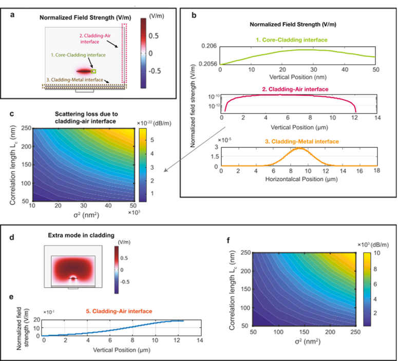
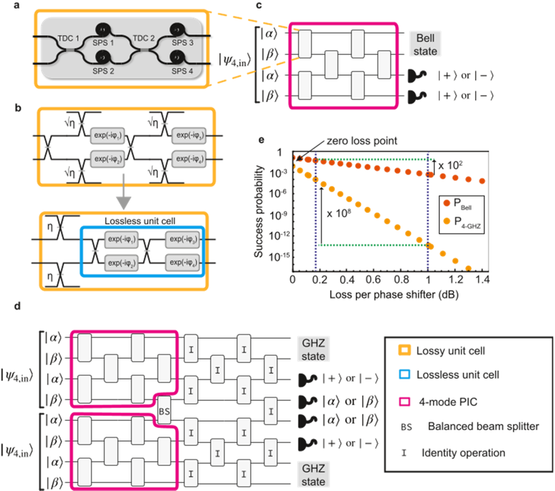

How can tiny circuits of light help build the quantum computers of tomorrow? Quantum photonics—the science of manipulating single photons on integrated chips—holds great promise for powerful quantum technologies. Yet, creating photonic circuits that operate efficiently at visible wavelengths, where many quantum devices naturally work, remains a challenge. A recent breakthrough combines ultra-low loss silicon nitride waveguides with fast, low-power piezo-optomechanical modulation, offering a new path toward scalable, reconfigurable quantum photonic circuits.

> **TL;DR**
> - The researchers developed a low-confinement silicon nitride photonic platform with record-low optical losses (2.6 dB/m at 780 nm) and efficient piezo-optomechanical phase modulation.
> - This platform supports fast (megahertz-scale), low-power, and low-hysteresis modulation, enabling deep reconfigurable circuits essential for visible-wavelength quantum photonic computing.

*Note: this summary is based on a preprint — research shared ahead of formal peer review.*

Quantum photonic circuits manipulate photons to perform computations, generate quantum states, or enable quantum communication. Many quantum light sources and memories operate at visible wavelengths, but building integrated photonic circuits at these wavelengths with low loss and efficient modulation has been difficult. Conventional thermo-optic modulators consume significant power and cause thermal crosstalk, while previous piezo-optomechanical devices either suffered from high optical losses or used materials incompatible with standard CMOS fabrication. Low-confinement silicon nitride waveguides offer ultra-low propagation losses but integrating effective modulators on this platform has been challenging due to mechanical and optical design constraints.

The team fabricated low-confinement silicon nitride waveguides using an anneal-free plasma-enhanced chemical vapor deposition (PECVD) process compatible with CMOS foundries. They integrated piezo-optomechanical actuators made from aluminum nitride (AlN) beneath the waveguides to induce strain and modulate the refractive index without significant heat generation. By carefully designing thick silicon dioxide claddings with an undercut beneath the actuator, they concentrated mechanical strain in the waveguide core and cladding to achieve strong modulation response. They characterized the devices using Mach-Zehnder interferometers incorporating spiral phase shifters, measuring optical loss, modulation efficiency, bandwidth, and hysteresis through electrical and optical testing.

The platform achieved an exceptionally low propagation loss of 2.6 dB/m at 780 nm, an order of magnitude lower than previous piezo-optomechanical devices at visible wavelengths. The piezo-optomechanical actuators demonstrated a voltage-length product of 2.8 V·m, indicating efficient phase modulation, and negligible hysteresis during voltage sweeps. Modulation bandwidth reached approximately 7 MHz, with a fast 50-nanosecond response time, all while consuming nanowatt-level holding power. These characteristics enabled the demonstration of reconfigurable Mach-Zehnder interferometers with low insertion loss (0.63 dB per spiral phase shifter), supporting the construction of deep, actively tunable quantum photonic circuits.

This work addresses critical challenges for scalable quantum photonic computing at visible wavelengths by combining ultra-low optical loss with fast, low-power, and CMOS-compatible modulation. The low-confinement silicon nitride platform supports large-scale, reconfigurable circuits essential for generating complex quantum states and implementing linear optical quantum computing. By overcoming limitations of previous technologies—such as high thermal dissipation or incompatible materials—this platform paves the way for more practical and scalable quantum photonic devices, potentially accelerating progress toward real-world quantum technologies.

While the results demonstrate significant advances, the platform has been characterized primarily at room temperature and below mechanical resonance frequencies. Further work is needed to explore performance under cryogenic conditions typical for many quantum systems and to integrate these modulators into full quantum photonic processors. Additionally, the devices were fabricated using anneal-free PECVD processes, which may have different material properties compared to high-temperature methods. Continued optimization and experimental validation will be essential to fully realize the potential of this approach in complex quantum photonic architectures.

## Figures

*Analysis shows that light loss at the waveguide's cladding–air interface is minimal, with etched designs causing most light to radiate away quickly. — Figure from Mayank Mishra et al., [CC BY 4.0](http://creativecommons.org/licenses/by/4.0/), caption edited.*

*This figure shows how losses in phase shifters affect the creation of special quantum states in photonic circuits. — Figure from Mayank Mishra et al., [CC BY 4.0](http://creativecommons.org/licenses/by/4.0/), caption edited.*

## Sources

- [Ultra-low loss piezo-optomechanical low-confinement silicon nitride platform for visible wavelength quantum photonic circuits](https://arxiv.org/abs/2603.02584)
- DOI: [10.48550/arxiv.2603.02584](https://doi.org/10.48550/arxiv.2603.02584)

*This article reuses and adapts text and figures from the original research by Mayank Mishra et al., available via arXiv Quantum Physics, under the [CC BY 4.0](http://creativecommons.org/licenses/by/4.0/) license.*
