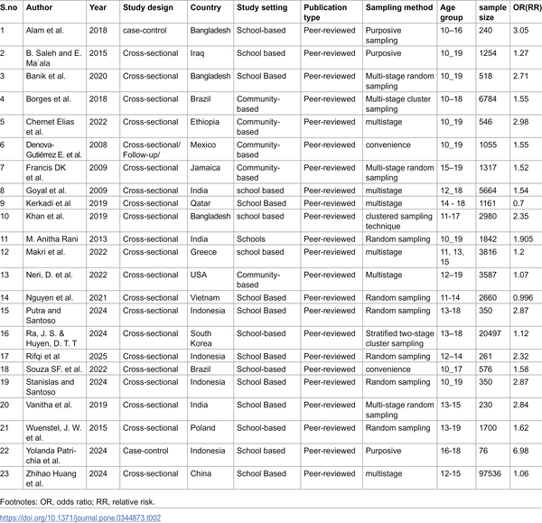

Did you know that eating ultra-processed foods can raise teens' risk of obesity by over 60%? As adolescent obesity rates continue to climb worldwide, understanding the dietary factors behind this trend is crucial. A recent large-scale meta-analysis sheds light on how ultra-processed food consumption is linked to increased overweight and obesity risk among young people.

> **TL;DR**
> - Adolescents who consume higher amounts of ultra-processed foods have approximately 63% greater odds of being overweight or obese compared to those with lower intake.
> - This meta-analysis synthesizes data from 23 studies across multiple countries, reinforcing the need for public health strategies that reduce ultra-processed food consumption among youth.

Obesity during adolescence is a growing global health concern, associated with increased risks of cardiovascular disease, type 2 diabetes, metabolic syndrome, and psychological challenges. Sedentary lifestyles and unhealthy diets are key contributors, with ultra-processed foods—industrial products high in added sugars, unhealthy fats, salt, and additives—becoming increasingly common in young people's diets. These foods often displace nutrient-rich whole foods, leading to excessive calorie intake and weight gain. While previous research has linked ultra-processed food consumption to obesity in adults, evidence specifically focused on adolescents has been scattered and sometimes inconsistent. This gap prompted researchers to conduct a systematic review and meta-analysis to clarify the relationship between ultra-processed food intake and overweight/obesity risk in adolescents aged 10 to 19 years.

The researchers conducted a thorough search across multiple scientific databases, including PubMed and ScienceDirect, to identify observational studies examining ultra-processed food consumption and overweight or obesity outcomes in adolescents. They included 23 studies published up to mid-2025, encompassing data from approximately 155,000 adolescents worldwide. These studies varied in design—mostly cross-sectional, with some case-control and cohort studies—and used standardized criteria to define overweight and obesity, such as the World Health Organization and International Obesity Task Force growth references. The team assessed study quality using established scales and performed a meta-analysis using a random-effects model to account for differences among studies. They also evaluated potential biases and heterogeneity to ensure the robustness of their findings.

The meta-analysis found a clear and statistically significant association: adolescents with higher consumption of ultra-processed foods had 63% higher odds of being overweight or obese compared to those with lower consumption. This association held across diverse populations and study designs. The included studies reported common ultra-processed foods such as sugary drinks, pizza, burgers, fried snacks, processed meats, and sweets—items typically high in calories but low in nutritional value. The findings support the idea that diets rich in ultra-processed foods contribute substantially to excess weight gain during this critical developmental period.

These results underscore the importance of targeting ultra-processed food consumption in public health strategies aimed at preventing adolescent obesity. Given that adolescence is a formative stage for establishing lifelong eating habits and metabolic health, reducing intake of these energy-dense, nutrient-poor foods could help curb the rising tide of obesity and its associated health risks. Policymakers, educators, parents, and healthcare providers can use this evidence to advocate for healthier food environments, improved dietary guidelines, and educational campaigns that promote whole, minimally processed foods among young people.

While the meta-analysis provides strong evidence of an association, it is important to note that most included studies were observational, which limits the ability to establish causality definitively. Variations in dietary assessment methods and definitions of ultra-processed foods across studies may introduce some inconsistencies. Additionally, factors such as physical activity, socioeconomic status, and genetic predispositions also influence obesity risk and were controlled to varying degrees in the studies. Future research could benefit from longitudinal designs and intervention trials to further clarify how reducing ultra-processed food intake affects adolescent weight outcomes.

## Figures

*Summary of studies examining ultra-processed food intake and obesity in teenagers.*

## Sources

- [Ultra-processed food consumption and the risk of overweight and obesity in adolescents: A systematic review and meta-analysis](https://journals.plos.org/plosone/article?id=10.1371/journal.pone.0344873)
- DOI: [10.1371/journal.pone.0344873](https://doi.org/10.1371/journal.pone.0344873)
