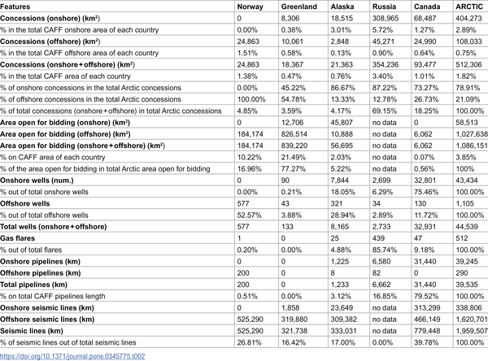
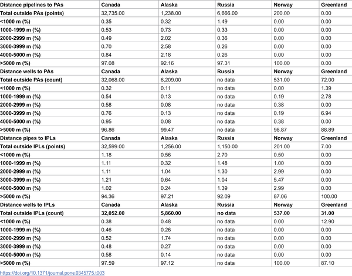

The Arctic is warming nearly four times faster than the rest of the planet, making it a frontline for climate change impacts. At the same time, this region holds vast oil and gas reserves that many argue must remain untouched to meet global climate targets. But what does this tension look like on the ground? A recent study offers the first comprehensive maps showing where oil and gas infrastructure overlaps with ecologically sensitive zones and Indigenous Peoples’ lands across the Arctic. These spatial insights reveal the complex conflicts and urgent need for new approaches to Arctic governance.

> **TL;DR**
> - Over 70% of Arctic oil and gas development overlaps with Indigenous Peoples’ lands, posing risks to their rights and cultures.
> - Oil and gas infrastructure is also found near key ecologically sensitive areas, threatening fragile Arctic ecosystems already stressed by rapid warming.

Global efforts to limit warming to 1.5°C require that about 60% of known oil and gas reserves remain unextracted — what scientists call 'unburnable carbon.' The Arctic is a critical region in this context because it is warming much faster than the global average and is home to extensive fossil fuel resources. Yet, expanding oil and gas development here risks severe ecological damage and threatens Indigenous communities whose livelihoods and cultures are closely tied to the land. Understanding where these developments intersect with sensitive ecological and cultural areas is essential for informed policy decisions.

The researchers compiled and analyzed open-access geospatial data from multiple national and global sources to create the first detailed spatial atlas of Arctic oil and gas infrastructure. They mapped over 44,000 wells, nearly 40,000 kilometers of pipelines, and nearly two million kilometers of seismic lines within the Arctic region defined by the Conservation of Arctic Flora and Fauna (CAFF) boundary. They then overlaid these data with maps of ecologically sensitive areas and Indigenous Peoples’ lands to identify spatial overlaps and proximities.

The analysis revealed that oil and gas activities cover about 1.82% of the Arctic region, with 73.3% of hydrocarbon areas intersecting Indigenous lands and 7.57% overlapping protected ecological zones. Key hotspots of overlap include Alaska’s North Slope and Russia’s Yamal Peninsula. The infrastructure is often situated close to areas of ecological importance and culturally significant sites, highlighting potential conflicts between industrial development, environmental conservation, and Indigenous rights.

This study provides a crucial spatial perspective on the ‘unburnable carbon’ debate in the Arctic, emphasizing that fossil fuel extraction here is not only a climate issue but also a matter of ecological preservation and social justice. By revealing where oil and gas development conflicts with Indigenous territories and sensitive ecosystems, the research supports calls for a paradigm shift in Arctic governance. It advocates for policies that prioritize equity, respect Indigenous rights, and establish supply-side climate measures such as an Arctic Fossil Fuel Non-Proliferation zone to prevent further environmental degradation and ensure a just transition.

While the spatial atlas offers comprehensive data on current and past oil and gas infrastructure, it does not capture all future planned developments or the full complexity of local Indigenous perspectives, which can vary widely. Additionally, the study focuses on spatial overlaps and proximities but does not directly measure ecological or social impacts, which require further interdisciplinary research. Nonetheless, the maps provide a valuable tool for policymakers and advocates aiming to balance climate goals, ecological conservation, and Indigenous rights in the Arctic.

## Figures

*Table showing how oil and gas locations relate to the Arctic region.*

*Shortest distances from oil and gas wells and pipelines to protected area and indigenous land borders.*

## Sources

- [Unburnable carbon in the rapidly warming Arctic: Mapping spatial relationships among oil and gas development, ecologically sensitive areas and Indigenous Peoples’ lands](https://journals.plos.org/plosone/article?id=10.1371/journal.pone.0345775)
- DOI: [10.1371/journal.pone.0345775](https://doi.org/10.1371/journal.pone.0345775)
