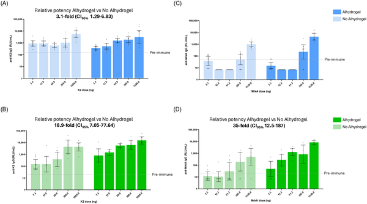
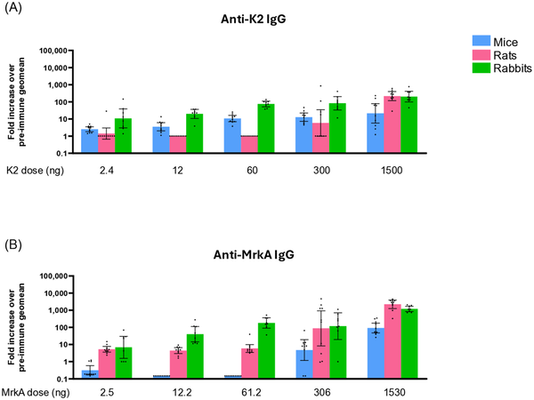
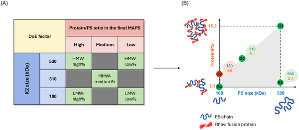

Klebsiella pneumoniae is a formidable bacterial foe, increasingly resistant to antibiotics and a major cause of severe infections in newborns worldwide, especially in low- and middle-income countries. With no licensed vaccines currently available, scientists are exploring innovative strategies to outsmart this pathogen. One promising approach harnesses a novel vaccine platform that couples bacterial sugar molecules with proteins to boost immune protection. Recent animal studies reveal how tweaking the sugar chains and protein ratios in these vaccines can enhance their effectiveness, offering hope for future human vaccines against this dangerous bacterium.

> **TL;DR**
> - A novel vaccine platform called MAPS combines bacterial surface sugars (K-antigens) with proteins to stimulate stronger immune responses against Klebsiella pneumoniae.
> - Animal studies show that longer sugar chains and higher protein-to-sugar ratios improve antibody production, and antibodies from vaccinated animals protect mice from infection.

Klebsiella pneumoniae is a leading cause of neonatal sepsis, a life-threatening bloodstream infection in newborns, particularly in resource-limited settings. This bacterium’s outer surface is coated with diverse sugar molecules known as K-antigens, which help it evade the immune system. Because of the large variety of K-antigens, designing a vaccine that covers many strains is challenging. The MAPS (Multiple Antigen Presenting System) technology offers a flexible approach by linking these sugar molecules to proteins, potentially enhancing immune recognition and protection. This strategy is especially relevant given the rise of multidrug-resistant Klebsiella strains and the urgent need for effective vaccines.

Researchers developed different MAPS vaccine constructs by chemically attaching biotin molecules to Klebsiella’s K2 polysaccharide antigen and linking these to a fusion protein containing MrkA, a surface protein from Klebsiella that can stimulate protective immunity. They varied key features such as the length of the sugar chains (molecular weight), the ratio of protein to polysaccharide, and the overall size of the MAPS complexes. These constructs were tested in mice, rabbits, and rats, with and without an aluminum-based adjuvant (Alhydrogel), to evaluate the immune responses generated. Antibody levels against both the sugar and protein components were measured, and the protective ability of antibodies from vaccinated rabbits was assessed by transferring their sera to mice challenged with a clinical Klebsiella strain.

The study found that longer polysaccharide chains and higher protein-to-sugar ratios in the MAPS vaccine constructs led to stronger antibody responses in rabbits. The inclusion of the MrkA protein fused to the biotin-binding rhizavidin carrier further enhanced immune recognition of the sugar antigen. Vaccinated rabbits produced antibodies capable of killing Klebsiella bacteria in laboratory assays. Importantly, when these antibodies were passively transferred to mice, they provided protection against infection with a clinically relevant Klebsiella strain. The presence of the aluminum adjuvant boosted immune responses across animal models. These results highlight how precise tuning of vaccine components can optimize immunogenicity.

This work advances the rational design of vaccines targeting Klebsiella pneumoniae, a pathogen with no licensed vaccines and a growing threat due to antibiotic resistance. By demonstrating how a flexible polysaccharide-protein platform can be optimized to elicit protective immunity in animal models, it lays the groundwork for developing multivalent vaccines that cover multiple Klebsiella strains. Such vaccines could significantly reduce neonatal sepsis deaths in low-resource settings and curb the spread of drug-resistant infections. Moreover, the MAPS technology’s adaptability suggests potential applications against other challenging bacterial pathogens.

While these findings are promising, the results are currently limited to animal models, and human immune responses may differ. The complexity of Klebsiella’s polysaccharide diversity means that further work is needed to develop vaccines covering a broad range of strains. Additionally, the safety and efficacy of these MAPS vaccines must be established in clinical trials. The study also focused on a single K-antigen type (K2), so extending the approach to other serotypes will be crucial for comprehensive protection. Finally, manufacturing and scalability considerations remain for translating this technology into widely available vaccines.

## Figures

*Graphs show immune response levels in mice and rabbits after different doses of a vaccine with or without Alhydrogel adjuvant on day 42.*

*Immune responses to increasing doses of a vaccine tested in mice, rats, and rabbits show rising antibody levels against K2 and MrkA proteins.*

*Fig 4 shows five MAPS types made by mixing K2 size and protein/polysaccharide ratios, tested in rabbits and mapped by their features.*

## Sources

- [Understanding the impact of Klebsiella pneumoniae K-Antigen based MAPS vaccine design on the immune response in animal models](https://journals.plos.org/plospathogens/article?id=10.1371/journal.ppat.1014289)
- DOI: [10.1371/journal.ppat.1014289](https://doi.org/10.1371/journal.ppat.1014289)
