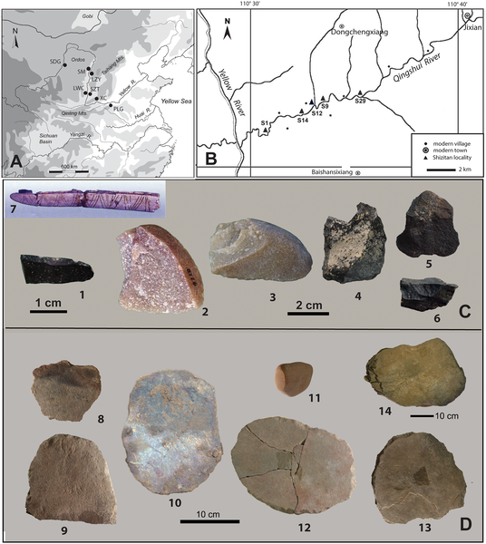
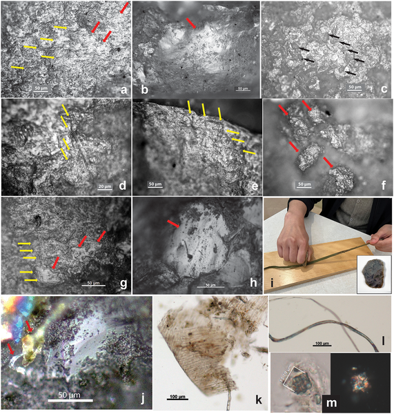

How did people 20,000 years ago make fibers and textiles without modern tools? Scientists have uncovered microscopic bast fibers and traces of wear on stone tools from the Ice Age site of Shizitan in North China, revealing surprising insights into early fiber production and even the use of plant-based dyes. This discovery opens a window into the ingenuity of Upper Paleolithic humans adapting to harsh climates through complex textile technology.

> **TL;DR**
> - Microscopic analysis of stone tools from the Shizitan site (28,000–18,000 years ago) reveals bast fiber microremains from hemp and flax, indicating fiber processing activities during the Last Glacial Maximum.
> - Usewear patterns on tools suggest stages of fiber production such as cutting, retting, pounding, and scraping, while colored fibers hint at early plant-based dyeing practices.

Fiber technology—including making cords, mats, baskets, and textiles—has been vital throughout human history, yet direct evidence from the Paleolithic period is rare due to organic fibers’ rapid decay. Previous finds of ancient cordage are limited and fragmentary, so researchers often rely on indirect clues like tool wear patterns and microscopic residues. The Shizitan site on the North China Loess Plateau offers a rare, well-dated archaeological record spanning the Last Glacial Maximum (LGM), a period of extreme cold and dryness around 27,000 to 23,000 years ago. This challenging environment likely spurred innovations in clothing and fiber use to protect against harsh conditions. Until now, evidence for fiber production in Upper Paleolithic China has been scarce, making these new findings particularly valuable.

To overcome the challenges of preserving delicate fibers, the research team employed a multidisciplinary approach combining microfossil analysis, usewear studies, ethnographic comparisons, and experimental archaeology. They examined stone tools and grinding stones excavated from two key Shizitan localities (SZT14 and SZT29), dating from approximately 28,000 to 18,000 years ago. Using compound light microscopy, they identified microfibers, phytoliths, and fungal remains on tool surfaces. Detailed wear pattern analysis helped infer specific fiber-processing activities such as cutting stalks, retting (soaking fibers to separate them), pounding fiber ribbons, and scraping to clean fibers. Comparisons with ethnographic records and experimental tool use strengthened interpretations of these wear traces. Additionally, observations of colored fibers suggested the possible extraction and application of plant-based dyes and hematite pigments.

The study identified microremains of bast fibers from hemp and flax on stone tools, marking some of the earliest direct evidence of fiber processing in Upper Paleolithic North China. Usewear patterns corresponded to different stages of bast fiber production, including cutting, retting, pounding, and scraping—activities commonly linked to textile manufacture. Notably, colored fibers found on tools imply that Shizitan people may have dyed fibers using plant-based substances and hematite, an iron oxide pigment. These findings align with broader cultural shifts during the LGM, such as the emergence of microblade technology, increased interregional interactions, ritual practices, and the use of wild millet. The cold, dry LGM conditions likely influenced these adaptations, including greater reliance on fiber technology for clothing and other purposes.

This research pushes back the timeline for complex fiber production in East Asia, revealing that Upper Paleolithic humans in North China were engaged in sophisticated textile-related activities during one of Earth’s coldest periods. The integration of microfossil and usewear analyses offers a powerful toolset for uncovering ancient fiber technologies that rarely survive in the archaeological record. Understanding early fiber production enriches our knowledge of human technological evolution, cultural adaptation, and survival strategies in challenging environments. Moreover, evidence of early dye use hints at aesthetic and symbolic dimensions of prehistoric life, suggesting that clothing and decoration played important roles beyond mere utility.

While the microscopic fibers and wear patterns strongly indicate bast fiber processing, the fragile nature of these materials means interpretations must be cautious. The identification of colored fibers as dyed remains is suggestive but not definitive, as alternative explanations like natural pigmentation cannot be fully ruled out. Additionally, the absence of preserved textile fragments limits direct confirmation of finished products. Further research combining chemical analyses and broader regional comparisons will help clarify these early fiber technologies and their cultural contexts.

## Figures

*Map shows Shizitan site and nearby areas with photos of stone tools and grinding stones studied from Shizitan and nearby sites.*

*Images show wear and residue on ancient and experimental tools, revealing patterns from cutting and scraping plants like hemp and velvetleaf.*

## Sources

- [Unveiling bast fiber production in Upper Paleolithic North China: Microfibers and usewear traces on stone tools from Shizitan](https://journals.plos.org/plosone/article?id=10.1371/journal.pone.0346767)
- DOI: [10.1371/journal.pone.0346767](https://doi.org/10.1371/journal.pone.0346767)
