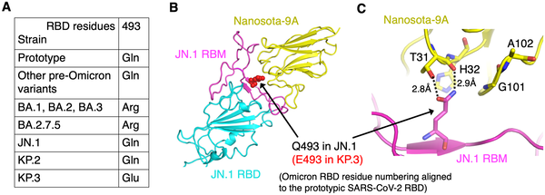
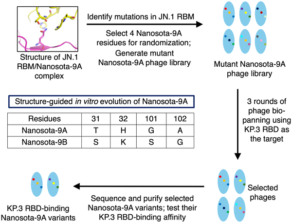
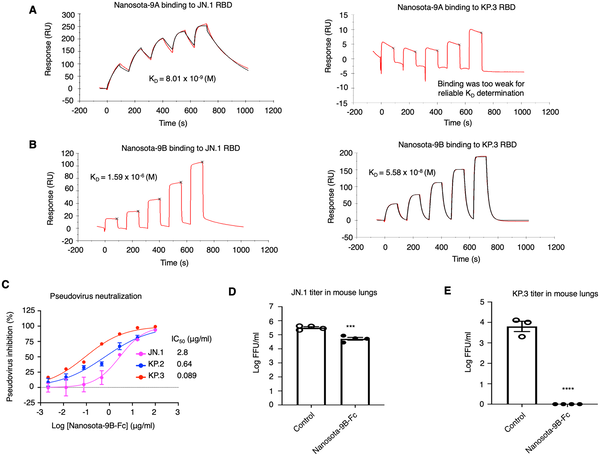
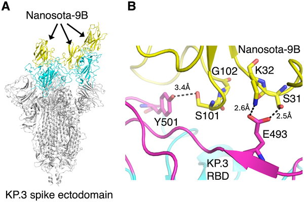

As the COVID-19 pandemic continues, SARS-CoV-2 keeps evolving, accumulating mutations that can undermine the effectiveness of antibody-based treatments. A key challenge is how to keep pace with these changes without starting from scratch each time a new variant emerges. What if existing antibody therapies could be rapidly updated to tackle new viral mutations? This is the promise of a clever 'update and reuse' strategy demonstrated by researchers engineering tiny, versatile nanobodies to neutralize recent SARS-CoV-2 variants that had previously escaped antibody recognition.

> **TL;DR**
> - Researchers used detailed structural knowledge to guide the redesign of an existing nanobody, restoring its ability to bind and neutralize a SARS-CoV-2 variant with a key spike protein mutation.
> - Combining the original and updated nanobodies into a bispecific molecule enabled effective neutralization of multiple virus variants, illustrating a practical approach to maintain therapeutic coverage as the virus evolves.

Antibody therapies have been vital tools against COVID-19, but their effectiveness can be compromised as the virus mutates, especially in the spike protein that the virus uses to infect human cells. One such mutation, Q493E in the spike’s receptor-binding domain (RBD), found in recent Omicron subvariants like KP.3, disrupts the binding of many antibodies and nanobodies, including Nanosota-9A, a previously developed nanobody that effectively neutralized earlier Omicron forms. This mutation allows the virus to 'escape' neutralization, posing a challenge for treatment.

The researchers employed a structure-guided in vitro evolution strategy. Starting with the known 3D structure of Nanosota-9A bound to the spike protein, they identified four nanobody amino acid positions near the mutated site to target for randomization. They created a library of nanobody variants with mutations at these positions and used phage display to select those that bound strongly to the mutated KP.3 RBD. The best candidate, named Nanosota-9B, was then characterized for binding affinity and neutralization potency. Finally, they engineered a bispecific nanobody combining Nanosota-9A and Nanosota-9B to regain broad activity against multiple variants.

Nanosota-9B showed high-affinity binding to the KP.3 RBD and effectively neutralized KP.3 pseudoviruses in cell-based assays, though with reduced activity against the original JN.1 variant. In mouse infection models, the Fc-tagged form of Nanosota-9B reduced viral loads significantly, especially against KP.3. Structural studies revealed that Nanosota-9B accommodates the Q493E mutation by forming new interactions that avoid clashes present in Nanosota-9A. The bispecific nanobody combining both versions neutralized both JN.1 and KP.3 variants effectively, demonstrating restored breadth of activity.

This work provides a proof of concept for an efficient 'update and reuse' approach to antibody therapeutics: rather than discarding existing nanobodies when new viral escape mutations arise, researchers can rapidly adapt them using structure-guided engineering. This strategy conserves valuable research resources, shortens development times, and helps maintain therapeutic coverage as SARS-CoV-2 continues to evolve. Beyond COVID-19, this approach could serve as a template for durable, adaptable biologics against other rapidly mutating viruses.

While promising, this study focuses on a specific mutation and a limited set of Omicron subvariants. The reduced binding affinity of the updated nanobody to some variants highlights the trade-offs involved in targeting diverse viral forms. Further work is needed to assess the durability of such engineered nanobodies against future mutations and to evaluate their safety and efficacy in clinical settings. Nonetheless, the approach represents a valuable tool in the ongoing effort to keep pace with viral evolution.

## Figures

*A single Q493E mutation in Omicron JN.1 stops Nanosota-9 from binding by disrupting key interactions at the virus's spike protein.*

*Flowchart showing how Nanosota-9A was improved in the lab to better target a virus mutation, resulting in Nanosota-9B.*

*Nanosota-9B binds strongly to certain Omicron variants and effectively blocks their entry into human cells at low concentrations.*

*Cryo-EM shows how Nanosota-9B binds and stabilizes the KP.3 spike protein by attaching to all three RBD sites.*

## Sources

- [Update and reuse: Structure-guided nanobody evolution against SARS-CoV-2 escape](https://journals.plos.org/plospathogens/article?id=10.1371/journal.ppat.1014223)
- DOI: [10.1371/journal.ppat.1014223](https://doi.org/10.1371/journal.ppat.1014223)
