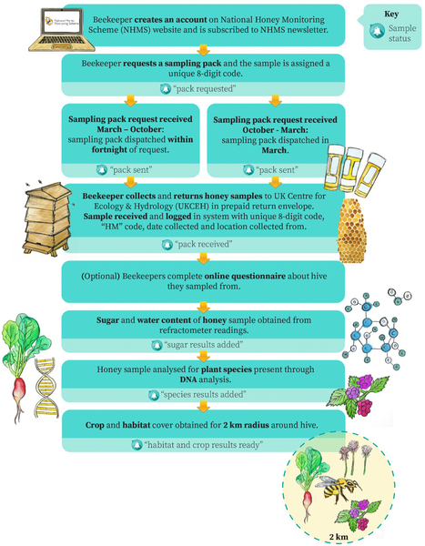
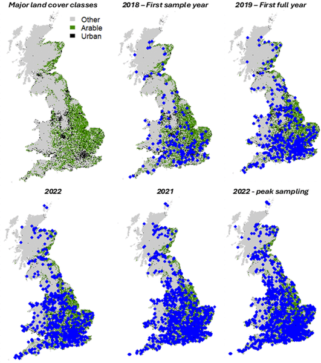
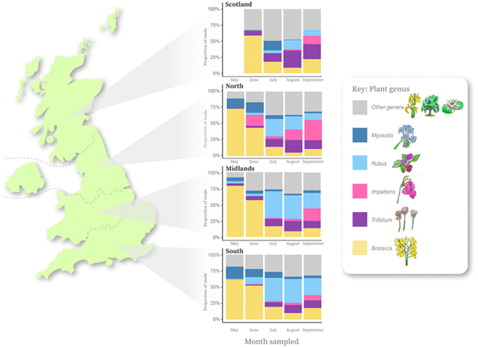
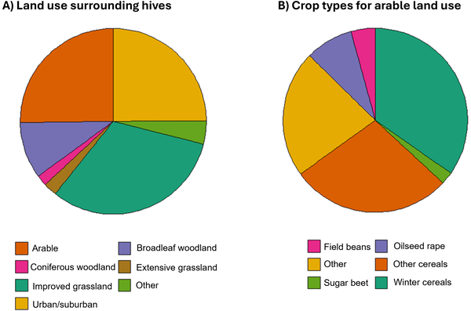

Imagine if a spoonful of honey could tell us not just about the sweet treat itself, but also about the plants bees visit, the landscapes they forage in, and even the subtle shifts in our environment over time. Thanks to an innovative citizen science initiative across the UK, this is now a reality. By analyzing DNA traces left in honey, scientists are unlocking detailed insights into the diets of honeybees and the health of ecosystems on a national scale.

> **TL;DR**
> - Citizen scientists across the UK have contributed thousands of honey samples, enabling large-scale, long-term monitoring of plant species visited by honeybees using environmental DNA (eDNA) analysis.
> - This approach reveals spatial and temporal changes in floral resource availability, informing land-use policies, pollinator conservation, and environmental health assessments.

Pollinators like bees play a crucial role in ecosystems and agriculture, supporting the reproduction of many plants and contributing significantly to crop yields. However, wild pollinator populations are declining globally due to factors such as habitat loss, pesticide exposure, diseases, invasive species, and climate change. Understanding how floral resources—the plants bees rely on—change across landscapes and seasons is essential for protecting these vital insects. Traditional monitoring methods are often limited by cost, scale, and the need for expert identification. Honeybees, as managed pollinators with extensive foraging ranges, offer a unique window into these patterns. By tapping into the DNA left behind in honey, researchers can identify the plants bees have visited over time and across regions.

The UK National Honey Monitoring Scheme (NHMS) harnesses the enthusiasm and reach of over 3,500 volunteer beekeepers who collect honey samples from their hives across England, Wales, Scotland, and Northern Ireland. Participants submit honey collected directly from recently produced combs during the main foraging months (May to October). Researchers extract environmental DNA (eDNA) from pollen grains suspended in the honey, using a process that involves filtering the honey-water mixture, extracting DNA, and sequencing a specific plant DNA barcode region (ITS2). This DNA sequencing data is then analyzed to identify the plant species bees have foraged on. The scheme also integrates land cover data within a 2 km radius of each hive, derived from satellite imagery and crop maps, to contextualize the floral sources. Results are shared back with beekeepers through an online portal, providing personalized insights into their bees’ diets and local habitats.

Analysis of nearly 5,800 honey samples collected between 2018 and 2025 reveals that honeybee diets vary both spatially across the UK and temporally throughout the foraging season. Dominant plants include brassicas (such as oilseed rape), clovers (Trifolium species), and brambles (Rubus species), reflecting a mix of wild and cultivated floral resources. Notably, invasive plant species also appear in the bees’ diets, highlighting their presence in the landscape. The data confirms that most hives are located in intensively managed agricultural areas, but also in urban, suburban, forested, and extensively managed landscapes. This large-scale, long-term dataset establishes a valuable benchmark for assessing resource availability not only for honeybees but also for wider pollinator communities.

This citizen science-led eDNA biomonitoring platform demonstrates a cost-effective and scalable way to track environmental changes and pollinator resource use at a national level. The insights gained can inform land-use planning, agricultural policy, and conservation strategies aimed at supporting pollinator health. Furthermore, the archived honey samples provide a resource for future studies on invasive species, bee pathogens, and chemical exposures, including pesticides. By leveraging the natural foraging behavior of honeybees and the power of DNA technology, this approach offers a practical and inclusive tool for monitoring ecosystem health in a changing world.

While honey-derived eDNA provides a broad picture of plant species visited by honeybees, it primarily reflects the foraging preferences of this single species and may not capture the full diversity of floral resources used by other pollinators. The method depends on pollen presence in honey, which can vary with nectar source and honey processing. Additionally, participation is voluntary and may be biased toward certain regions or beekeeper demographics, potentially influencing spatial coverage. Despite these limitations, the large sample size and multi-year data collection help mitigate some biases and offer robust insights into temporal and spatial trends.

## Figures

*Flowchart showing how beekeepers register online, collect honey samples, and send them to UKCEH for analysis.*

*Map showing hive locations providing honey samples from 2018 to 2023, with fewer sites after 2023 due to analysis costs.*

*Honey from four UK regions shows different plant DNA from five common plant types, revealing local floral sources.*

*Land types around honeybee hives and the share of crops within farmed areas near the hives.*

## Sources

- [Using honeybees for national scale long-term eDNA biomonitoring](https://journals.plos.org/plosone/article?id=10.1371/journal.pone.0347485)
- DOI: [10.1371/journal.pone.0347485](https://doi.org/10.1371/journal.pone.0347485)
