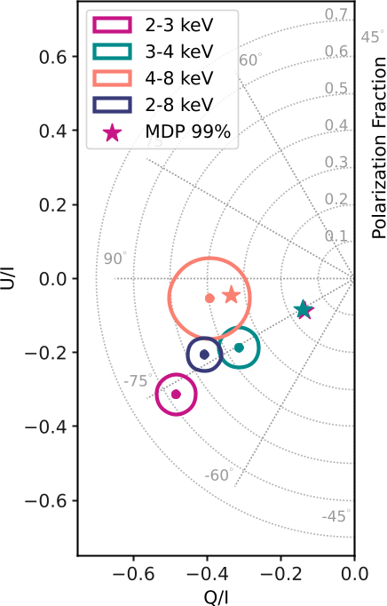
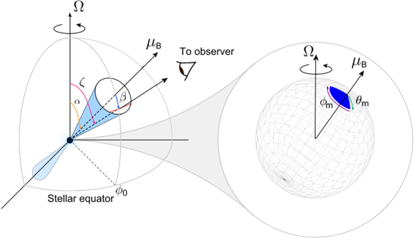
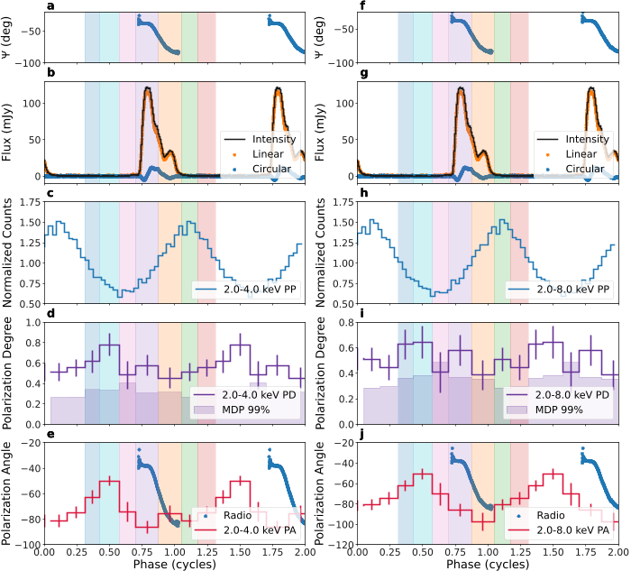

Imagine light traveling through what seems like empty space, only to find that space itself acts like a prism, bending and splitting the light depending on its polarization. This strange effect, called vacuum birefringence, was predicted by quantum electrodynamics (QED) decades ago but has eluded direct observation—until now. Scientists have observed this phenomenon around a magnetar, one of the universe’s most magnetic objects, revealing new insights into how quantum physics operates under extreme conditions.

> **TL;DR**
> - Polarized X-ray measurements of the magnetar 1E 1547.0−5408 show exceptionally high polarization degrees, reaching up to 82% at certain energies and rotational phases.
> - These observations provide the first direct astrophysical evidence of vacuum birefringence, confirming a key QED prediction about how intense magnetic fields affect light propagation through the vacuum.

*Note: this summary is based on a preprint — research shared ahead of formal peer review.*

Magnetars are neutron stars endowed with magnetic fields trillions of times stronger than Earth’s, exceeding 10^14 gauss. These extreme fields create a natural laboratory to test physics that cannot be reproduced on Earth. Quantum electrodynamics predicts that such intense magnetic fields polarize the vacuum itself, causing light with different polarizations to travel at different speeds—a phenomenon known as vacuum birefringence. Although indirect hints have surfaced in laboratory and astrophysical contexts, direct, phase- and energy-resolved measurements of this effect had not been achieved until observations of 1E 1547.0−5408, a radio-emitting magnetar, were conducted.

Researchers coordinated simultaneous observations using NASA’s Imaging X-ray Polarimetry Explorer (IXPE), the Neutron Star Interior Composition Explorer (NICER), and the Parkes/Murriyang radio telescope. IXPE provided sensitive measurements of the X-ray polarization in the 2–8 keV energy range, while NICER and Parkes helped characterize the magnetar’s timing and radio polarization properties. By phase-folding the data according to the magnetar’s 2.09-second spin period and aligning the X-ray and radio signals, the team could track how polarization properties varied with rotation and energy. They also used radiative transfer simulations incorporating vacuum birefringence effects to interpret the data.

The magnetar’s soft X-ray emission exhibited remarkably high polarization degrees—up to 65% averaged over phase at 2 keV, and nearly 80% at certain rotational phases in the 2–3 keV band. The polarization angle varied smoothly with phase, consistent with the geometry of a rotating dipolar magnetic field. Notably, the polarization degree dropped between 2 and 4 keV, which aligns with theoretical expectations of mode conversion near a vacuum resonance energy. These polarization signatures could not be explained by standard surface emission models without refractive effects. Instead, the data strongly support the presence of vacuum birefringence influencing how polarized light propagates through the magnetosphere.

This study marks a milestone in astrophysics and quantum physics by providing the first direct observational confirmation of vacuum birefringence around a magnetar. It opens a new window to study quantum electrodynamics in regimes of ultra-strong magnetic fields, inaccessible in terrestrial laboratories. The results also demonstrate how combining X-ray and radio polarization measurements can reveal the geometry and physical processes near neutron stars. Beyond advancing fundamental physics, these findings motivate future polarimetric observations and theoretical work to deepen our understanding of quantum vacuum effects in extreme cosmic environments.

While the polarization measurements are robust and consistent with vacuum birefringence models, some uncertainties remain. The interpretation depends on assumptions about the magnetar’s magnetic field geometry and emission regions. Signal-to-noise limitations at higher energies restrict detailed conclusions above 4 keV. Additionally, alternative explanations involving complex surface or magnetospheric conditions cannot be entirely ruled out. Continued observations with more sensitive instruments and complementary theoretical modeling will be essential to confirm and refine these findings.

## Figures

*Polarization of 1E 1547.0−5408 varies by energy, peaking at 59% in 2–3 keV and staying high overall, with stable polarization angle. — Figure from Rachael E. Stewart et al., [CC BY 4.0](http://creativecommons.org/licenses/by/4.0/), caption edited.*

*A spinning neutron star with a tilted magnetic field emits radio waves from a hotspot, shown as a blue wedge on its surface. — Figure from Rachael E. Stewart et al., [CC BY 4.0](http://creativecommons.org/licenses/by/4.0/), caption edited.*

*This figure compares radio and X-ray polarization and intensity of 1E 1547.0−5408 across different energy bands and pulse phases. — Figure from Rachael E. Stewart et al., [CC BY 4.0](http://creativecommons.org/licenses/by/4.0/), caption edited.*

## Sources

- [Vacuum birefringence and the polarized X-ray emission from a radio magnetar](https://arxiv.org/abs/2509.19446)
- DOI: [10.1038/s41586-026-10859-z](https://doi.org/10.1038/s41586-026-10859-z)

*This article reuses and adapts text and figures from the original research by Rachael E. Stewart et al., available via arXiv Quantum Physics, under the [CC BY 4.0](http://creativecommons.org/licenses/by/4.0/) license.*
