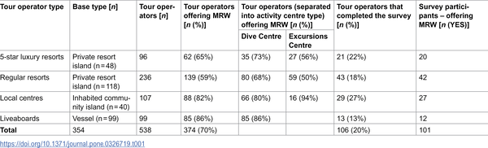
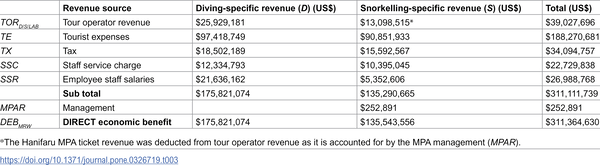
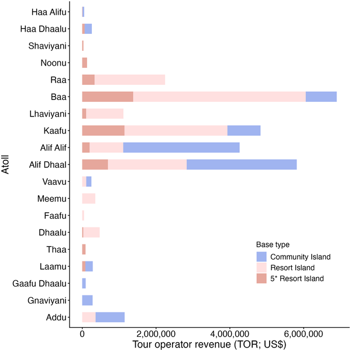

Discover how manta ray tourism fuels millions in the Maldives and helps protect these majestic creatures. Manta rays, with their graceful movements and impressive size, are more than just captivating marine animals; they are vital to the economy and culture of island communities. Learn how watching manta rays underwater supports conservation efforts and sustains local livelihoods in this stunning tropical paradise.

> **TL;DR**
> - Manta ray tourism in the Maldives generated an estimated $227 million in 2021, representing 2.6% of the nation's GDP and showing a 380% growth since 2008.
> - The economic benefits extend beyond tourism operators to local businesses, employees, and government, highlighting manta rays’ intrinsic and cultural value and the importance of conservation.

The Maldives, a nation of 26 atolls in the Indian Ocean, relies heavily on its marine biodiversity to attract tourists and sustain its economy. Manta rays, large filter-feeding rays known for their seasonal aggregations, are a major draw for marine wildlife tourism. As charismatic species, manta rays help engage the public and local communities in conservation efforts. However, balancing tourism growth with environmental protection is challenging, especially given the vulnerability of manta ray populations worldwide due to overfishing and habitat threats. Economic valuation of manta ray tourism provides a powerful argument for protecting these species and their habitats, ensuring sustainable benefits for both nature and people.

Researchers conducted a comprehensive study using surveys of 106 tour operators across the Maldives, combined with data mining of government and tourism reports, to estimate the economic impact of manta ray watching in 2021. They defined manta ray watching trips as diving or snorkeling excursions specifically targeting encounters with reef and oceanic manta rays at known aggregation sites. The study aggregated data by administrative regions and accounted for direct revenues from tours as well as related tourist expenditures. This approach allowed the team to calculate both the direct and socio-economic benefits of manta ray tourism at a national scale.

The study found that manta ray tourism generated approximately $227.3 million in 2021, including $39 million from manta-focused diving and snorkeling excursions and $188.3 million from related tourist spending. This represents about 2.6% of the Maldives’ GDP and marks a nearly 380% increase since 2008. Manta ray watching is now offered by 80% of tourism operators nationwide. Beyond direct revenues, the industry supports local businesses, employment, and government income, with total direct economic benefits estimated at over $311 million annually. The researchers also highlighted the cultural and intrinsic value manta rays hold for local communities, reinforcing their importance beyond economics.

This study underscores the vital role manta rays play in the Maldives’ blue economy, linking marine wildlife conservation directly to economic prosperity. By quantifying the substantial financial benefits of manta ray tourism, the research provides compelling evidence to support continued protection measures such as the national shark and ray sanctuary and marine protected areas. It illustrates how sustainable tourism centered on charismatic species can foster community wellbeing, diversify income sources, and incentivize conservation efforts. These insights are crucial for policymakers balancing tourism development with environmental stewardship in vulnerable island ecosystems.

While the study offers a robust economic valuation based on extensive survey data and government reports, it focuses primarily on direct tourism revenues and related expenditures. It does not include manta ray watching from vessels without diving or snorkeling, nor does it fully capture potential indirect or long-term ecological impacts of tourism. Additionally, the intrinsic and cultural values, though acknowledged, are more difficult to quantify and may vary across communities. Continued monitoring and adaptive management will be essential to ensure that tourism growth does not compromise manta ray populations or the health of marine ecosystems.

## Figures

*Overview of 538 Maldives tour operators and their involvement in manta ray watching tourism.*

*In 2021, 374 Maldives tour operators sold 475,061 manta ray watching tickets, generating significant economic benefits from diving and snorkeling tours.*

*Tour operator revenue from manta ray watching in Maldives varies by region, excluding liveaboards and areas with no reported tourism.*

## Sources

- [Valuing conservation and natural wealth: The blue economy of manta ray watching in the Maldives](https://journals.plos.org/plosone/article?id=10.1371/journal.pone.0326719)
- DOI: [10.1371/journal.pone.0326719](https://doi.org/10.1371/journal.pone.0326719)
