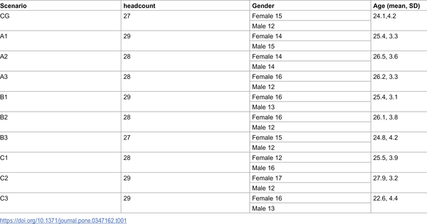
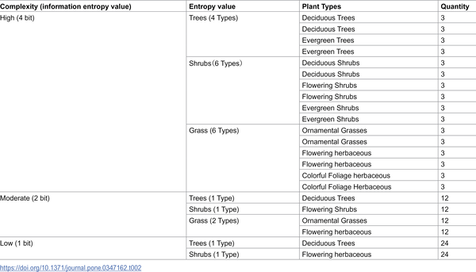

University life can be a pressure cooker, with students facing relentless academic demands and social challenges. But amidst the concrete and classrooms, campus courtyards offer a quiet refuge. New research shows that not all greenery is equally calming—it's the specific arrangement and variety of plants that can make these outdoor spaces powerful tools for stress recovery.

> **TL;DR**
> - Vegetated campus courtyards with well-ordered and diverse plantings help students physiologically and psychologically recover from stress better than non-vegetated spaces.
> - The study found that the visual coherence (orderliness) of plant arrangements moderates how biodiversity (complexity) impacts stress reduction, with ordered, diverse scenes promoting greater autonomic relaxation.

Mental health challenges among university students are rising worldwide, with stress, anxiety, and depression increasingly common. Access to natural environments is known to support mental well-being, but urban campuses are often dense and constrained, making it critical to understand how to design small green spaces that truly restore. Two leading theories—Stress Reduction Theory and Attention Restoration Theory—explain how nature helps reduce stress and replenish attention. However, these theories often treat greenery as a uniform benefit, overlooking how the specific visual qualities of plants influence recovery. This study bridges that gap by examining how the visual order (coherence) and diversity (complexity) of vegetation in campus courtyards affect stress recovery.

Researchers recruited 282 university students and exposed them to virtual reality (VR) simulations of campus courtyards. These simulations varied systematically in two key visual features: coherence, which reflects how orderly and clustered the plants are arranged (low, moderate, high), and complexity, measured by Shannon entropy to represent plant species diversity (low, moderate, high). A non-vegetated courtyard served as a control. Participants underwent a stress induction phase, followed by a recovery phase during which physiological indicators like heart rate, heart rate variability, and skin conductance level were recorded. They also completed the Perceived Restorativeness Scale to assess subjective restoration. This randomized controlled design allowed the team to isolate how coherence and complexity interact to influence stress recovery.

The study found that vegetated courtyards significantly improved physiological markers of stress recovery and subjective restorativeness compared to the non-vegetated control. Importantly, perceived restorativeness increased steadily with greater plant diversity and was highest when plant arrangements were moderately to highly coherent. Crucially, the physiological measure of skin conductance—a marker of autonomic nervous system relaxation—showed that biodiversity-rich scenes only promoted stress recovery when the vegetation was well-ordered. In other words, complexity alone wasn’t enough; the visual coherence of plantings moderated whether diverse greenery helped calm the nervous system. This reveals a conditional mechanism linking information-processing theory with stress reduction: orderly complexity invites exploration and fascination without cognitive overload, facilitating parasympathetic rebound.

These findings refine existing theories of restorative environments by demonstrating that the interplay between visual order and diversity in vegetation shapes how effectively green spaces reduce stress. The use of an entropy-based framework provides a quantitative, reproducible way to design and evaluate restorative landscapes. Moreover, the VR protocol developed is portable and adaptable, enabling campus and urban designers worldwide to test and tailor courtyard designs with local plant species. As universities and cities densify, such micro-restorative green spaces become vital infrastructure for mental health, offering evidence-based guidance to create calming environments that support student well-being.

While the VR approach offers controlled and immersive exposure to varied courtyard designs, it cannot fully replicate the multisensory experience of real outdoor environments, such as smells, sounds, and tactile sensations. The study sample was drawn from one university in China, so cultural and regional differences in plant preferences and stress responses may influence generalizability. Additionally, physiological measures capture short-term stress recovery, leaving open questions about long-term mental health benefits. Future research could extend these findings by testing real-world courtyard modifications and exploring how other sensory factors interact with visual coherence and complexity.

## Figures

*Summary of key social and demographic traits of the study group.*

*Table showing how plant types and numbers vary with landscape complexity, keeping total plants at 48 for each level.*

## Sources

- [Vegetated landscape coherence and complexity shape psychophysiological stress recovery in campus courtyards](https://journals.plos.org/plosone/article?id=10.1371/journal.pone.0347162)
- DOI: [10.1371/journal.pone.0347162](https://doi.org/10.1371/journal.pone.0347162)
