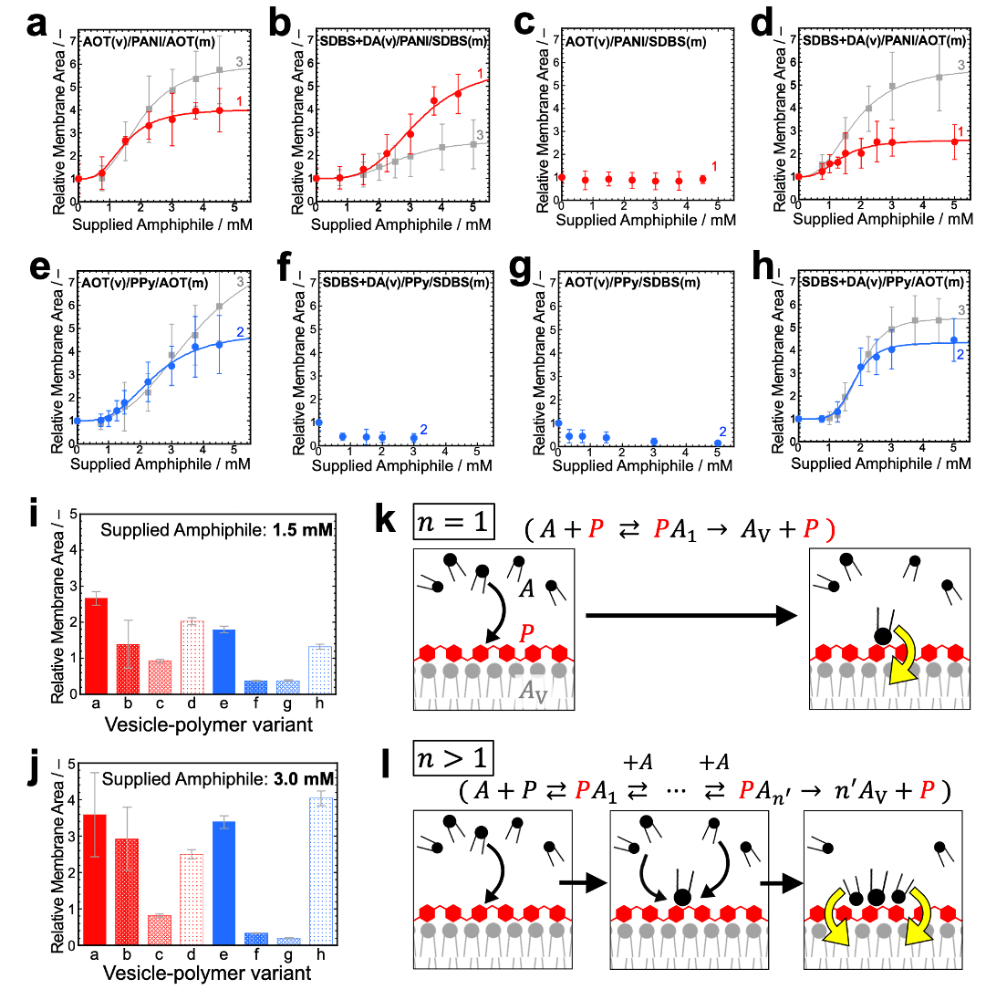
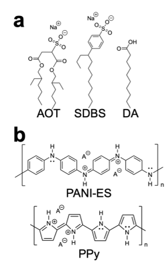

Scientists are building synthetic cells that can grow and evolve like living organisms. Imagine tiny vesicles—small bubble-like compartments—working together with catalytic polymers to selectively incorporate molecules and grow, much like the earliest life forms might have done. This research sheds light on the fundamental physicochemical principles that could have enabled life-like behaviors to emerge from simple molecular assemblies.

> **TL;DR**
> - Synthetic minimal cells composed of vesicles and catalytic polymers can exhibit differential growth depending on their molecular composition and environmental conditions.
> - By combining different vesicle templates, catalytic polymers, and amphiphile supplies, researchers revealed a multi-dimensional fitness landscape that links molecular recognition to evolvability in synthetic cells.

*Note: this summary is based on a preprint — research shared ahead of formal peer review.*

One of the great challenges in understanding the origins of life is figuring out how simple molecular assemblies could have started to behave like living cells—growing, reproducing, and evolving. Synthetic minimal cells provide a bottom-up approach to this problem by reconstructing essential cellular functions from scratch using simple components. Unlike approaches that rely on complex biological machinery such as gene expression, synthetic minimal cells focus on the minimal physicochemical principles needed for life-like behaviors. This allows scientists to explore how primitive compartments might have grown and evolved before the advent of modern cells.

In this study, researchers created eight variants of synthetic minimal cells by combining two types of vesicle templates—made from different sulfonated amphiphiles—with two catalytic polymers synthesized enzymatically on the vesicle surfaces, and then supplying two different amphiphile molecules externally. The vesicles act as templates guiding the formation of catalytic polymers—either polyaniline (PANI-ES) or polypyrrole (PPy)—which in turn promote selective incorporation of amphiphiles into the vesicle membranes. This process drives vesicle growth while maintaining compositional identity. The team used dynamic light scattering and cryo-electron microscopy to monitor vesicle size changes before and after amphiphile addition, and analyzed growth kinetics using Hill equations to characterize the system’s behavior.

The experiments showed that the different synthetic minimal cell variants exhibited distinct growth responses when supplied with amphiphiles, ranging from significant growth to suppressed growth or even shrinkage. These responses depended on the combination of vesicle template, catalytic polymer, and amphiphile supplied. The growth patterns fit well with Hill kinetics, revealing three key parameters that describe the system’s behavior. This allowed the researchers to map a multi-dimensional fitness landscape where the relative growth advantage of each variant depends on its composition and environmental amphiphile availability. This demonstrates a physicochemical link between molecular recognition, compositional inheritance, and differential growth—key elements for evolvability.

This work advances synthetic minimal cell research by showing how vesicle-surface-templated catalytic polymers can drive differential growth in a controlled, composition-dependent manner. By establishing a system where molecular recognition leads to selective growth advantages, the study provides a promising route toward synthetic cells capable of heredity and evolution-like dynamics. These insights deepen our understanding of how life-like behaviors might emerge from simple molecular building blocks and primitive compartments, contributing to origins-of-life research and synthetic biology.

While the study presents a novel and well-characterized system, it remains an early-stage experimental platform. The synthetic minimal cells constructed are simplified models far from the complexity of living organisms. Practical applications in biotechnology or medicine are not immediate, and broader validation and replication by the scientific community will be important. Additionally, the concepts and mechanisms involved are abstract and technical, which may limit accessibility for general audiences without specialized background.

## Figures

*Growth patterns of different simplified synthetic cells over time. — Figure from Minoru Kurisu et al., [CC BY 4.0](http://creativecommons.org/licenses/by/4.0/), caption edited.*

*Chemical structures of vesicle-forming amphiphiles and enzymatically made catalytic polymers used in the study. — Figure from Minoru Kurisu et al., [CC BY 4.0](http://creativecommons.org/licenses/by/4.0/), caption edited.*

## Sources

- [Vesicle-surface-templated catalytic polymers drive differential growth in synthetic minimal cell variants](https://arxiv.org/abs/2608.18425)
- DOI: [10.48550/arxiv.2608.18425](https://doi.org/10.48550/arxiv.2608.18425)

*This article reuses and adapts text and figures from the original research by Minoru Kurisu et al., available via arXiv Materials Science, under the [CC BY 4.0](http://creativecommons.org/licenses/by/4.0/) license.*
