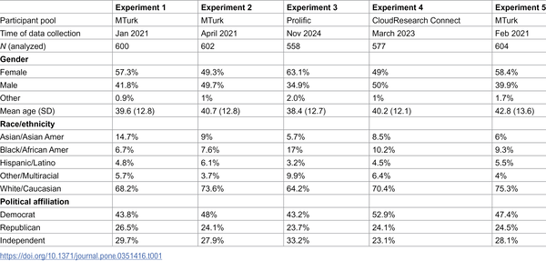

Can simply calling someone a “victim” change how we judge them? It turns out that the words we use to describe people involved in conflicts or crimes can subtly but powerfully shape our attitudes. Whether it’s a man accused of sexual assault, a celebrity charged with domestic violence, or a police officer involved in a controversial shooting, the label of “victim” can tilt public opinion in unexpected ways.

> **TL;DR**
> - Labeling a person as the victim in news reports consistently increases support for them, across diverse contexts including sexual assault, domestic violence, and police shootings.
> - This “victim framing” effect mainly influences people who consciously recognize and cite the victim label as shaping their judgments, highlighting how language cues guide social evaluations.

In public discourse, especially around crime and justice, defenders of accused individuals often portray their client as the “real victim” to gain sympathy and reduce blame. This rhetorical tactic, known as victim framing, has been studied mostly in sexual assault cases. But does this linguistic strategy work more broadly? Understanding how victim framing operates is important because it can influence legal outcomes, media coverage, and social attitudes toward all parties involved.

Researchers conducted five experiments involving nearly 3,000 participants from across the United States. Participants read fictional news articles describing various alleged wrongdoings—ranging from sexual assault allegations involving different genders and sexual orientations, to physical assault by celebrities or strangers, and even a police shooting of an unarmed civilian. In each scenario, either the accused, the accuser, or neither was explicitly labeled as the victim. After reading, participants rated their support, empathy, and perceptions of responsibility for each person involved. They also copied the part of the article that most influenced their opinions, allowing researchers to identify who was affected by the victim framing language.

The studies found that victim framing consistently swayed attitudes: people tended to support whoever was labeled the victim more than in cases where no victim label was used. This effect held true across all types of scenarios, including less familiar or racially charged contexts like police shootings. However, the framing only strongly influenced those participants who explicitly referenced the victim-related language when explaining their judgments. Individual differences like gender or political beliefs influenced overall attitudes but did not eliminate the effect of victim framing. Interestingly, some participants who rejected common myths about sexual assault showed a reverse effect when the accused was framed as the victim, indicating that personal beliefs also interact with how language shapes opinion.

These findings highlight the subtle but meaningful role language plays in shaping social and legal judgments. Victim framing is a powerful tool that can influence public support and perceptions of credibility, responsibility, and harm. Recognizing this effect is crucial for media literacy, legal discourse, and social justice efforts, as it underscores how labels can bias our evaluations even when the facts remain constant. This research also extends our understanding of victim framing beyond sexual assault to a broader range of social conflicts, suggesting the need for careful attention to how victims and perpetrators are described in public narratives.

While the experiments used well-controlled fictional scenarios and a large, diverse sample, real-world situations are often more complex, involving additional information and emotional factors. The victim framing effect depends on individuals consciously noticing the victim label, so it may not influence everyone equally. Moreover, personal beliefs and cultural backgrounds can modulate how people respond to such framing. Future research could explore how these effects play out in actual media consumption and legal decision-making, as well as strategies to mitigate unintended biases caused by language.

## Figures

*Table 1 shows the age, gender, and background of all participants in the experiments.*

## Sources

- [Victim framing shapes attitudes across diverse contexts](https://journals.plos.org/plosone/article?id=10.1371/journal.pone.0351416)
- DOI: [10.1371/journal.pone.0351416](https://doi.org/10.1371/journal.pone.0351416)
