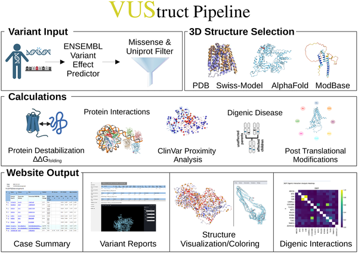
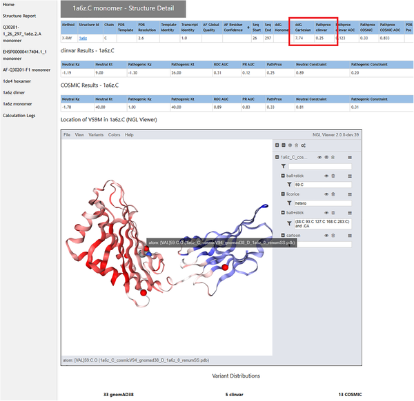

Imagine a doctor faced with a patient whose symptoms suggest a rare genetic disorder, but whose DNA sequencing reveals genetic variants that are mysterious—neither clearly harmful nor benign. How can these ‘variants of unknown significance’ be understood to guide diagnosis and treatment? Enter VUStruct, an innovative software pipeline that harnesses the power of 3D protein structures, artificial intelligence, and high-performance computing to shed light on these genetic puzzles.

> **TL;DR**
> - VUStruct automates the analysis of genetic variants by mapping them onto 3D protein structures and running a suite of computational assessments to predict their molecular impacts.
> - This pipeline has already aided clinicians in diagnosing rare diseases by generating mechanistic hypotheses about how specific variants disrupt protein function.

Genetic sequencing has revolutionized our ability to identify variants in patient genomes, but many of these variants remain ‘unknown’ in terms of their effect on health. Traditional methods rely on databases linking genes to diseases or on DNA-level scoring algorithms, which often lack the specificity needed for individual diagnosis. Proteins—the molecular machines encoded by genes—operate in complex three-dimensional shapes, and changes in their amino acid sequences can affect folding, stability, interactions, and function. Understanding these effects requires structural biology insights beyond what DNA sequence alone can provide.

VUStruct begins with a patient’s list of genetic variants and automatically converts these into protein-level changes. It then selects relevant 3D protein structures from experimental databases and computational models, including AlphaFold predictions and curated splice variants. Using a high-performance computing cluster, VUStruct launches multiple parallel analyses: it evaluates how variants might alter protein folding energy, predicts disruptions to binding surfaces, assesses spatial clustering of variants linked to disease, and examines potential impacts on post-translational modification sites. The pipeline also considers combinations of variants that might cause digenic diseases. Results are integrated into a user-friendly web report with interactive 3D visualizations and links to established variant databases.

Applied to over 175 patient cases from the Undiagnosed Diseases Network, VUStruct has demonstrated clinical utility by generating hypotheses that guided further testing and diagnosis. In two highlighted cases, the structural insights provided by VUStruct were key to resolving previously unsolved diagnostic challenges. Beyond clinical use, VUStruct has supported academic research by informing experimental directions in computational genomics and biochemical studies. Its automated, extensible design allows it to keep pace with expanding protein structure databases and advances in machine learning.

VUStruct represents a significant step forward in personalized medicine for rare genetic diseases. By integrating 3D structural biology with AI-powered analyses, it moves beyond DNA sequence scores to mechanistic interpretations of how variants affect protein function. This deeper understanding can improve diagnostic accuracy, inform treatment decisions, and accelerate research into disease mechanisms. As protein structure prediction and computational power continue to advance, tools like VUStruct will become increasingly vital in translating genomic data into actionable clinical insights.

While VUStruct enhances variant interpretation, it does not provide definitive pathogenicity predictions alone. Its strength lies in generating mechanistic hypotheses that require validation through clinical correlation and experimental follow-up. The accuracy of analyses depends on the quality and availability of protein structures and models, which vary across genes. Additionally, the pipeline currently focuses on missense variants affecting protein coding regions and may not capture effects of other variant types or regulatory elements. Users should consider VUStruct as a complementary tool within a broader diagnostic framework.

## Figures

*VUStruct maps user-provided genetic variants onto protein structures and runs multiple analyses using high-performance computing.*

*Interactive 3D models show genetic variant impacts with color codes and stats to help understand their effects and reliability.*

## Sources

- [VUStruct: A compute pipeline for high throughput and personalized structural biology](https://journals.plos.org/ploscompbiol/article?id=10.1371/journal.pcbi.1014183)
- DOI: [10.1371/journal.pcbi.1014183](https://doi.org/10.1371/journal.pcbi.1014183)
