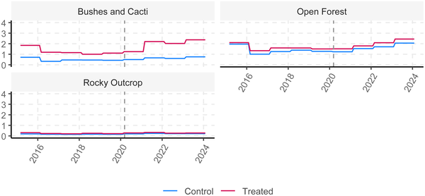
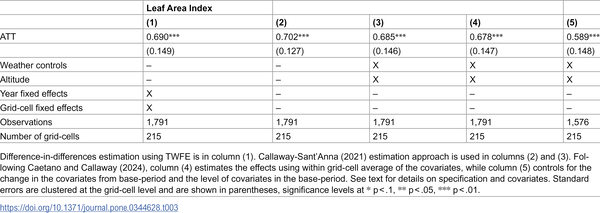

What happens to nature when humans suddenly disappear? The Galapagos Islands, famous for their unique biodiversity, offer a striking example. When the COVID-19 pandemic halted tourism and restricted movement, these fragile islands experienced an unexpected environmental respite. Using satellite imagery, scientists observed a remarkable surge in vegetation density, revealing how quickly nature can respond when human pressures ease.

> **TL;DR**
> - During the COVID-19 lockdowns, vegetation density in tourism zones of the Galapagos Islands increased by 51%, especially in sensitive Bushes and Cacti areas.
> - Agricultural zones also saw a 33% increase in vegetation density, reflecting intensified local food production amid disrupted imports.

The Galapagos Islands are globally renowned for their extraordinary biodiversity and ecological sensitivity. However, these islands face significant environmental pressures from tourism and agriculture, alongside a heavy reliance on imported food. Human activities have long altered the natural landscape, fragmenting habitats and reducing native vegetation. In 2020, the COVID-19 pandemic led to an unprecedented halt in tourism and restricted movement of goods and people, creating a rare natural experiment to study how vegetation responds when human disturbance abruptly diminishes.

Researchers used satellite-derived Leaf Area Index (LAI) data, which measures the density of plant leaves covering the ground, to track vegetation changes from 2014 through early 2024. They focused on islands with both diverse vegetation and human activity, such as Santa Cruz and Isabela. By mapping tourism and agricultural zones separately and comparing them to similar but undisturbed control areas, the team applied a robust statistical method called a doubly robust difference-in-differences approach. This allowed them to isolate the effects of the COVID-19 mobility restrictions on vegetation density while accounting for factors like rainfall and temperature.

The study found a striking 51% increase in vegetation density within tourism areas, particularly in the fragile Bushes and Cacti zones, following the cessation of foot traffic during lockdowns. Simultaneously, agricultural zones showed a 33% increase in vegetation density relative to control areas, indicating that local food production intensified as imports were disrupted. Notably, these vegetation changes persisted even after some restrictions were eased, suggesting lasting shifts in land use and ecosystem recovery.

These findings provide quantitative evidence of how quickly island ecosystems can respond to changes in human activity. The rapid vegetation resurgence highlights the resilience of natural landscapes when given relief from human pressures. Moreover, the simultaneous increase in agricultural vegetation underscores the complex balance between conservation and food security in island communities. This research offers valuable insights for land-use policy and conservation strategies, emphasizing the importance of managing tourism and agriculture to support both ecological health and local livelihoods.

While the study leverages robust satellite data and statistical methods, it is limited to the Galapagos Islands and may not directly generalize to other ecosystems. The timing of government agricultural aid programs, which began after the initial lockdown period, suggests that immediate vegetation changes were primarily driven by reduced human disturbance rather than policy interventions. However, later support may have reinforced some land-use changes. Additionally, the study focuses on vegetation density as measured by leaf area, which does not capture all aspects of ecosystem health or biodiversity. Further research is needed to understand long-term ecological impacts and to explore similar effects in other regions.

## Figures

*Changes in plant leaf coverage over time in Galapagos tourism areas by vegetation type.*

*How travel limits affect the leaf cover of bushes and cacti in tourist spots.*

## Sources

- [Welcome to paradise: Measuring vegetation responses to tourism and agricultural activity using Leaf Area Index in the Galapagos Islands](https://journals.plos.org/plosone/article?id=10.1371/journal.pone.0344628)
- DOI: [10.1371/journal.pone.0344628](https://doi.org/10.1371/journal.pone.0344628)
