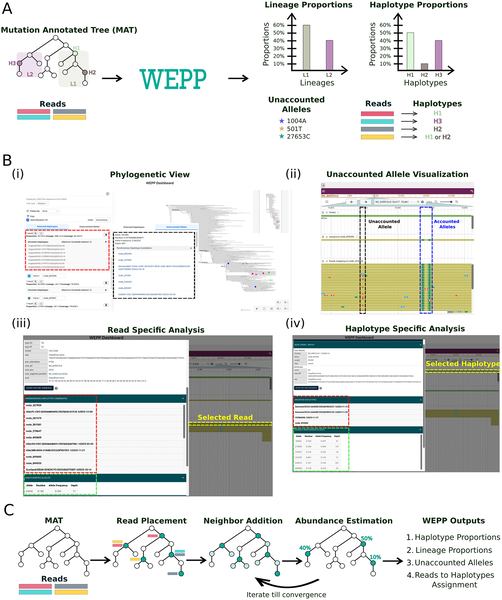
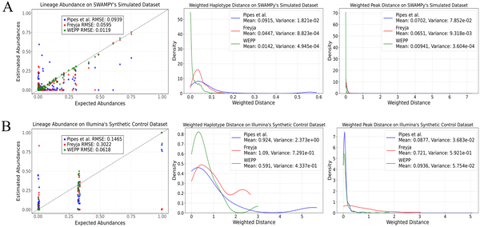
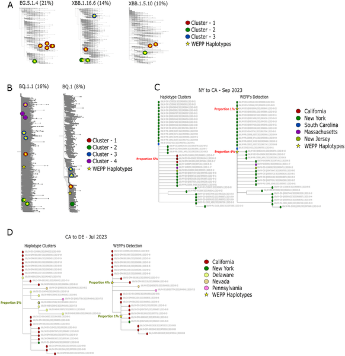
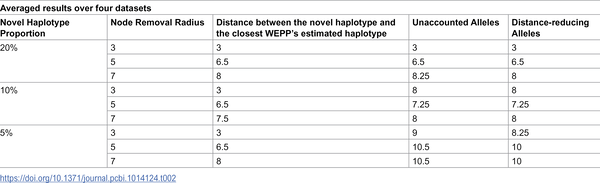

Imagine being able to detect emerging virus variants in your city’s sewage weeks before they appear in clinical tests. This capability could provide crucial early warnings to public health officials, enabling faster responses to outbreaks. A new computational tool named WEPP (Wastewater-based Epidemiology using Phylogenetic Placements) makes this possible by reading viral genetic fragments in wastewater with near-exact precision, surpassing previous methods that only identified broad viral lineages.

> **TL;DR**
> - WEPP uses global phylogenetic trees of viral genomes to identify near-haplotype matches from fragmented viral sequences in wastewater samples.
> - This approach enables earlier detection of emerging variants, tracking of local transmission clusters, and identification of viral lineages missed by clinical surveillance.

Wastewater-based epidemiology (WBE) has become a valuable tool for monitoring infectious diseases since the COVID-19 pandemic. By analyzing sewage, which contains a mixture of pathogens shed by infected individuals, WBE offers a cost-effective, non-invasive, and timely snapshot of community-level infections. However, existing WBE methods typically identify viruses only at the lineage or strain level, limiting their ability to detect subtle genetic differences or novel variants. Clinical sequencing can provide finer resolution but is more expensive, slower, and has declined in many regions post-pandemic. Bridging this gap requires improved computational methods that can extract detailed genetic information from the complex, fragmented viral sequences found in wastewater.

WEPP addresses these challenges by leveraging a comprehensive, daily-updated global phylogeny of viral genomes known as a mutation-annotated tree (MAT). Instead of reconstructing viral genomes from scratch, WEPP places short sequencing reads from wastewater samples onto this large phylogenetic tree to identify the most likely viral haplotypes present. It then estimates the relative abundance of each haplotype and lineage within the sample. Importantly, WEPP flags “unaccounted alleles” — genetic variants found in the wastewater data but not explained by known haplotypes — which may indicate emerging or cryptic variants. The tool also includes an interactive dashboard that visualizes haplotype placements, abundances, and mutations in a global phylogenetic context, allowing detailed exploration of the data.

Extensive testing on simulated, synthetic, and real wastewater samples demonstrated that WEPP achieves near-haplotype resolution, accurately identifying viral variants within a single nucleotide difference of the true sequences. Compared to existing tools, WEPP improved the accuracy of lineage abundance estimates and detected viral haplotype clusters circulating within communities. Notably, it identified introductions of new viral clusters into cities up to five weeks before clinical confirmation and discovered mutations associated with novel variants. WEPP also found viral lineages present in wastewater but missed by clinical sequencing, highlighting its potential to fill surveillance gaps.

By enhancing the resolution of wastewater-based epidemiology from lineage-level to near-haplotype-level, WEPP transforms how public health officials can monitor infectious diseases. This improved precision enables earlier detection of emerging variants, better understanding of local transmission dynamics, and identification of cryptic viral mutations that may herald new outbreaks. As clinical sequencing efforts wane, tools like WEPP offer a scalable, cost-effective way to maintain robust genomic surveillance across diverse pathogens and regions. Ultimately, WEPP empowers communities to respond more swiftly and effectively to infectious disease threats through smarter wastewater monitoring.

While WEPP represents a significant advance, it relies on the availability and quality of global viral genome databases and sequencing data from wastewater samples. ‘Unaccounted alleles’ flagged by WEPP may sometimes result from sequencing errors or incomplete haplotype selection rather than true novel variants, necessitating careful interpretation. Additionally, the computational approach requires substantial processing power for large datasets, though the developers have optimized it for scalability. Continued validation across different pathogens and environments will help refine WEPP’s accuracy and broaden its applicability.

## Figures

*WEPP analyzes genetic data to identify and estimate the abundance of different haplotypes using an interactive dashboard and phylogenetic algorithms.*

*Fig 2 compares how well WEPP, Freyja, and Pipes et al. estimate lineage abundance and genetic differences in simulated and synthetic samples.*

*WEPP detects and visualizes virus haplotype clusters and their spread between states using its dashboard in different scenarios from 2023.*

*Table showing how WEPP detects new genetic types by changing their amount and mutation distance in samples.*

## Sources

- [WEPP: Phylogenetic placement achieves near-haplotype resolution in wastewater-based epidemiology](https://journals.plos.org/ploscompbiol/article?id=10.1371/journal.pcbi.1014124)
- DOI: [10.1371/journal.pcbi.1014124](https://doi.org/10.1371/journal.pcbi.1014124)
