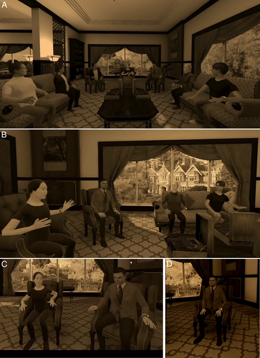

Imagine attending a panel discussion where the speakers appear as familiar faces in virtual reality — but halfway through, two panelists swap their virtual bodies, trying to impersonate each other. Would you notice? Now add an AI-controlled avatar of a historical figure joining the conversation. This scenario recently played out at a major VR conference, revealing surprising insights about how we perceive identity and authenticity in social virtual reality (VR).

> **TL;DR**
> - About 40% of the audience did not detect when two panelists swapped avatars and impersonated each other in a live VR panel.
> - An AI-driven avatar of Alan Turing participated in the panel, showing both the potential and challenges of AI impersonation in VR environments.

Virtual reality has evolved from a niche technology into a platform where people can meet, work, and socialize in immersive environments. As VR and extended reality (XR) technologies grow, so do concerns about how identity is represented and verified. Unlike traditional video calls, VR allows users to embody avatars that can look and move like real people. This opens up new possibilities — but also new risks. What happens if someone impersonates a friend or colleague by taking over their avatar? Or if AI systems create convincing virtual personas that blur the line between human and machine? These questions become urgent as social VR platforms gain popularity and AI language models become more sophisticated.

To explore these issues, researchers organized a panel discussion at the IEEE VR 2025 conference. Five panelists appeared as avatars closely resembling their real selves, interacting in a virtual reconstruction of Bletchley Park, the historic site where Alan Turing worked during World War II. The panel was projected live onto a large screen for the conference audience. Midway through the discussion, two panelists deliberately swapped avatars and attempted to mimic each other’s mannerisms and speech styles. Additionally, an avatar of Alan Turing, controlled by a large language model (similar to ChatGPT), joined the panel and contributed to the conversation. After the session, about 100 audience members completed a survey to assess whether they noticed the avatar swap and their impressions of the AI participant.

The results were striking: nearly 40% of respondents did not notice the avatar swap, demonstrating a form of 'change blindness' to social identity within VR. This suggests that visual appearance and embodied presence can strongly influence how we identify others, even when behavior and speech patterns change. Meanwhile, the AI-controlled Alan Turing avatar was generally perceived as less realistic and somewhat distracting, but its participation highlighted the growing capabilities of AI in natural language interaction within immersive environments. Together, these findings reveal both the power and the pitfalls of identity representation in social VR.

This study underscores the urgent need for ethical guidelines and identity verification methods in social VR platforms. As AI-driven avatars become more lifelike and VR environments more immersive, the potential for impersonation and deception grows. Without safeguards, users might unknowingly share sensitive information or be manipulated by AI or malicious actors masquerading as trusted individuals. The research also raises important questions about how historical figures should be represented by AI in virtual spaces, balancing educational value with respect and authenticity. Understanding these dynamics is crucial as extended reality and AI technologies continue to merge and reshape social interaction.

While insightful, the study had some limitations. The panel took place in a controlled conference setting with a modest sample size, which may not fully reflect real-world social VR experiences. The audience was aware they were watching a VR panel, possibly influencing their perceptions. Also, the AI avatar’s behavior was limited by current language model capabilities and the specific interface used. More research is needed to explore identity deception and AI impersonation across diverse VR contexts and larger populations, as well as to develop effective detection and ethical frameworks.

## Figures

*A virtual room where panelists and the moderator interact, showing their positions and views during the discussion.*

## Sources

- [Where extended reality and AI may take us: Ethical issues of impersonation and AI fakes in social virtual reality](https://journals.plos.org/plosone/article?id=10.1371/journal.pone.0340829)
- DOI: [10.1371/journal.pone.0340829](https://doi.org/10.1371/journal.pone.0340829)
