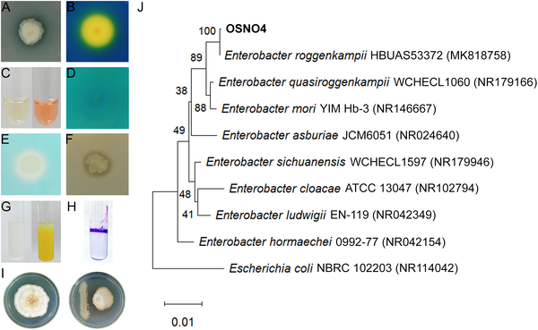
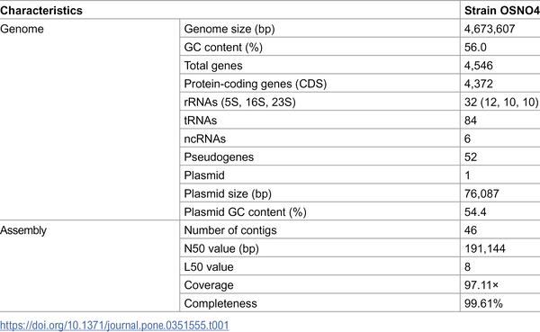
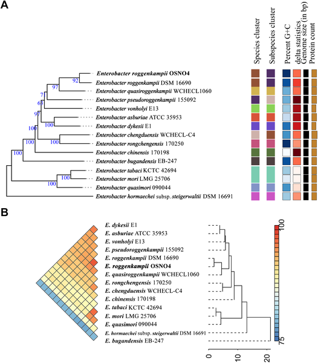

Soil salinity is a growing threat to global agriculture, especially for rice, a staple feeding over half the world's population. But what if tiny microbes living around plant roots could help crops thrive in salty soils? Scientists have uncovered a salt-loving bacterium, Enterobacter roggenkampii OSNO4, that not only tolerates harsh conditions but also promotes rice growth under salt stress. By decoding its entire genome, researchers are revealing the genetic toolkit that empowers this bacterium to support plants and potentially transform farming in saline environments.

> **TL;DR**
> - Enterobacter roggenkampii OSNO4 is a halotolerant rhizobacterium with multiple plant growth-promoting traits, including nutrient solubilization, hormone production, and antifungal activity.
> - Whole-genome sequencing and functional assays confirm OSNO4’s ability to improve rice seed germination, root and shoot growth under salinity stress, making it a promising bioinoculant for climate-resilient agriculture.

Rice cultivation faces significant challenges from soil salinity, which disrupts plant nutrient uptake and growth, leading to reduced yields. Traditional methods to combat salinity stress are often costly or environmentally taxing. Plant growth-promoting rhizobacteria (PGPR) offer an eco-friendly alternative by naturally enhancing plant resilience and nutrient acquisition. While several salt-tolerant bacteria have been identified, comprehensive genome-level understanding of their beneficial traits and safety is crucial before agricultural application. Enterobacter roggenkampii, a species found in diverse environments including plant rhizospheres, has remained underexplored at the genomic scale despite its potential. This study focuses on a strain named OSNO4, isolated from rice rhizosphere soil in Bangladesh, to uncover its genetic and functional capabilities supporting rice growth under salt stress.

Researchers collected soil samples from rice fields across multiple districts and isolated 283 bacterial strains. Among these, 24 showed the ability to solubilize phosphate, a key nutrient for plants. The strain OSNO4 stood out for its multiple beneficial traits. It was tested for phosphate and potassium solubilization, production of the plant hormone indole-3-acetic acid (IAA), nitrogen fixation, siderophore (iron-chelating compounds) and ammonia production, protease activity, biofilm formation, and tolerance to abiotic stresses such as high salinity (up to 10% NaCl), drought, temperature extremes, and pH variations. OSNO4 also demonstrated antifungal activity against Fusarium concentricum, a plant pathogen. Whole-genome sequencing was performed using Illumina technology, followed by assembly and annotation to identify genes related to plant growth promotion, stress tolerance, and biosafety. Pan-genome analysis compared OSNO4 with related strains, and rice seed germination and growth assays under salt stress evaluated its practical effects.

The genome of OSNO4 spans approximately 4.67 million base pairs with 4,546 predicted genes. Genomic analysis revealed genes involved in nutrient mobilization, phytohormone biosynthesis, abiotic stress tolerance, and antifungal compound production. Six biosynthetic gene clusters were identified, including those related to siderophore production and potentially novel metabolites. Functionally, OSNO4 solubilized phosphate and potassium, produced significant levels of IAA, fixed nitrogen, and formed biofilms, all contributing to plant growth. Notably, it tolerated high salt concentrations and suppressed fungal growth by over 54%. In rice seed germination tests under salinity stress (100 and 150 mM NaCl), OSNO4 inoculation increased germination rates substantially, from around 50% to over 85% and 42% to 72%, respectively. Seedlings treated with OSNO4 also showed improved root and shoot growth and biomass accumulation compared to controls. Importantly, antibiotic susceptibility testing and absence of hemolytic activity suggested OSNO4 is safe for agricultural use.

This study provides a comprehensive genomic and functional characterization of Enterobacter roggenkampii OSNO4, highlighting its multifaceted abilities to support rice growth under salinity stress. By combining genome sequencing with laboratory and plant assays, the research offers a detailed blueprint of the bacterium’s beneficial traits and safety profile. The findings underscore OSNO4’s potential as a bioinoculant to enhance crop resilience in saline soils, an increasingly important goal amid climate change and soil degradation. Deploying such microbial allies could reduce reliance on chemical fertilizers and improve sustainable agricultural productivity, particularly in salt-affected regions.

While the results are promising, the study was conducted under controlled laboratory and pot conditions, which may not fully replicate complex field environments. Further large-scale field trials are necessary to confirm OSNO4’s efficacy and stability in diverse agricultural settings. Additionally, although genomic analyses suggest biosafety, continuous monitoring for potential horizontal gene transfer or unintended ecological impacts is prudent before widespread application. The bacterium’s interactions with native soil microbiomes and long-term effects on soil health also warrant further investigation.

## Figures

*Isolate OSNO4 shows multiple plant growth benefits and is identified by its genetic sequence among related bacteria.*

*Overview of the key genetic features of strain OSNO4.*

*Phylogenomic analysis shows the genetic relationships of E. roggenkampii OSNO4 with related bacteria using genome comparisons and similarity scores.*

## Sources

- [Whole-genome characterization of halotolerant Enterobacter roggenkampii OSNO4 and its potential for climate-resilient agriculture](https://journals.plos.org/plosone/article?id=10.1371/journal.pone.0351555)
- DOI: [10.1371/journal.pone.0351555](https://doi.org/10.1371/journal.pone.0351555)
