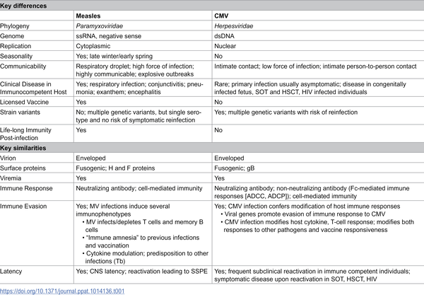
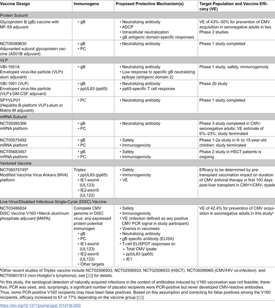

Measles and cytomegalovirus (CMV) are both viruses that commonly infect humans, especially children. Yet, while the measles vaccine has been a public health triumph for decades, a vaccine for CMV remains elusive. Why is it that we can prevent measles so effectively but still struggle to develop a vaccine against CMV? Understanding the differences in these viruses’ biology, how they infect people, and how our immune system responds to them sheds light on this important question.

> **TL;DR**
> - Measles virus causes a highly contagious, symptomatic disease that elicits strong lifelong immunity after infection, making vaccine development more straightforward.
> - CMV infection is often asymptomatic, involves complex immune evasion, strain variation, and lifelong latency, complicating efforts to create an effective vaccine.

Both measles virus (MV) and cytomegalovirus (CMV) are widespread viral infections typically acquired during childhood, and humans are their only hosts. Measles virus is a relatively recent human pathogen that jumped from cattle, whereas CMV has co-evolved with humans and other animals over millions of years. Measles causes an acute, often severe illness with symptoms like rash and fever, while CMV infections are usually silent in healthy individuals but can cause serious disease in newborns and immunocompromised patients. The measles vaccine, developed in the 1970s, is highly effective and confers lifelong immunity, but despite decades of research, no licensed CMV vaccine exists yet. This contrast raises important questions about the challenges of vaccine development for different viruses.

Researchers have compared the biology, epidemiology, and immune responses elicited by measles virus and CMV to understand why vaccine development has succeeded for one but not the other. This includes detailed analyses of viral genomes, modes of transmission, clinical manifestations, and immune evasion strategies. Clinical trials testing various CMV vaccine candidates—such as subunit vaccines targeting viral envelope proteins, mRNA vaccines, and disabled infectious single-cycle viral vaccines—have also been conducted to evaluate safety, immunogenicity, and efficacy. These studies inform which viral components might best stimulate protective immunity and highlight the complexities involved.

Key differences emerge between the two viruses. Measles virus is a highly contagious RNA virus spread by respiratory droplets, causing symptomatic disease that triggers strong neutralizing antibody and cellular immune responses, leading to lifelong immunity. In contrast, CMV is a DNA virus transmitted mainly through intimate contact and body fluids, often causing asymptomatic infections but capable of lifelong latency and frequent reactivation. CMV has a large, complex genome encoding many proteins that help it evade the immune system and vary between strains, allowing reinfections even in previously immune individuals. These factors make it difficult to identify clear immune correlates of protection and to design vaccines that provide durable immunity. Clinical trials of CMV vaccines targeting glycoprotein B and other viral proteins have shown only moderate or limited efficacy so far.

Understanding why a vaccine exists for measles but not CMV highlights the intricate interplay between viral biology and immune defense mechanisms. It underscores that vaccine development is not just about making a safe vaccine but also about overcoming challenges posed by viral diversity, immune evasion, and the need for long-lasting protection. For CMV, a vaccine is especially important to prevent congenital infections that cause lifelong disabilities. Progress in CMV vaccine research continues, informed by lessons from measles and other viruses, and remains a critical goal for improving public health.

While the insights into measles and CMV differences clarify many challenges, vaccine development is an evolving field. Some CMV vaccine candidates are still in clinical trials, and future advances in immunology and vaccine technology may overcome current obstacles. Additionally, the complex nature of CMV infection and immunity means that a single vaccine approach may not be sufficient, and multiple strategies might be needed. Continued research and clinical evaluation are essential before a safe and effective CMV vaccine becomes widely available.

## Figures

*Table comparing key biological features of cytomegalovirus and measles virus.*

*Table showing recent CMV vaccine trials and their viral targets, with study numbers for active and recent trials.*

## Sources

- [Why do we have a vaccine for measles, but not cytomegalovirus (CMV)?](https://journals.plos.org/plospathogens/article?id=10.1371/journal.ppat.1014136)
- DOI: [10.1371/journal.ppat.1014136](https://doi.org/10.1371/journal.ppat.1014136)
