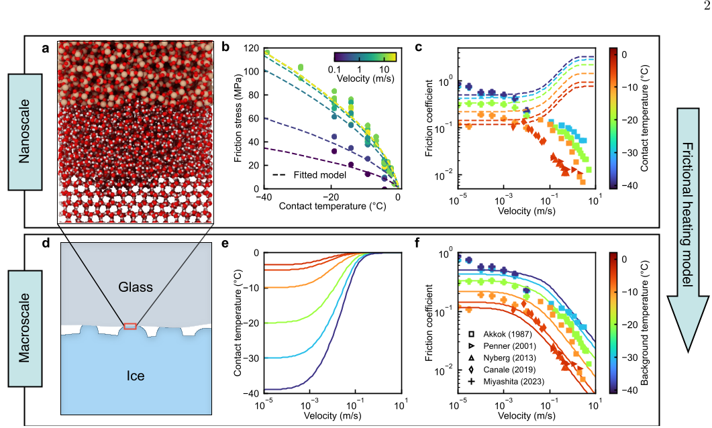

Why does ice feel so slippery under your feet or blades? For centuries, scientists have debated the cause behind this familiar yet puzzling phenomenon. Is it melting, pressure, or something else that makes ice slick? Recent research using advanced computer simulations and physics-based models sheds fresh light on this question, revealing that frictional heating—not melting—is the key to ice's slipperiness.

> **TL;DR**
> - Nanoscale simulations show that a thin liquid-like film forms on ice surfaces, but frictional heating during sliding dramatically thickens this film and reduces its viscosity, lowering friction.
> - By combining molecular-level friction data with a frictional heating model, researchers accurately predict how ice friction decreases with sliding speed, matching experimental observations.

*Note: this summary is based on a preprint — research shared ahead of formal peer review.*

The slipperiness of ice has intrigued humans since ancient times, with early sleds and skates relying on this property. Historically, explanations ranged from Michael Faraday’s 19th-century idea of a premelting liquid film on ice surfaces to theories about pressure-induced melting and frictional heating proposed in the early 20th century. Despite extensive study, the precise mechanisms remained debated, especially as modern experiments and simulations offered conflicting views on the roles of melting, pressure, and shear effects at the ice interface.

To tackle this, the researchers performed molecular dynamics simulations using machine-learning interatomic potentials to model ice sliding against glass at the nanoscale—a proxy for ice-rock contact. These simulations provided frictional shear stress data across various sliding velocities and temperatures. Recognizing that nanoscale data alone overestimate friction and miss velocity trends, they integrated these results into a frictional heating model that accounts for heat generated at microscopic contact points. This multiscale approach allowed them to predict macroscopic friction behavior by iteratively solving for contact temperature and friction stress.

The simulations confirmed that a premelting liquid-like film exists on ice surfaces even without sliding or heating. However, as sliding speed increases, frictional heating raises the contact temperature close to the melting point, thickening this film by about ten times and reducing its viscosity by roughly a hundredfold. These changes cause friction to decrease with velocity, aligning closely with experimental ice–glass friction data. The study also showed that the frictional behavior is robust across different simulation methods and ice crystal orientations, reinforcing the central role of frictional heating rather than melting.

This work reconciles previous conflicting theories by demonstrating that while premelting establishes the lubricating film, frictional heating governs its slipperiness during motion. It revives and supports the nearly century-old hypothesis by Bowden and Hughes that frictional heating—not melting—is responsible for ice’s low friction. Understanding this mechanism has practical implications for winter sports, safety on icy surfaces, and materials design, providing a more accurate physics-based foundation for predicting and managing ice friction.

While the study’s multiscale simulations and modeling offer strong evidence, it remains a computational study pending peer-reviewed validation. The model focuses on ice–glass interfaces, so slipperiness involving snow, other materials, or coated surfaces requires further investigation. Additionally, the complex interplay of shear-induced disordering and recrystallization at the interface continues to be an active area of research, highlighting that ice friction is a multifaceted phenomenon.

## Figures

*This figure compares ice friction from tiny nanoscale contacts to larger macroscale surfaces, showing how temperature and speed affect sliding friction. — Figure from Sigbjørn Løland Bore et al., [CC BY 4.0](http://creativecommons.org/licenses/by/4.0/), caption edited.*

## Sources

- [Why ice is so slippery](https://arxiv.org/abs/2603.11539)
- DOI: [10.48550/arxiv.2603.11539](https://doi.org/10.48550/arxiv.2603.11539)

*This article reuses and adapts text and figures from the original research by Sigbjørn Løland Bore et al., available via arXiv Materials Science, under the [CC BY 4.0](http://creativecommons.org/licenses/by/4.0/) license.*
