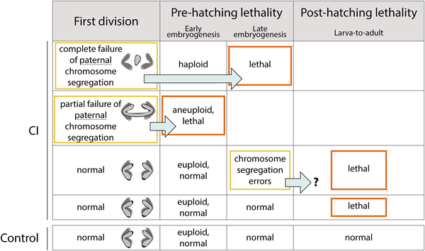
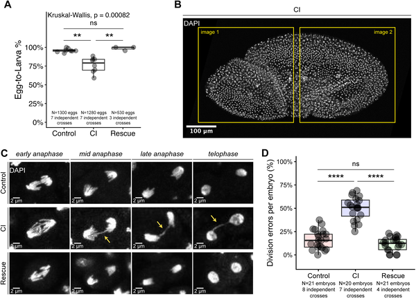
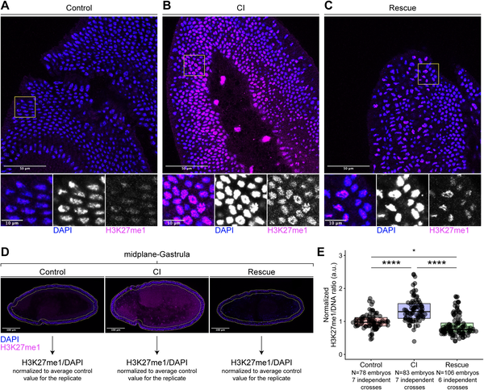
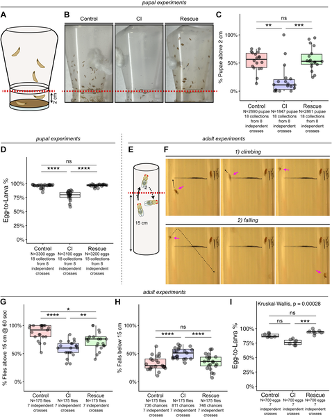

Imagine a tiny bacterium that can manipulate the reproductive biology of insects to ensure its own spread — not just by causing early embryo death, but by subtly altering development and behavior long after birth. This is the story of Wolbachia, a widespread bacterial symbiont known for its ability to influence insect reproduction through a phenomenon called cytoplasmic incompatibility (CI). Recent research has uncovered surprising new effects of this bacterial manipulation, revealing that Wolbachia’s influence extends beyond early embryo lethality to cause delayed developmental defects and movement problems in fruit flies, driven by epigenetic changes and maternal genetic factors.

> **TL;DR**
> - Wolbachia-induced cytoplasmic incompatibility causes chromosome segregation errors not only during the first embryonic division but also later during gastrulation, leading to increased embryo and larval death.
> - These delayed defects are linked to elevated levels of an epigenetic chromatin mark (H3K27me1) and are influenced by the maternal genetic background, suggesting complex host-bacteria interactions beyond early embryo lethality.

Wolbachia bacteria are common endosymbionts found in many insect species, transmitted maternally through eggs. They manipulate host reproduction in various ways to favor infected females, thereby spreading themselves through insect populations. One key mechanism is cytoplasmic incompatibility (CI), where sperm from infected males is modified so that when it fertilizes eggs from uninfected females, the resulting embryos often fail to hatch. This phenomenon has been exploited in vector control strategies to reduce populations of disease-carrying insects. However, until now, research has mostly focused on the immediate effects of CI on early embryo death, leaving the broader developmental consequences less understood.

Researchers investigated the effects of Wolbachia-induced CI in the fruit fly Drosophila melanogaster, a well-established model organism. They performed controlled crosses between infected and uninfected flies, including 'CI crosses' (infected males × uninfected females) and 'Rescue crosses' (both parents infected). Using a panel of genetically distinct wild-type female lines, they assessed variability in CI effects. The team examined chromosome segregation during embryonic development stages, measured egg hatch rates, and observed larval and adult behaviors such as climbing ability. They also used immunofluorescence to quantify levels of the epigenetic chromatin mark H3K27me1 in embryos, linking molecular changes to developmental outcomes.

The study confirmed that CI leads to well-known chromosome segregation errors during the first embryonic division, reducing egg hatch rates. Importantly, it also revealed that embryos surviving this initial stage still experience significant mitotic errors during gastrulation, a later developmental phase, which correlates with increased larval lethality. Moreover, larvae and adult flies derived from CI crosses showed locomotor defects, such as impaired climbing ability. These defects were absent in Rescue crosses, indicating that Wolbachia infection in females can mitigate the effects. The researchers found that CI-derived embryos had significantly elevated levels of the epigenetic mark H3K27me1, suggesting that Wolbachia-induced sperm modifications trigger heritable chromatin changes. Additionally, the strength of CI-induced lethality varied widely depending on the maternal genetic background, highlighting the complexity of host-symbiont interactions.

These findings expand our understanding of how Wolbachia manipulates insect reproduction, showing that the impact of cytoplasmic incompatibility extends beyond early embryo death to include delayed developmental and behavioral defects mediated by epigenetic mechanisms. This deeper insight is crucial for improving Wolbachia-based strategies to control insect populations and reduce vector-borne diseases. Recognizing the role of maternal genetics and epigenetics in CI strength could help tailor more effective interventions and predict outcomes in diverse insect populations.

While this study provides compelling evidence of delayed Wolbachia-induced defects and epigenetic involvement, it primarily focuses on laboratory fruit fly models, which may not capture the full complexity of natural insect populations. The exact molecular pathways linking Wolbachia modifications to epigenetic changes remain to be fully elucidated. Additionally, variability in CI effects across different genetic backgrounds suggests that outcomes could differ widely in the wild, underscoring the need for further research to understand how these findings translate to other species and ecological contexts.

## Figures

*CI-derived embryos often face chromosome errors causing death before or after hatching, with some dying during later development stages.*

*Embryos from CI crosses show more cell division errors during early development compared to controls, affecting egg hatch rates and chromosome segregation.*

*Embryos from CI flies show higher H3K27me1 levels compared to controls, indicating changes in chromatin during early development.*

*Larvae and adult flies from certain crosses show movement problems, climbing less and pupating lower than controls.*

## Sources

- [Wolbachia-induced Cytoplasmic Incompatibility drives epigenetic and maternally-influenced post-embryonic defects](https://journals.plos.org/plospathogens/article?id=10.1371/journal.ppat.1014180)
- DOI: [10.1371/journal.ppat.1014180](https://doi.org/10.1371/journal.ppat.1014180)
