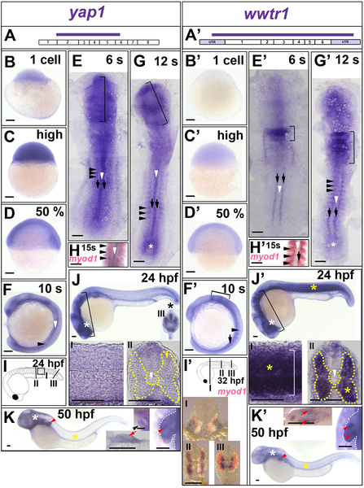
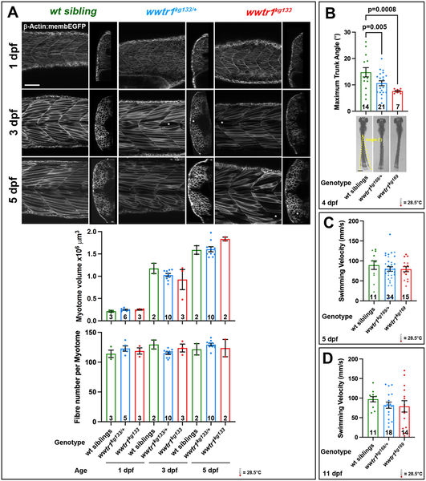
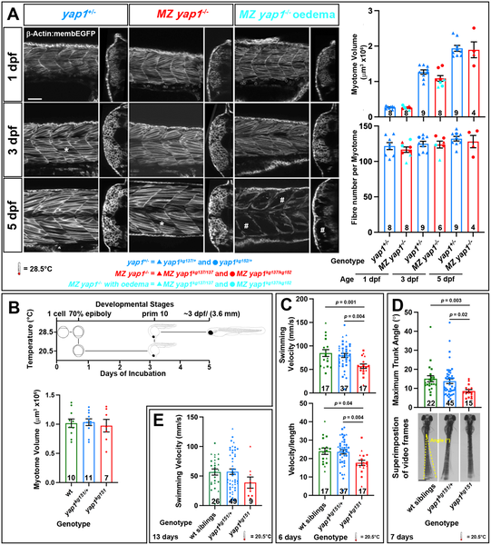
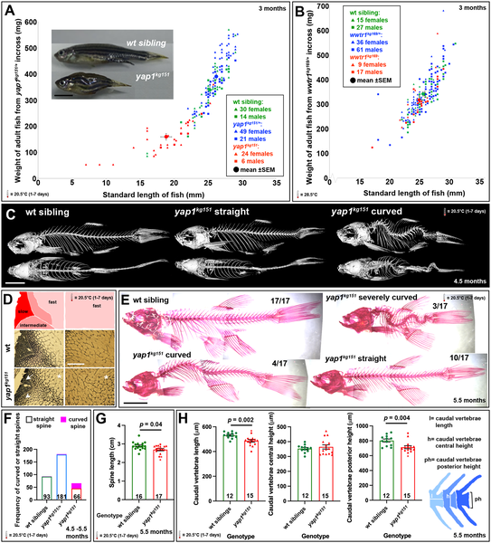

Scoliosis, a condition where the spine curves abnormally, affects millions worldwide, often emerging during adolescence. Despite its prevalence, the underlying causes remain elusive, involving a complex interplay of genetics, muscle function, and mechanical forces. Intriguingly, a tiny freshwater fish—the zebrafish—has become a powerful model to unravel these mysteries. Recent research reveals how a gene called Yap1 acts as a crucial sensor and regulator during spine development, helping to keep the vertebral column straight and preventing deformities like kyphoscoliosis.

> **TL;DR**
> - The Yap1 gene in zebrafish is essential for normal spine development and muscle function, acting as a mechanosensor that integrates signals between muscle, bone, and tendon.
> - Loss of Yap1 leads to early motility defects and gradual development of spinal curvature resembling human scoliosis, highlighting a genetic and mechanical feedback mechanism in vertebral growth.

Scoliosis affects about 2–3% of people and can require surgery in severe cases. It often arises during rapid growth phases in adolescence, a time when the musculoskeletal system undergoes intense remodeling. Scientists suspect that imbalances in forces exerted by muscles on bones contribute to spinal deformities. However, pinpointing the genetic and environmental factors that initiate scoliosis has been challenging. The Hippo signaling pathway, involving proteins like Yap1 and Wwtr1 (also known as Taz), is known to mediate cellular responses to mechanical forces in various tissues, including muscle and bone. Understanding how these proteins function during vertebral development could shed light on scoliosis mechanisms.

Researchers used zebrafish as a model organism due to their transparent embryos and well-characterized musculoskeletal development. They tracked the expression of yap1 and wwtr1 genes during early development, focusing on muscle precursor cells and the notochord, a structure important for spine formation. Using genome editing techniques, they created zebrafish mutants lacking functional Yap1 or Wwtr1 proteins. They then assessed the mutants' muscle development, swimming behavior, growth, and spine morphology over time. They also examined gene expression patterns related to the hypochord, a signaling center influencing vertebral growth, and tested environmental effects like temperature on mutant phenotypes.

The study found that yap1 is transiently expressed in muscle and notochord precursor cells early in development, while wwtr1 is expressed later in differentiated muscle fibers. Mutations in yap1 led to reduced overall growth and early defects in swimming ability, despite normal muscle histology. Notably, about one-third of yap1 mutants developed kyphoscoliosis—a combination of spinal curvature and vertebral abnormalities—starting around 11 days post-fertilization. These spinal defects appeared to arise from an initial mild vertebral growth defect that progressively worsened, consistent with a positive feedback mechanism where abnormal mechanical forces exacerbate deformity. In contrast, wwtr1 mutants showed only transient motility defects without scoliosis. The researchers also observed that yap1 mutants had altered expression of col8a1a mRNA in the hypochord, suggesting disrupted signaling during early vertebral development. Interestingly, some mutant symptoms, like tissue edema, were temperature-sensitive and could be alleviated by rearing fish at lower temperatures.

This research highlights Yap1 as a critical mechanosensor that integrates muscle and bone development signals to maintain spine integrity. It provides a compelling genetic and mechanistic link between early developmental gene expression, muscle function, and the gradual onset of scoliosis-like spinal deformities. By showing how a mild initial vertebral defect can evolve into full kyphoscoliosis through mechanical feedback, the study supports longstanding clinical observations about spine growth under abnormal forces. These insights could inform future studies aimed at identifying genetic risk factors and developing interventions to prevent or mitigate scoliosis in humans.

While the zebrafish model offers valuable insights, there are limitations to directly extrapolating findings to humans. The exact cell types where Yap1 acts autonomously remain unclear, and the interplay with other genetic and environmental factors requires further exploration. Additionally, the molecular pathways linking Yap1 mechanosensation to vertebral growth regulation are not fully delineated. Clinical applications will need extensive validation, and the temperature-sensitive aspects observed in fish may not translate to human physiology. Nonetheless, this work lays important groundwork for understanding the complex biology of spine development and scoliosis.

## Figures

*Early development shows distinct patterns of yap1 and wwtr1 mRNA in brain, notochord, and muscle precursor cells.*

*Wwtr1 mutant fish show normal muscle growth but reduced movement and slower swimming when stimulated compared to normal siblings.*

*Yap1 mutant larvae show normal muscle growth but swim slower and move less in response to touch and electrical stimulation compared to siblings.*

*Adult yap1 mutants show curved spines, smaller vertebrae, and reduced growth compared to normal fish, with similar muscle fiber types observed.*

## Sources

- [Yap1 regulates motility and vertebral development and prevents kyphoscoliosis in zebrafish](https://journals.plos.org/plosgenetics/article?id=10.1371/journal.pgen.1012172)
- DOI: [10.1371/journal.pgen.1012172](https://doi.org/10.1371/journal.pgen.1012172)
