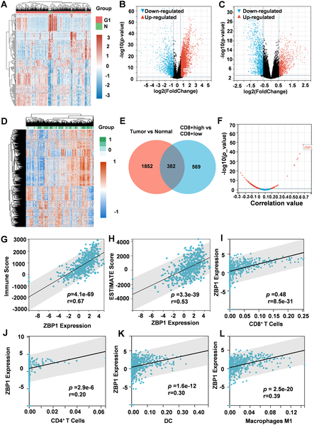
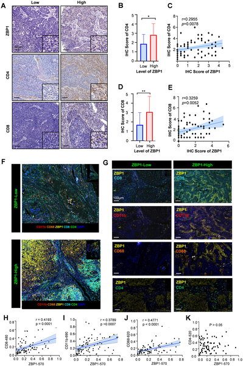
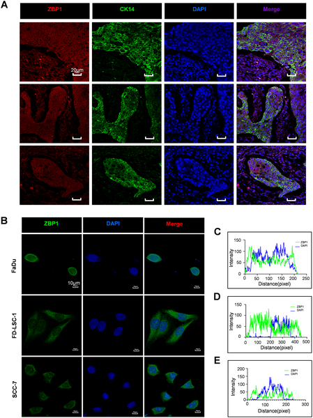

What if a single protein could flip the switch on stubborn cancers that evade the immune system? Head and neck squamous cell carcinoma (HNSCC) often hides from immune attack, making immunotherapy less effective. Recent research shines a light on ZBP1, a protein that can reprogram these “cold” tumors into “hot” ones, rallying immune cells to fight back.

> **TL;DR**
> - ZBP1 expression in head and neck cancer correlates with increased infiltration and activation of cancer-fighting CD8+ T cells and M1 macrophages.
> - By boosting immune cell recruitment and suppressing immune-suppressive pathways, ZBP1 improves tumor control and patient survival, highlighting its potential as a biomarker and therapeutic target.

Head and neck squamous cell carcinoma ranks among the most common and deadly cancers worldwide. Despite advances, many tumors resist immune checkpoint therapies because their tumor microenvironments (TMEs) lack active immune cells, earning the label “cold” tumors. These environments are dominated by immune-suppressive cells that shield cancer from attack. CD8+ T cells, often called “killer” T cells, are crucial for recognizing and destroying cancer cells, but they are frequently scarce or inactive in HNSCC. Understanding how to convert these cold TMEs into immune-active ones is a critical challenge in cancer immunology.

Researchers combined computational analyses of large patient datasets with experimental validation in human tumor samples and mouse models. They analyzed gene expression profiles from The Cancer Genome Atlas (TCGA) to identify genes linked to immune cell presence, focusing on ZBP1. Immunohistochemistry and multiplex immunofluorescence mapped ZBP1 and immune cells in 92 patient tumors. Mouse models engineered to overexpress ZBP1 in tumor cells allowed functional testing of its effects on tumor growth and immune responses. Single-cell RNA sequencing and flow cytometry detailed how ZBP1 reshapes the immune landscape within tumors.

The study found that ZBP1 is significantly elevated in HNSCC tumors compared to normal tissue and strongly correlates with infiltration of CD8+ T cells and M1 macrophages, both key players in anti-tumor immunity. High ZBP1 levels predicted better overall and disease-specific survival and were associated with earlier-stage tumors. In mouse models, overexpressing ZBP1 slowed tumor growth, enhanced activation of IFN-γ-producing CD8+ T cells, and reduced the presence of immunosuppressive M2 macrophages. Single-cell analyses revealed that ZBP1 promotes chemokine signaling pathways that attract and activate cytotoxic T cells while suppressing metabolic pathways that support immune suppression. Spatial analyses showed increased interactions between immune cells in ZBP1-high tumors, highlighting its role in orchestrating immune cell crosstalk.

This research positions ZBP1 as a master regulator capable of transforming the immune landscape of head and neck cancers, turning cold tumors into hotbeds of immune activity. By synchronizing recruitment of cancer-fighting lymphocytes and dampening suppressive myeloid cells, ZBP1 enhances the body’s natural defenses against tumors. Clinically, ZBP1 could serve as a biomarker to identify patients more likely to respond to immunotherapies and as a promising target for new treatments aimed at reprogramming the tumor microenvironment to improve outcomes.

While these findings are compelling, they stem from a combination of computational analyses, human tissue studies, and mouse models. Further clinical studies are needed to confirm how ZBP1-targeted therapies might perform in patients. The complexity of tumor-immune interactions means that ZBP1’s effects could vary depending on tumor subtype and patient-specific factors. Additionally, the precise molecular mechanisms by which ZBP1 modulates immune cells require deeper exploration to safely translate these insights into therapies.

## Figures

*ZBP1 is linked to immune cell presence and activity in head and neck cancer, showing strong ties to key immune cells and tumor environment features.*

*Higher ZBP1 levels in head and neck cancer tissues link to more immune cells like CD8+ and CD4+ T cells, macrophages, and myeloid cells.*

*ZBP1 protein is found in both tumor and surrounding cells in head and neck cancer, showing different patterns inside human and mouse cells.*

## Sources

- [ZBP1 Drives CD8+ T cell-mediated anti-tumor immunity in head and neck squamous cell carcinoma](https://journals.plos.org/plosgenetics/article?id=10.1371/journal.pgen.1012107)
- DOI: [10.1371/journal.pgen.1012107](https://doi.org/10.1371/journal.pgen.1012107)
