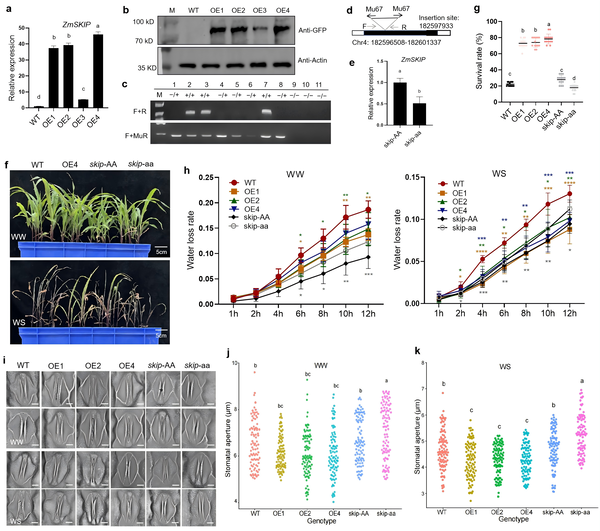
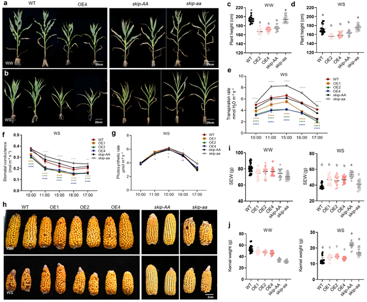
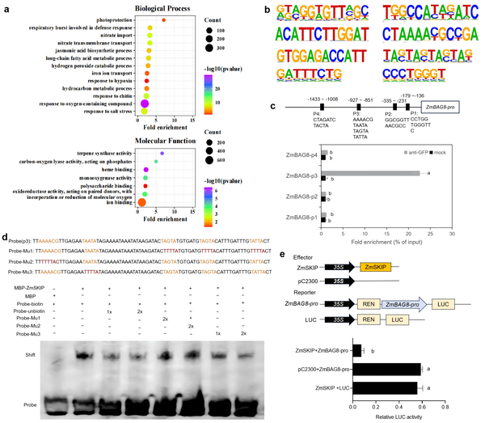
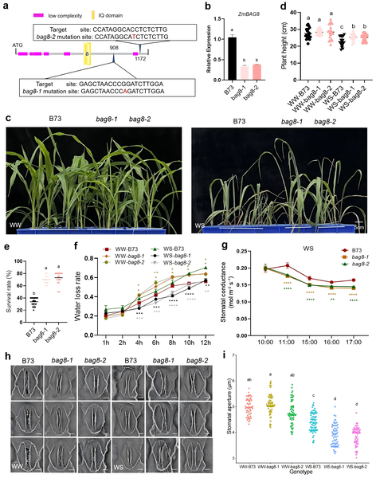

Imagine a maize plant facing a harsh drought, struggling to conserve every drop of water. One of its survival tricks lies in tiny pores on its leaves called stomata, which can open or close to control water loss. Scientists have now uncovered how a small protein, ZmSKIP, acts as a molecular switch to help maize plants close these pores during drought, improving their chances of survival.

> **TL;DR**
> - ZmSKIP protein promotes drought tolerance in maize by reducing stomatal aperture, thereby decreasing water loss.
> - ZmSKIP suppresses the expression of the gene ZmBAG8 through direct DNA binding, a process enhanced by phosphorylation under drought stress.

Maize is a vital crop worldwide, but drought stress can severely limit its yield. Plants manage water loss mainly through stomata, microscopic openings on leaf surfaces that regulate gas exchange and transpiration. Controlling stomatal aperture is a key strategy plants use to balance water conservation with photosynthesis. While many factors influence stomatal behavior, the molecular mechanisms in maize, especially those involving gene regulation under drought, remain incompletely understood. This study focuses on ZmSKIP, a protein previously known for roles in RNA splicing, revealing its new function as a transcription factor that helps maize survive dry conditions.

Researchers generated maize plants that overexpress ZmSKIP and also studied mutants with reduced ZmSKIP function. They measured water loss rates, stomatal apertures, and plant survival under drought conditions. Molecular techniques including DNA-binding assays, gene expression analysis, and protein interaction studies were used to explore how ZmSKIP regulates target genes. They identified ZmBAG8 as a key gene directly suppressed by ZmSKIP binding to its promoter. Additionally, they examined how phosphorylation of ZmSKIP by another protein kinase (ZmSnRK2.3) modulates its activity during drought stress.

The study found that maize plants overexpressing ZmSKIP had narrower stomatal openings and lost water more slowly, resulting in better survival under drought. Conversely, mutants lacking functional ZmSKIP showed wider stomata and increased water loss. ZmSKIP binds specifically to a “TAATA” DNA motif in the promoter region of the gene ZmBAG8, suppressing its expression. ZmBAG8 normally promotes stomatal opening, so reducing its activity helps close stomata. Under drought, phosphorylation of ZmSKIP by ZmSnRK2.3 enhances its ability to repress ZmBAG8, further tightening stomatal control. Moreover, ZmBAG8 can sequester ZmSKIP in stress granules, reducing its nuclear presence and fine-tuning this regulatory balance.

Understanding how ZmSKIP controls stomatal aperture through gene regulation sheds light on a novel drought tolerance mechanism in maize. This insight has practical implications for crop improvement, as manipulating ZmSKIP or its pathway could lead to maize varieties better equipped to withstand water scarcity. Given the increasing challenges of climate change and drought on agriculture, such molecular targets offer promising avenues to enhance food security.

While the findings reveal a clear role for ZmSKIP in maize drought response, the study focuses on a single species and specific genetic contexts. The complexity of drought tolerance involves many interacting pathways, so further research is needed to understand how ZmSKIP integrates with other mechanisms in diverse environmental conditions. Additionally, translating these molecular insights into field-ready crops will require extensive breeding and testing to ensure agronomic viability.

## Figures

*Study shows how altering ZmSKIP gene in maize affects growth, drought survival, water loss, and leaf pore size in young plants.*

*This figure shows how genetically modified maize with ZmSKIP grows taller, uses water better, and produces heavier ears, especially under drought conditions.*

*ZmSKIP protein reduces ZmBAG8 gene activity by binding specific DNA motifs in its promoter, shown through multiple lab tests.*

*Study of bag8 mutant maize shows changes in gene expression, growth, survival, water loss, and stomata under normal and drought conditions.*

## Sources

- [ZmSKIP enhances drought tolerance by reducing stomatal aperture in maize](https://journals.plos.org/plosgenetics/article?id=10.1371/journal.pgen.1012077)
- DOI: [10.1371/journal.pgen.1012077](https://doi.org/10.1371/journal.pgen.1012077)
